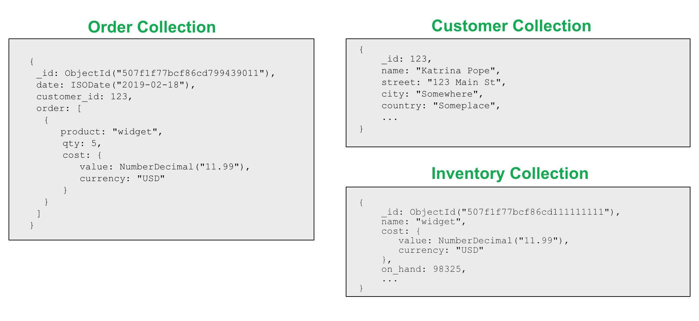

# MongoDB Design Pattern

https://www.mongodb.com/blog/post/building-with-patterns-a-summary

---

## The Subset Pattern

### exmaple

제품과 제품에 대한 리뷰 목록


제품 목록에 최근 리뷰 몇 개를 보여줘야하는 경우,
모든 리뷰를 제품과 함께 저장하는 대신 컬렉션을 두 개로 나눌 수 있다.


하나의 컬렉션은 현재 리뷰와 같이 가장 자주 사용되는 데이터를, 다른 컬렉션은 오래된 리뷰, 제품 이력 등과 같이 덜 자주 사용되는 데이터를 담는다. 

### 장점
더 자주 액세스하는 데이터가있는 더 작은 문서를 사용하면 작업 세트의 전체 크기가 줄어 듭니다. 
따라서 응용 프로그램에 가장 자주 사용되는 정보에 대한 디스크 액세스 시간이 단축됩니다. 

### 단점
한 가지 단점은 하위 집합을 관리해야하며,
이전 검토 또는 모든 정보를 가져와야 할 경우 데이터베이스로 추가 이동해야한다는 것입니다.

## Extended Reference Pattern
자주 액세스하는 데이터를 모으기 위해 많은 여러 Collection의 JOIN 작업이 필요한 경우 Extended Reference Pattern을 사용할 수 있다.

### example

고객-주문 관계



별도의 논리적 개체를 별도의 컬렉션을 갖는 것이 좋다.
하지만 성능 관점에서 볼 때 특정 순서에 따라 정보를 모아야하므로 문제가 된다.

고객과 주문은 1-N 관계이다.
반대로 주문과 고객은 N-1의 관계를 갖고있다.

주문 목록에서 주문과 주문자 정보를 보여줘야할 때 각 주문에 고객 정보를 복사하면 JOIN을 줄일 수 있다.
또한 모든 고객 정보가 주문에 필요한 것은 아니기 때문에 고객에 대한 모든 정보를 복제하는 대신 우선 순위가 가장 높고 이름 및 주소와 같이 가장 자주 액세스하는 필드만 복사한다.


### 장점
조회 측에서 필드를 식별하고 자주 액세스하는 필드를 기본 문서로 가져 오면 성능이 향상된다.
이 패턴을 통해 더 빠른 읽기와 전체 JOIN 수의 감소가 가능해진다.

### 단점
그러나 데이터 복제는 스키마 디자인 패턴의 부작용이다.
참조하고 있는 정보의 원본 정보가 업데이트되면 이를 처리하는 방법도 고려해야한다.

---

## Attribute Pattern

### example
출시일 별 영화 조회

```json
{
    title: "Star Wars",
    director: "George Lucas",
    release_US: ISODate("1977-05-20T01:00:00+01:00"),
    release_France: ISODate("1977-10-19T01:00:00+01:00"),
    release_Italy: ISODate("1977-10-20T01:00:00+01:00"),
    release_UK: ISODate("1977-12-27T01:00:00+01:00")
}
```

위와 같은 Schema 구조에서 국가별 개봉날짜를 검색하려면 나라별 출시일에 Index를 걸어야한다.

```
{release_US: 1}
{release_France: 1}
{release_Italy: 1}
{release_UK: 1}
```

`출시일`의 하위 집합으로 배열을 만들면 Index를 줄일 수 있다.

```json
{
    title: "Star Wars",
    director: "George Lucas",
    releases: [
        {
            location: "USA",
            date: ISODate("1977-05-20T01:00:00+01:00")
        },
        {
            location: "France",
            date: ISODate("1977-10-19T01:00:00+01:00")
        },
        {
            location: "Italy",
            date: ISODate("1977-10-20T01:00:00+01:00")
        },
        {
            location: "UK",
            date: ISODate("1977-12-27T01:00:00+01:00")
        }
    ]
}
```

```
{ "releases.location": 1, "releases.date": 1}
```

Attribute pattern은 document에 많지만 유사한 필드를 대상으로 쉽게 Indexing 할 수 있도록 해준다.
이 패턴을 사용할 때 더 적은 인덱스가 필요하며 쿼리 작성이 더 단순 해지고 쿼리가 더 빨라진다.
