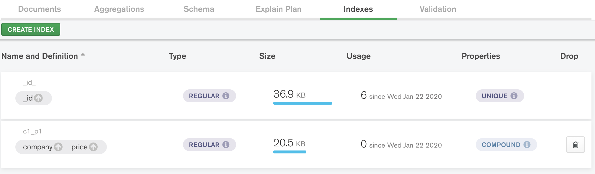

# MongoDB Index

## Index와 B-Tree

MongoDB는 indexing 알고리즘으로 `B-Tree`를 사용한다.
B-Tree는 
1. 정확한 일치, 범위 조건, 정렬, prefix 일치 등의 다양한 쿼리를 용이하게 처리하게 해준다.
2. 키가 추가되거나 삭제되더라도 밸런스된 상태를 계속유지한다.

### B-Tree

출처: https://hyungjoon6876.github.io/jlog/2018/07/20/btree.html

이진 트리가 자식 노드가 최대 2개인 노드를 말하는 것이라면 B-Tree는 자식 노드의 개수가 2개 이상인 트리를 말합니다.
또한 노드내의 데이터가 1개 이상일수가 있습니다. 


노드내 최대 데이터 수가 2개라면 2차 B-Tree, 3개라면 3차 B-Tree 라고 말합니다. 
1, 2, 3 ... N차 B-Tree 라고 합니다.


노드의 자식노드의 데이터들은 노드 데이터를 기준으로
데이터보다 작은 값은 왼쪽 서브 트리에, 큰값들은 오른쪽 서브 트리에 이루어 져야 합니다.

## Index 규칙

- index는 도큐먼트를 가져오기 위한 필요한 작업량을 많이 줄인다
    (Index를 적절하게 걸면 Full scan을 하지 않아도 된다)
- (a, b) 인덱스가 있다면 a 인덱스에 대해서는 중복이고 b에 대해서는 중복이 아니다.
- 복합 인덱스에서 키의 순서는 매우 중요하다

## 복합 인덱스

복합 인덱스에서는 순서가 중요하다.


- (제조사 1, 가격 1) index를 건 경우




낮은 가격 순으로 정렬하고 싶을 때 (제조사 1, 가격 1) index를 참고할 수 있을까?


query에 compound index key가 있더라도 compound index 순서에 따라 index를 참고하지 않을 수 있다.

- (가격 1, 제조사 1) index를 건 경우

순서를 바꾸면 이전 쿼리는 index를 참고한다.


---

- subdocument(nested object)도 indexing 가능하다.

참고: https://docs.mongodb.com/manual/core/index-single/#create-an-index-on-an-embedded-field

---

## 인덱스 효율

- 쿼리 성능을 위해선 인덱스가 필수적이지만, 각 인덱스는 유지 비용이 들어간다.

하나의 컬렉션에 인덱스가 10개가 있다면, 해당 컬렉션 내의 도큐먼트 수정 연산을 한 번 수행할 때마다 도큐먼트 자체의 수정 연산 이외에 10개의 인덱스를 수정해야한다.

읽기 성능 vs 수정 성능: **trade-off**

- 인덱스와 현재 작업중인 데이터를 램에서 다 처리 못할 경우

램이 충분하지 않으면 page fault로 인해, 디스크 액세스 횟수가 들어나게 된다.
=> 최소 인덱스만큼은 램에 들어가도록 해야한다.

3개의 복합 키를 가진 인덱스는 필요할 수 있으나, 단일 키 인덱스보다 더 많은 공간을 필요로한다.
=> 인덱스는 필요한 키만 가지고 있어야한다.

## Dense Indexes (밀집 인덱스) vs Sparse Indexes (희소 인덱스)

- 밀집: 도큐먼트가 인덱스 키를 가지고 있지 않더라도 인덱스에는 해당 엔트리가 존재함
- 희소: 인덱스의 키가 null값이 아닌 값을 가진 도큐먼트에만 존재함
  많은 수의 도큐먼트가 인덱스 키를 가지고 있지 않은 경우에 적합하다

```
db.collection.createIndex( { x: 1 }, { sparse: true } );
```

## Index build lock

- 4.2 version 미만
  - foreground indexing:
    Index를 생성하는 동안 모든 쓰기/읽기 잠금, 하지만 빠르다
  - background indexing:
    read-write lock을 사용하여 Index를 생성하는 동안에도 DB에 접근 가능, 하지만 느리다.

- 4.2 version 이상
  - MongoDB 4.2 index builds obtain an `exclusive lock` on only the collection being indexed during the start and end of the build process to protect metadata changes. The rest of the build process uses the yielding behavior of background index builds to `maximize read-write access` to the collection during the build. 4.2 index builds still produce efficient index data structures despite the more permissive locking behavior.
  - MongoDB 4.2 index build performance is at least on par with background index builds. **For workloads with few or no updates received during the build process, 4.2 index builds builds can be as fast as a foreground index build on that same data.**

출처: https://docs.mongodb.com/manual/core/index-creation/#comparison-to-foreground-and-background-builds

---

- Exclusive Lock

`쓰기 잠금(Write lock)`이라고도 불린다.

어떤 트랜잭션에서 데이터를 변경하고자 할 때,
해당 트랜잭션이 완료될 때까지 해당 테이블 혹은 레코드(row)를 다른 트랜잭션에서 읽거나 쓰지 못하게 하기 위해 Exclusive lock을 걸고 트랜잭션을 진행시키는 것이다.

출처: https://jeong-pro.tistory.com/94

---

- 참고
- [인덱싱 전략](https://docs.mongodb.com/manual/applications/indexes/)
