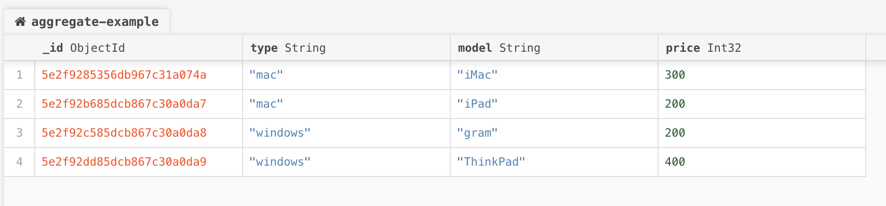
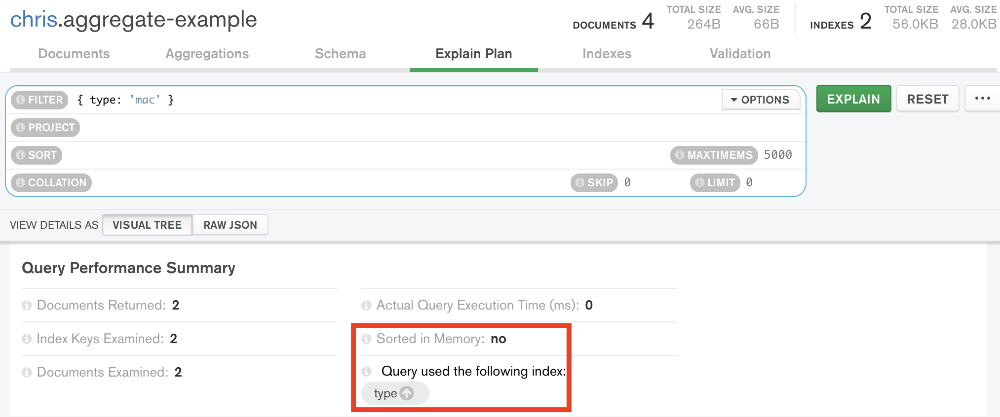
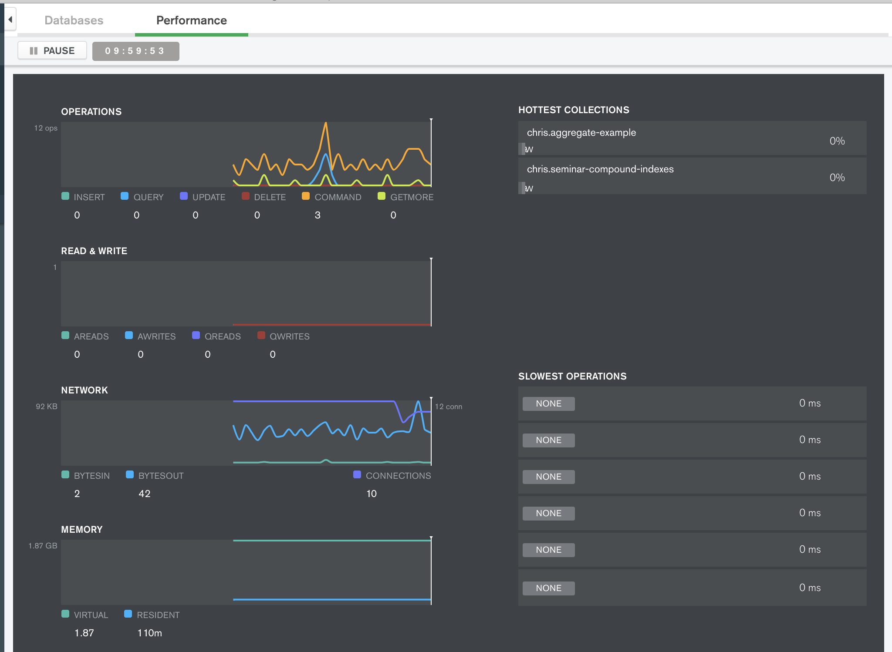
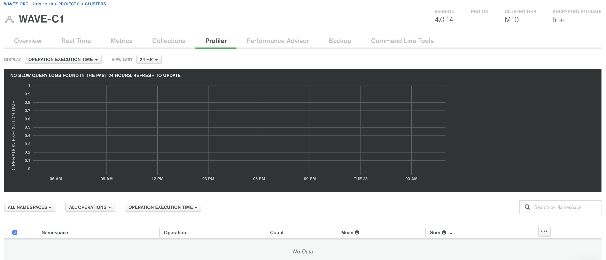
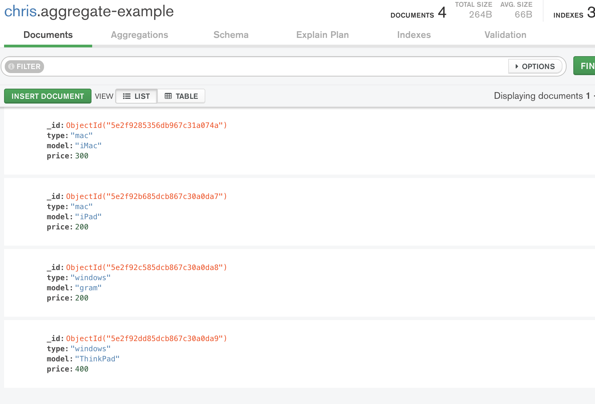
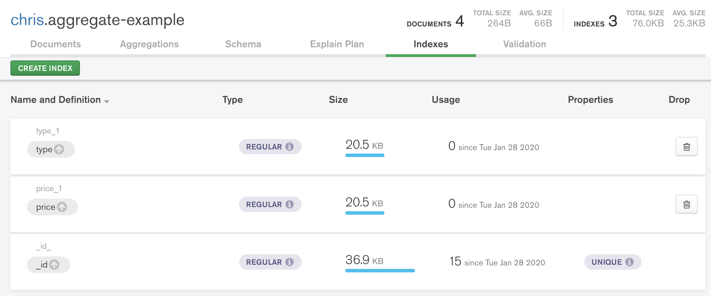
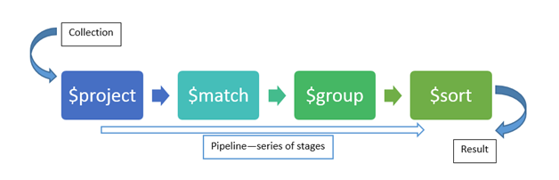
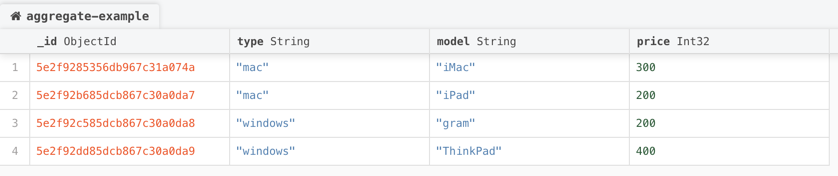
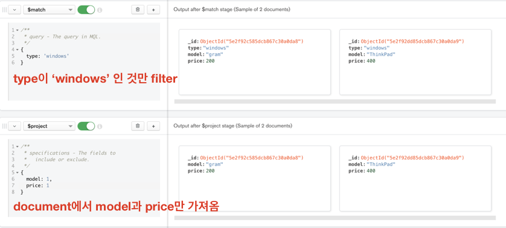
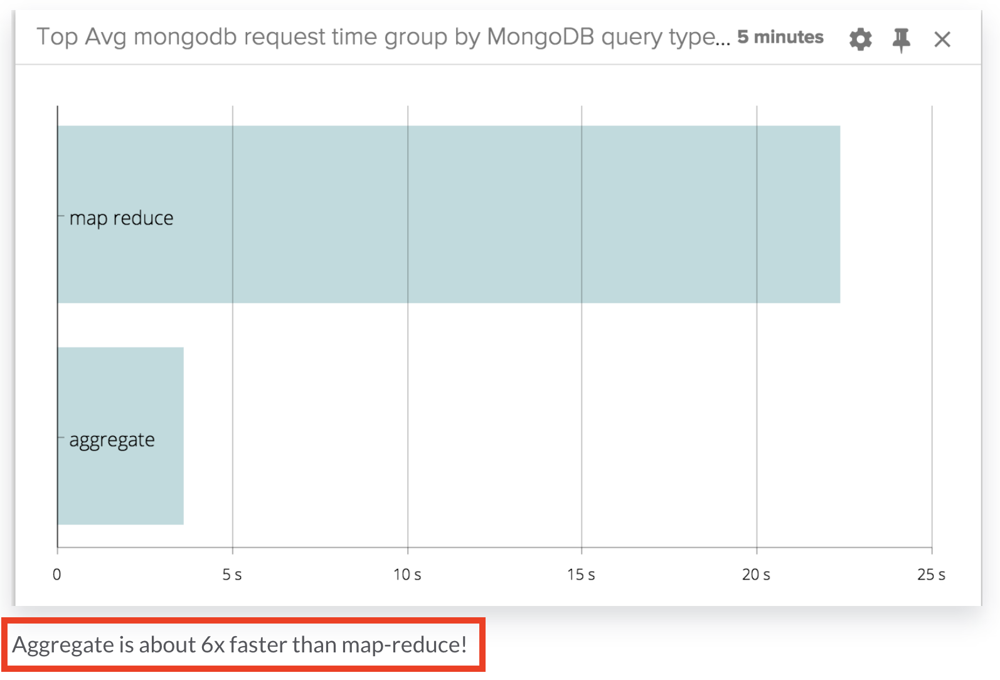

# MongoDB Performance Tips

## MongoDB

### Explain Query

query를 실행할 때 성능을 위해선 해당 query에 index가 걸리는지 확인하는 것은 중요하다.
index를 생성한 뒤 해당 index를 제대로 타는지 확인하기 위해서 query에 explain()을 추가하여 query를 분석한다.
explain은 query에 대한 자세한 정보를 보여준다.



```
# index 생성 전
mongo-repl:PRIMARY> db['aggregate-example']
  .find({ type: 'mac' })
  .explain('executionStats');

{
  "queryPlanner" : {
    "plannerVersion" : 1,
    "namespace" : "chris.aggregate-example",
    "indexFilterSet" : false,
    "parsedQuery" : {
      "type" : {
        "$eq" : "mac"
      }
    },
    ...
  "executionStats" : {
    "executionSuccess" : true,
    "nReturned" : 2,  
    "executionTimeMillis" : 0,
    "totalKeysExamined" : 0,
    "totalDocsExamined" : 4, 
    "executionStages" : {
      "stage" : "COLLSCAN",
      "filter" : {
        "type" : {
          "$eq" : "mac"
        }
      },
      "nReturned" : 2, <=============== returned document: 2
      ...
      "docsExamined" : 4 <=============== scanned documents: 4 = Full Scan
    },
    "allPlansExecution" : [ ]
  },
  ...
}
```

```
# `type` index 생성 후
mongo-repl:PRIMARY> db['aggregate-example']
  .find({ type: 'mac' })
  .explain('executionStats');

{
  "queryPlanner" : {
    "plannerVersion" : 1,
    "namespace" : "chris.aggregate-example",
    "indexFilterSet" : false,
    "parsedQuery" : {
      "type" : {
        "$eq" : "mac"
      }
    },
    ...,
    "winningPlan" : {
			...
      "indexName" : "type_1", <=============== index
      ...
		},
  },
  "executionStats" : {
    "executionSuccess" : true,
    "nReturned" : 2,
    "executionTimeMillis" : 0,
    "totalKeysExamined" : 2,
    "totalDocsExamined" : 2,
    "executionStages" : {
      "stage" : "FETCH",
      "nReturned" : 2, <=============== returned document: 2
      ...
      "docsExamined" : 2, <=============== scanned documents: 2
      ...
  },
  ...
}
```

하지만 단순히 index를 타는지 확인할 경우 `Compass`의 `Explain Plan` 사용하는 편이 더 편하다.



조회용 query를 사용할 땐 explain 기능을 사용하여 index를 타는지 유/무를 확인하고 scan 되는 document 수와 return 되는 document의 수를 확인하자.

### Profiler

참고: https://docs.mongodb.com/manual/tutorial/manage-the-database-profiler/

#### Profiler

profiler는 profiling 설정을 하면, 연산(operation)에 대한 데이터를 admin database의 system.profile collection(capped collection)에 쓴다.

- profiling level
  - 0 (default): profiler는 아무런 데이터도 모으지 않는다.
  - 1: profiler는 `slowms`보다 오래 걸리는 연산의 데이터를 모은다.
    - db.setProfilingLevel(1, { slowms: 20 })
  - 2: profiler는 모든 연산에 대해 데이터를 모은다.

```
# Profiling level 설정
mongo-repl:PRIMARY> db.setProfilingLevel(2)

{
  "was" : 0,
  "slowms" : 100,
  "sampleRate" : 1,
  "ok" : 1,
  "$clusterTime" : {
    "clusterTime" : Timestamp(1580204694, 1),
    "signature" : {
      "hash" : BinData(0,"AAAAAAAAAAAAAAAAAAAAAAAAAAA="),
      "keyId" : NumberLong(0)
    }
  },
  "operationTime" : Timestamp(1580204694, 1)
}
```

```
# Profiling level 확인
mongo-repl:PRIMARY> db.getProfilingStatus()

{
  "was" : 2, <============ current profiling level
  "slowms" : 100,
  "sampleRate" : 1,
  "$clusterTime" : {
    "clusterTime" : Timestamp(1580204944, 1),
    "signature" : {
      "hash" : BinData(0,"AAAAAAAAAAAAAAAAAAAAAAAAAAA="),
      "keyId" : NumberLong(0)
    }
  },
  "operationTime" : Timestamp(1580204944, 1)
}
```

```
# Profiling data 확인
mongo-repl:PRIMARY> db.system.profile.find().pretty()

{
  "op" : "query",
  "ns" : "chris.aggregate-example",
  "command" : { <=============== query 정보
    "find" : "aggregate-example",
    "filter" : {
      "type" : "mac"
    },
    "lsid" : {
      "id" : UUID("dfd3d855-aa42-48e1-99f0-00106e557492")
    },
    "$clusterTime" : {
      "clusterTime" : Timestamp(1580204724, 1),
      "signature" : {
        "hash" : BinData(0,"AAAAAAAAAAAAAAAAAAAAAAAAAAA="),
        "keyId" : NumberLong(0)
      }
    },
    "$db" : "chris"
  },
  "keysExamined" : 2,
  "docsExamined" : 2,
  "cursorExhausted" : true,
  "numYield" : 0,
  "nreturned" : 2,
  "queryHash" : "2A1623C7",
  "planCacheKey" : "ADC191CC",
  "locks" : {
    "ReplicationStateTransition" : {
      "acquireCount" : {
        "w" : NumberLong(1)
      }
    },
    "Global" : {
      "acquireCount" : {
        "r" : NumberLong(1)
      }
    },
    "Database" : {
      "acquireCount" : {
        "r" : NumberLong(1)
      }
    },
    "Collection" : {
      "acquireCount" : {
        "r" : NumberLong(1)
      }
    },
    "Mutex" : {
      "acquireCount" : {
        "r" : NumberLong(1)
      }
    }
  },
  "flowControl" : {

  },
  "responseLength" : 369,
  "protocol" : "op_msg",
  "millis" : 0, <=============== query를 수행하는데 드는 시간
  "planSummary" : "IXSCAN { type: 1 }",
  "execStats" : {
    "stage" : "FETCH",
    "nReturned" : 2,
    "executionTimeMillisEstimate" : 0,
    "works" : 3,
    "advanced" : 2,
    "needTime" : 0,
    "needYield" : 0,
    "saveState" : 0,
    "restoreState" : 0,
    "isEOF" : 1,
    "docsExamined" : 2,
    "alreadyHasObj" : 0,
    "inputStage" : {
      "stage" : "IXSCAN",
      "nReturned" : 2,
      "executionTimeMillisEstimate" : 0,
      "works" : 3,
      "advanced" : 2,
      "needTime" : 0,
      "needYield" : 0,
      "saveState" : 0,
      "restoreState" : 0,
      "isEOF" : 1,
      "keyPattern" : {
        "type" : 1
      },
      "indexName" : "type_1",
      "isMultiKey" : false,
      "multiKeyPaths" : {
        "type" : [ ]
      },
      "isUnique" : false,
      "isSparse" : false,
      "isPartial" : false,
      "indexVersion" : 2,
      "direction" : "forward",
      "indexBounds" : {
        "type" : [
          "[\"mac\", \"mac\"]"
        ]
      },
      "keysExamined" : 2,
      "seeks" : 1,
      "dupsTested" : 0,
      "dupsDropped" : 0
    }
  },
  "ts" : ISODate("2020-01-28T09:45:31.083Z"), <=============== query를 수행한 시간
  "client" : "127.0.0.1",
  "appName" : "MongoDB Shell",
  "allUsers" : [ ],
  "user" : ""
}
```

Profiling 기능이 활성화되면, 추가 디스크 서용에 대한 영향을 고려해야할 것이다.

#### Profiler 활용 방법
Profiler를 통해 slow query를 분석할 수 있다.

- MongoDB CLI

```
# 가장 느린 query를 10개만 가져온다.

db.system.profile
  .find({ op: "query" })
  .sort({ millis: -1 })
  .limit(10)
  .pretty();
```

- Compass



Performance tab에서 slow query를 확인할 수 있다.

- MongoDB Atlas



Profiler tab에서 slow query를 확인할 수 있다.

### 기타 Query 최적화 Tips

참고: https://docs.mongodb.com/manual/tutorial/optimize-query-performance-with-indexes-and-projections/ 

#### Network I/O를 줄이기 위해서 조회 시 필요한 특정 property만 가져와라

```js
db.users
  .find(
    { age: { $gt: 20 } }, // filter option: 20 < age
    { username: 1, age: 1 } // project: username과 age만 가져온다.
  );
```

#### Network I/O를 줄이기 위해서 조회 결과의 수를 제한하라

```js
db.posts
  .find()
  .sort( { timestamp : -1 } )
  .limit(10); // query 결과 갯수 제한
```

#### 특정 index를 테스트하기 위해 $hint를 사용해라

참고: https://blog.ull.im/engineering/2019/04/05/mongodb-indexing-strategy.html#hint

쿼리에 특정 index를 사용하도록 하거나 index를 제거해서 테스트하고 싶을 때 hint를 사용한다.



위와 같은 Collection에서



위와 같은 `type`과 `price`로 각각 index를 걸었을 때

```
# type index를 지정
mongo-repl:PRIMARY> db['aggregate-example']
  .find({ type: 'mac' })
  .hint({ type: 1 })
  .explain('executionStats')

{
  "queryPlanner" : {
    "plannerVersion" : 1,
    "namespace" : "chris.aggregate-example",
    "indexFilterSet" : false,
    "parsedQuery" : {
      "type" : {
        "$eq" : "mac"
      }
    },
    ...
  "executionStats" : {
    "executionSuccess" : true,
    "nReturned" : 2,
    "executionTimeMillis" : 0,
    "totalKeysExamined" : 2,
    "totalDocsExamined" : 2,
    "executionStages" : {
      "stage" : "FETCH",
      "nReturned" : 2, <=========== returned documents
      ...
      "docsExamined" : 2, <=========== scanned documents
      ...
      }
    }
  },
  ...
}
```

```
# price index를 지정
mongo-repl:PRIMARY> db['aggregate-example']
  .find({ type: 'mac' })
  .hint({ price: 1 })
  .explain('executionStats')

{
  "queryPlanner" : {
    "plannerVersion" : 1,
    "namespace" : "chris.aggregate-example",
    "indexFilterSet" : false,
    "parsedQuery" : {
      "type" : {
        "$eq" : "mac"
      }
    },
    ...
  "executionStats" : {
    "executionSuccess" : true,
    "nReturned" : 2,
    "executionTimeMillis" : 0,
    "totalKeysExamined" : 4,
    "totalDocsExamined" : 4,
    "executionStages" : {
      "stage" : "FETCH",
      "filter" : {
        "type" : {
          "$eq" : "mac"
        }
      },
      "nReturned" : 2, <=========== returned documents
      ...
      "docsExamined" : 4, <=========== scanned documents: Full Scan
      ...
    }
  },
  ...
}
```

```
# query에 index를 안태울 경우
mongo-repl:PRIMARY> db['aggregate-example']
  .find({ type: 'mac' })
  .hint({ $natural: 1 })
  .explain('executionStats')

{
  "queryPlanner" : {
    "plannerVersion" : 1,
    "namespace" : "chris.aggregate-example",
    "indexFilterSet" : false,
    "parsedQuery" : {
      "type" : {
        "$eq" : "mac"
      }
    },
    ...
  "executionStats" : {
    "executionSuccess" : true,
    "nReturned" : 2,
    "executionTimeMillis" : 0,
    "totalKeysExamined" : 0,
    "totalDocsExamined" : 4,
    "executionStages" : {
      "stage" : "COLLSCAN",
      "filter" : {
        "type" : {
          "$eq" : "mac"
        }
      },
      "nReturned" : 2, <=========== returned documents
      ...
      "docsExamined" : 4 <=========== scanned documents: Full Scan 
    }
  },
  ...
}
```

## Aggregate (집계 파이프라인) 성능

### Aggregate

MongoDB에서 집계 처리를 할 때 사용하는 framework으로
SQL의 집계 기능(e.g. **group by**, **join**, e.t.c...)을 MongoDB에서도 할 수 있게 해준다.



### 집계 파이프라인의 성능에 중요한 영향을 미칠 수 있는 몇 가지 주요 고려사항

1. 파이프라인에서 가능한 한 빨리 도큐먼트의 수와 크기를 줄인다 (using $match)
  : 다음 파이프라인 스테이지로 넘어가기 전에 최대한 크기를 줄인다
2. `index`는 *\$match*와 *\$sort* 작업에서만 사용할 수 있다.
3. *\$match* 또는 *\$sort* 이외의 연산자를 파이프라인에서 사용한 후에는 인덱스를 사용할 수 없다.

index를 사용하면 대규모 Collection을 선택적으로 검색하고 정렬하는 속도가 크게 빨라질 수 있다.

explain 옵션을 통해 파이프라인 프로세스 세부 정보를 확인할 수 있다.

```
mongo-repl:PRIMARY> db['aggregate-example'].aggregate([
  {
    $match: {
      type: 'windows'
    }
  },
  {
    $project: {
      model: 1,
      price: 1
    }
  }
], { explain: true })

{
  "stages" : [
    {
      "$cursor" : {
        "query" : {
          "type" : "windows"
        },
        "fields" : {
          "model" : 1,
          "price" : 1,
          "_id" : 1
        },
        "queryPlanner" : {
          "plannerVersion" : 1,
          "namespace" : "chris.aggregate-example",
          "indexFilterSet" : false,
          "parsedQuery" : {
            "type" : {
              "$eq" : "windows"
            }
          },
          "queryHash" : "2A1623C7",
          "planCacheKey" : "2A1623C7",
          "winningPlan" : {
            "stage" : "COLLSCAN",
            "filter" : {
              "type" : {
                "$eq" : "windows"
              }
            },
            "direction" : "forward"
          },
          "rejectedPlans" : [ ]
        }
      }
    },
    {
      "$project" : {
        "_id" : true,
        "price" : true,
        "model" : true
      }
    }
  ],
  "ok" : 1,
  "$clusterTime" : {
    "clusterTime" : Timestamp(1580178952, 1),
    "signature" : {
      "hash" : BinData(0,"AAAAAAAAAAAAAAAAAAAAAAAAAAA="),
      "keyId" : NumberLong(0)
    }
  },
  "operationTime" : Timestamp(1580178952, 1)
}
```

### allowDiskUse option

집계 중간 결과가 너무 큰 경우 (100MB 초과) 집계가 실패하게되는데,
allowDiskUse 옵션을 사용하면 파이프라인의 중간 결과를 디스크에 저장한다.

중간 결과가 너무 큰 경우 allowDiskUse 옵션을 사용해야하지만 파이프라인 속도가 느려질 수 있다.
그래서 allowDiskUse option의 사용을 최대한 피하기 위해, 집계 처리를 할 때는 `$match`를 사용해서 처리할 Document를 필터링 후, 
`$project`를 통해 처리할 필드를 선택하여 중간 파이프라인 크기와 최종 Document 갯수와 크기를 제한하기 위해 노력해야한다.

### Aggregate debug




위와 같이 collection에 document가 있을 때


Compass의 Aggregate를 사용하면 다음과 같이 Pipeline stage 별로 결과를 확인할 수 있다.



### Aggregate V.S. Map-Reduce
`Map-Reduce`는 Aggregate와 같이 집계처리를 위한 기능을 제공한다.
하지만 일반적으로 aggregate보다 훨씬 느리기 때문에 쓰지 않는다.



참고: https://sysdig.com/blog/mongodb-showdown-aggregate-vs-map-reduce/

## Mongoose 

### Mongoose?

Mongoose는 Node.js와 MongoDB를 위한 ODM(Object Data Mapping) library이다.
(ORM의 개념을 MongoDB로 옮겨왔다고 생각하면 된다.)

### 조회만 하는 operation은 lean query를 사용하자

> By default, Mongoose queries return an instance of the `Mongoose Document class`. **Documents are much heavier** than vanilla JavaScript objects, because they have a lot of internal state for change tracking. Enabling the **lean option tells Mongoose to skip instantiating a full Mongoose document and just give you the POJO**.

Mongoose를 통해 query를 실행하면 Mongoose는 내부에서 query 결과인 JSON object를 `Mongoose Documents` 객체로 변환한다.
이 Documents 객체는 내부 상태 변화를 추적하기 때문에 일반 JSON object 보다 무겁다.

```ts
User
  .find({ username: 'Chris' })
  .lean() // <- lean option
  .exec();
```

lean option을 사용하면 **Mongoose Documents**가 아닌 **plain JSON object**를 return 한다.
그렇기 때문에 단순 조회 기능일 경우 lean option을 사용하면 애플리케이션 성능이 더 빨라진다.
(class instance가 아닌 JSON object를 return 하므로 주의)

#### lean()을 사용하면 사용할 수 없는 것
- Change tracking
- Casting and validation
- Getters and setters
- Virtuals
- save()

=> ODM의 기능을 사용할 수 없다.

### DB request를 최소화하라: `.populate()`를 피하라

하나의 document가 다른 collection의 document를 _id로 참조하고 있을 때
.populate() 보다는 .aggregate()를 사용하라

```json
// users
{
  "_id": "user1",
  "name": "chris",
  "posts": [
    { "_id": "post1" },
    { "_id": "post2" },
    { "_id": "post3" },
    { "_id": "post4" },
  ]
}

// posts
{
  "_id": "post1",
  "title": "post1"
}
{
  "_id": "post2",
  "title": "post2"
}
{
  "_id": "post3",
  "title": "post3"
}
{
  "_id": "post4",
  "title": "post4"
}
```

user를 조회할 때 해당 유저의 post도 같이 가져오고 싶을 때 populate를 사용하면 _id로 참조하고 있던 posts property가 post object로 치환된다.

```js
const user = await User
  .findOne({ name: 'chris' })
  .populate('posts')
  .exec();

console.log(user);
// user: {
//   "_id": "user1",
//   "name": "chris",
//   "posts": [
//     { "_id": "post1", title: "post1" },
//     { "_id": "post2", title: "post2" },
//     { "_id": "post3", title: "post3" },
//     { "_id": "post4", title: "post4" }
//   ]
// }
```

하지만 populate는 JOIN query를 통해 조회하는 것이 아니고 property의 _id를 보고 하나하나 조회 query를 날리는 것이기 때문에 비효율적이다.
=> N+1 problem

참고: https://www.zerocho.com/category/MongoDB/post/59a66f8372262500184b5363

### DB operations를 병렬로 실행하라

순서대로 처리해야하는 작업이 아니라면 Promise.all을 사용해서 병렬로 처리하자

```ts
const [foo, bar] = await Promise.all([
  getUserById('foo'),
  getUserById('bar')
])

foo.changeName('FOO');
bar.changeName('BAR');

// bad
await user.save();
await post.save();

// good
const [user, post] = await Promise.all([user.save(), post.save()]);
```

### Mongoose connection을 재사용하라

새로운 TCP connection은 cost가 높기 때문에,
DB를 사용하는 요청을 처리할 때 마다 DB connection을 생성하고 close하지 말고 만들어진 connection을 재사용하라.

---

## references

- MongoDB
  - https://docs.mongodb.com/manual/administration/analyzing-mongodb-performance/
  - https://stackify.com/mongodb-performance-tuning/
  - [mapReduce vs aggregate](https://sysdig.com/blog/mongodb-showdown-aggregate-vs-map-reduce/)
  - https://stackoverflow.com/questions/12678631/map-reduce-performance-in-mongodb-2-2-2-4-and-2-6
  - [MongoDB in Action](http://www.yes24.com/Product/Goods/60659843)
  - [Mongodb internals](http://mongodb.citsoft.net/)

- Mongoose
    - [How to optimize MongoDB & Mongoose for Performance](https://medium.com/faun/performance-tips-for-mongodb-mongoose-190732a5d382)
    - [Faster Mongoose Queries With Lean](https://mongoosejs.com/docs/tutorials/lean.html)
