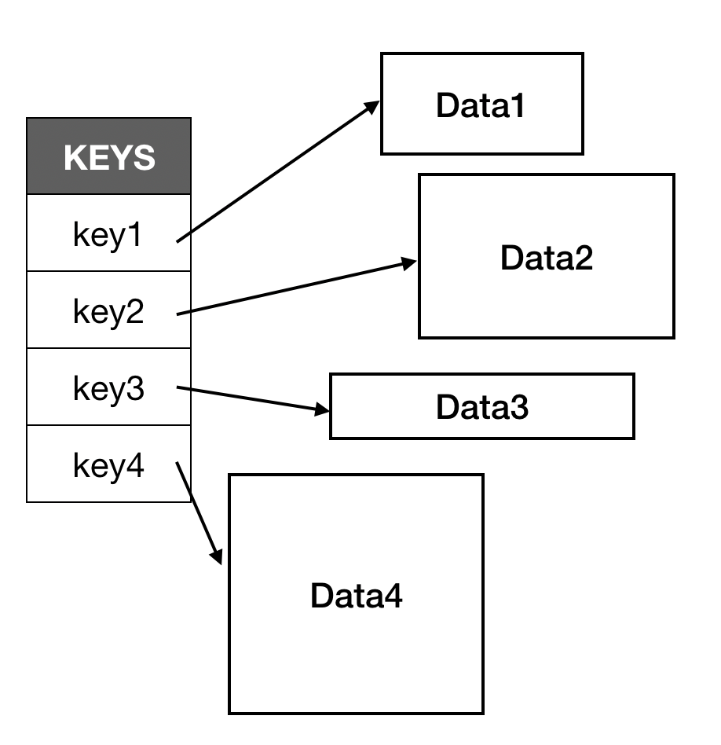
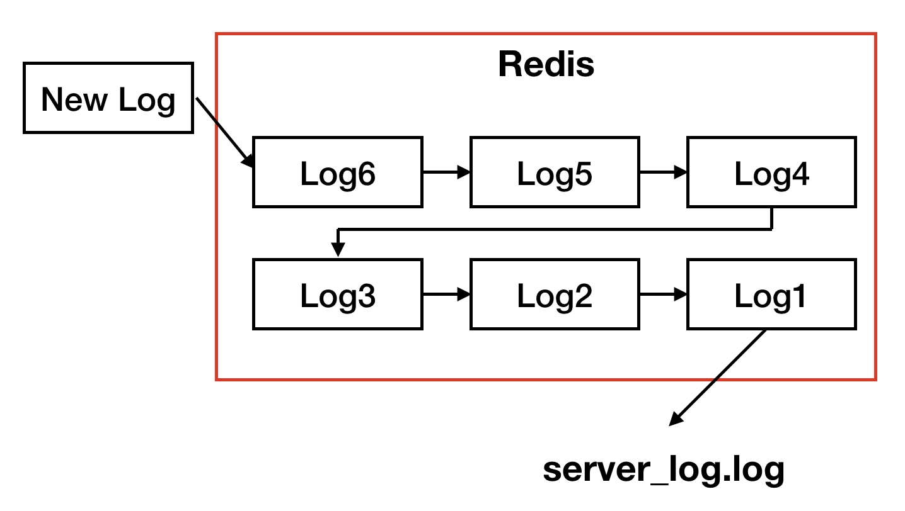

# 예제로 살펴본 Redis 활용법

---

[이것이 레디스다](http://www.yes24.com/Product/Goods/16512938)의 7장 레디스 활용 사례를 참고하여 정리하였음

---

## Data structure of Redis

Redis는 in-memory Key-Value(Map 구조) 저장소이다.



이 Value의 자료구조로는 **string**, **list**, **set**, **hash** 등이 있다.

## Examples

### 사용자 방문 확인 기능

- `GETBIT`, `SETBIT`: 입력된 offset 위치에 저장된 bit값을 변경하거나 가져온다.
- `BITCOUNT`: 값이 1인 bit의 갯수를 조회한다.

```bash
redis:6379> SETBIT bit 0 1
(integer) 0 # 이전 값

redis:6379> GETBIT bit 0
(integer) 1
redis:6379> GETBIT bit 2
(integer) 0

redis:6379> SETBIT bit 10 1
(integer) 0
redis:6379> BITCOUNT bit
(integer) 2
```

- 사용자 ID에 해당하는 offset의 bit 값을 변경하여 기능을 구현한다
  - key: `login:${date}`

```bash
# User ID가 '10'인 사용자의 2019.11.03 로그인 이력 저장
redis:6379> SETBIT login:20191103 10 1
(integer) 0
# User ID가 '13'인 사용자의 2019.11.03 로그인 이력 저장
redis:6379> SETBIT login:20191103 13 1
(integer) 0
# User ID가 '40'인 사용자의 2019.11.03 로그인 이력 저장
redis:6379> SETBIT login:20191103 40 1
(integer) 0

# 2019.11.03 로그인한 회원 수 조회
redis:6379> BITCOUNT login:20191103
(integer) 3

# User ID가 '10'인 사용자의 2019.11.03 로그인 이력 조회
redis:6379> GETBIT login:20191103 10
(integer) 1
```

### 웹 서버 로그 통합

Redis의 **List**를 사용하여 여러 웹 서버의 로그를 하나의 파일에 통합하여 저장하는 기능 구현



```ts
// Web Server에서 log를 쓰는 function
function writeLog(redisClient: RedisClient, log: string): void {
  const timestamp = moment().format('yyyyMMdd HH:mm:ss SSS');
  redisClient.lpush('server:log', `${timestamp} ${log}`);
}
```

```ts
// 로그를 통합하여 저장하는 Application의
// 통합 로그 생성 function
async function run(redisClient: RedisClient) {
  const timestamp = moment().format('yyyyMMdd_HH');
  
  while (true) {
    const log = await redisClient.rpop('server:log');

    if (!log) {
      break;
    }

    try {
      fs.appendFileSync(`server_log_${timestamp}.log`, log);
    } catch (err) {
      console.error(err);
    }
  }

  console.log('done!');
}
```

### 파일 다운로드 횟수 카운트 기능

- `INCR`: 숫자 string 값을 1 증가시킨다.

```bash
redis:6379> INCR num
(integer) 1
redis:6379> INCR num
(integer) 2
redis:6379> INCR num
(integer) 3
redis:6379> get num
"3"
```

- 파일 ID에 해당하는 key 값을 증가시켜 다운로드 횟수 기능을 구현한다
  - key: `download:${file_id}`

```ts
export class FileDownloadCounter {
  constructor(redisClient: RedisClient) {
    this.redisClient = redisClient;
  }

  increaseDownloadCount(fileId: string): Promise<number[]> {
    const total = this.redisClient.incr('download:total');
    const file = this.redisClient.incr(`download:${fileId}`);
    return Promise.all(total, file);
  }

  getDownloadCount(fileIds: string[]): Promise<number[]> {
    const getPromises = [];

    fileIds.forEach(id => {
      const getPromise = this.redisClient.get(`download:${id}`);
      getPromises.push(getPromises);
    });

    return Promise.all(getPromises);
  }
}
```

### 파일 다운로드 횟수 카운트 기능 (날짜별 다운로드 횟수)

```ts
export class FileDownloadByDateCounter {
  constructor(redisClient: RedisClient) {
    this.redisClient = redisClient;
  }

  increaseDownloadCount(fileId: string): Promise<number[]> {
    const today = moment('yyyyMMdd');
    const total = this.redisClient.incr(`download:total:${today}`);
    const file = this.redisClient.incr(`download:${fileId}:${today}`);
    return Promise.all(total, file);
  }

  getDownloadCountsByDate(fileIds: string[], date: string): Promise<number[]> {
    const getPromises = [];

    fileIds.forEach(id => {
      const getPromise = this.redisClient.get(`download:${date}:${id}`);
      getPromises.push(getPromise);
    });

    return Promise.all(getPromises);
  }
}
```

하지만 위와 같은 경우 **시작 날짜** 및 **마지막 날짜**를 찾기 힘들다.
=> `Hash` 자료 구조를 사용하여 위 기능을 개선

```bash
# key가 'mykey'인 HashMap의 'key1' key의 값을 '1'만큼 증가시킨다
redis:6379> HINCRBY mykey key1 1
(integer) 1
# key가 'mykey'인 HashMap의 'key1' key의 값을 '2'만큼 증가시킨다
redis:6379> HINCRBY mykey key1 2
(integer) 3

# key가 'mykey'인 HashMap의 'key1' key의 값을 가져온다
redis:6379> HGET mykey key1
"3"

# key가 'mykey'인 HashMap의 모든 key, value를 가져온다
redis:6379> HGETALL mykey
1) "key1"
2) "3"
```

```ts
export class FileDownloadByDateCounter {
  constructor(redisClient: RedisClient) {
    this.redisClient = redisClient;
  }

  increaseDownloadCount(fileId: string): Promise<number[]> {
    const today = moment('yyyyMMdd');
    const total = this.redisClient.hincrby('download:total', today, 1);
    const file = this.redisClient.hincrby(`download:${fileId}`, today, 1);
    return Promise.all(total, file);
  }

  getDownloadCountsByDate(fileIds: string[], date: string): Promise<number[]> {
    const hgetPromises = [];

    fileIds.forEach(id => {
      const hgetPromise = this.redisClient.hget(`download:${id}`, date);
      hgetPromises.push(hgetPromise);
    });

    return Promise.all(hgetPromises);
  }

  getAllDownloadCounts(fileIds: string[]): Promise<object[]> {
    const hgetallPromises = [];

    fileIds.forEach(id => {
      const hgetallPromise = this.redisClient.hgetall(`download:${id}`)
        .then(downloadCountHash => {
          return this.getAllDownloadCountsFromHash(downloadCountHash);
        });

      hgetallPromises.push(hgetallPromise);
    });
    
    return Promise.all(hgetallPromises);
  }

  private getAllDownloadCountsFromHash(downloadCountHash: Map<string, number>): object {
    const countObject = {};

    downloadCountHash.forEach(downloadCount => {
      const date = downloadCount.key;
      const count = downloadCount.value;
      countObject[date] = count;
    });

    return countObject;
  }
}
```

### 장바구니 기능 정보

- 기능
    - 장바구니 상품 등록
    - 장바구니 상품 삭제
    - 장바구니 비구기
    - 장바구니 상품 목록 조회
    - 오래된 장바구니 상품 삭제

```bash
redis:6379> SET key 1
OK

redis:6379> EXPIRE key 10
(integer) 1

redis:6379> TTL key
(integer) 5

redis:6379> get key
"1"

redis:6379> GET key
(nil)
```

```
// client의 장바구니 안에 있는 상품 목록
cart:${client_id}:products
// client의 장바구니 안에 있는 상품의 특정 정보 (상품명, 수량 등...)
cart:${client_id}:products:${product_id}
```

```ts
export class Cart {
  private static CART = 'cart';
  private static PRODUCTS = 'products';
  private static EXPIRE_SECS = 60 * 60 * 24 * 3;

  private redisClient: RedisClient;
  private clientId: string;

  constructor(redisClient: RedisClient, clientId: string) {
    this.redisClient = redisClient;
    this.clientId = clientId;
  }

  getCartInfo() {
    this.redisClient.get(`${Cart.CART}`)
  }
}
```


---

### 좋아요 기능

Redis `Set` 자료구조

```bash
# key가 'set'인 Set에 element를 추가한다.
redis:6379> SADD set 1
(integer) 1
redis:6379> SADD set 2
(integer) 1
redis:6379> SADD set 3
(integer) 1
redis:6379> SADD set 1
(integer) 0

# 'like' key를 가진 SET의 element를 조회한다.
redis:6379> SSCAN set 0
1) "0"
2) 1) "1"
   2) "2"
   3) "3"

# key가 'set'인 Set의 element 수를 가져온다.
redis:6379> SCARD set
(integer) 3

# key가 'set'인 Set의 '1' element를 삭제한다.
redis:6379> SREM set 1
(integer) 1
redis:6379> SCARD set
(integer) 2
```

- Redis의 SET 자료구조를 사용하여 좋아요 기능을 구현한다.
  - key: drawing_quiz:like:${drawing_id}

```ts
export class DrawingQuizLikeManager {
  private static LIKE_KEY = 'drawing_quiz:like';

  constructor(redisClient: RedisClient) {
    this.redisClient = redisClient;
  }

  like(drawingId: string, userId, string): Promise<number> {
  return this.redisClient.sadd(`${DrawingQuizLikeManager.LIKE_KEY}:${drawingId}`, userId);
  }

  cancelLike(drawingId: string, userId, string): Promise<number> {
    return this.redisClient.srem(`${DrawingQuizLikeManager.LIKE_KEY}:${drawingId}`, userId);
  }

  isLiked(drawingId: string, userId, string): Promise<boolean> {
    return this.redisClient.sismember(`${DrawingQuizLikeManager.LIKE_KEY}:${drawingId}`, userId)
      .then(result => (result === 1));
  }

  getLikes(drawingId: string): Promise<number> {
    return this.redisClient.scard(`${DrawingQuizLikeManager.LIKE_KEY}:${drawingId}`);
  }
}
```

### 순 방문자 집계 기능


---

### 최근 조회 상품 목록 기능

- 파일 ID에 해당하는 key 값을 증가시켜 다운로드 횟수 기능을 구현한다
  - key: `download:${file_id}`

List를 사용하여 최근 조회 상품을 관리할 수 있다.
하지만 최근 조회 목록에 있는 상품을 다시 조회할 경우
1. 최근 조회 상품 중복 확인
2. 순서를 제일 앞으로 다시 Sorting 해야함
등의 공수가 추가로 든다.

- 이를 `Sorted Set`을 사용하여 최근 조회 상품 목록 기능을 구현한다.
  - key: `recent:view:${user_id}`

```bash
# 'mykey' 라는 key에 'val100'을 '100'의 순서(score)로 추가한다
redis:6379> ZADD mykey 100 val100
(integer) 1
# 'key' 라는 key에 'val50'을 '50'의 순서(score)로 추가한다
redis:6379> ZADD mykey 50 val50
(integer) 1
# 'key' 라는 key에 'val20'을 '20'의 순서(score)로 추가한다
redis:6379> ZADD mykey 20 val20
(integer) 1

# 'mykey'의 모든 element를 조회한다 (sorted)
redis:6379> ZRANGE mykey 0 -1
1) "val20"
2) "val50"
3) "val100"

# 'mykey'의 모든 element를 역순으로 조회한다 (sorted)
redis:6379> ZREVRANGE mykey 0 -1
1) "val100"
2) "val50"
3) "val20"

# 'mykey' 라는 key에 'val20'의 순서(score)를 '1000'으로 변경한다
redis:6379> ZADD mykey 1000 val20
(integer) 0

# 'mykey'의 모든 element를 조회한다 (sorted)
redis:6379> ZRANGE mykey 0 -1
1) "val50"
2) "val100"
3) "val20" # 'val20'의 순서가 가장 마지막으로 변경됨
```

| score | positive rank | negative rank |
| - | - | - |
| 1 | 0 | -11 |
| 2 | 1 | -10 |
| 3 | 2 | -9 |
| 4 | 3 | -8 |
| 5 | 4 | -7 |
| 6 | 5 | -6 |
| 7 | 6 | -5 |
| 8 | 7 | -4 |
| 9 | 8 | -3 |
| 10 | 9 | -2 |
| 11 | 10 | -1 |

- Score를 조회한 시간으로 지정하면, 최근 순서대로 Sorting이 가능하다.
- 저장하는 최근 조회 상품의 최대 갯수를 제한할 경우 ZREMRANGEBYRANK를 사용한다.

```ts
export class UserRecentViewManager {
  private static RECENT_VIEW = 'recent:view';
  private static RECENT_VIEW_LIMIT = 10;

  constructor(redisClient: RedisClient) {
    this.redisClient = redisClient;
  }

  addRecentView(userId: string, productId: string): Promise<number> {
    const score = Date.now();
    await this.redisClient.zadd(`${UserRecentViewManager.RECENT_VIEW}:${userId}`, score, productId);
    return trimRecentView(redisClient, clientId);
  }

  getRecentView(userId: string): Promise<string[]> {
    return this.redisClient.zrevrange(userId, 0, -1);
  }

  private trimRecentView(userId: string): Promise<number> {
    const removeScore = -(UserRecentViewManager.RECENT_VIEW_LIMIT + 1);
    return this.redisClient.zremrangebyrank(`recent:view:${userId}`, removeScore, removeScore);
  }
}
```
