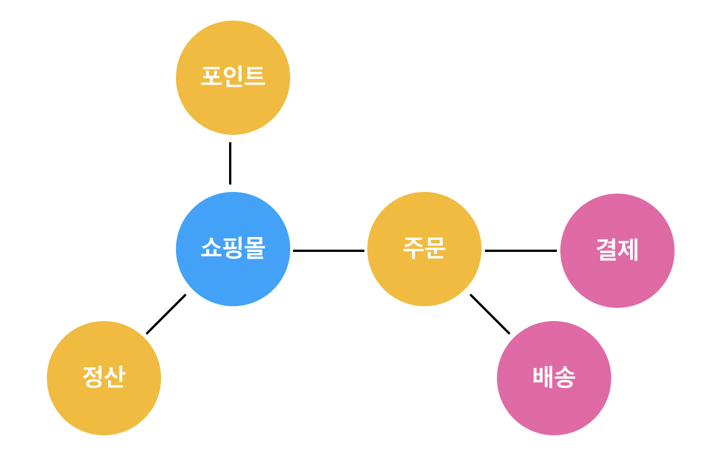
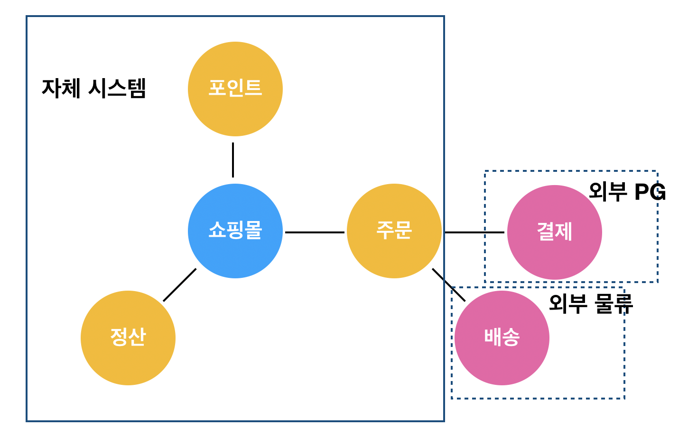
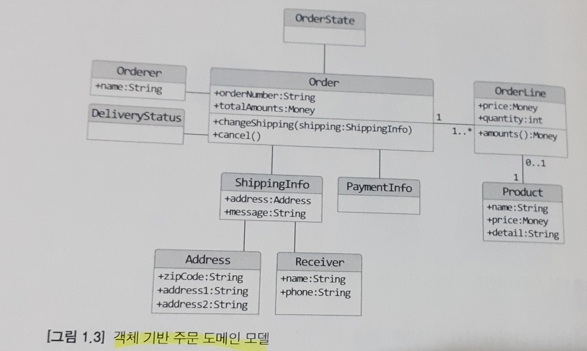
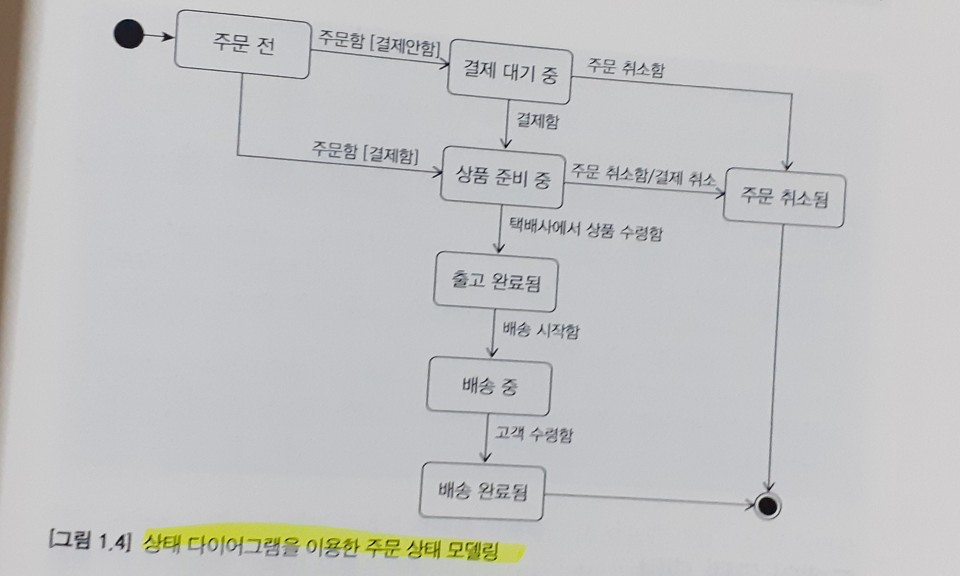
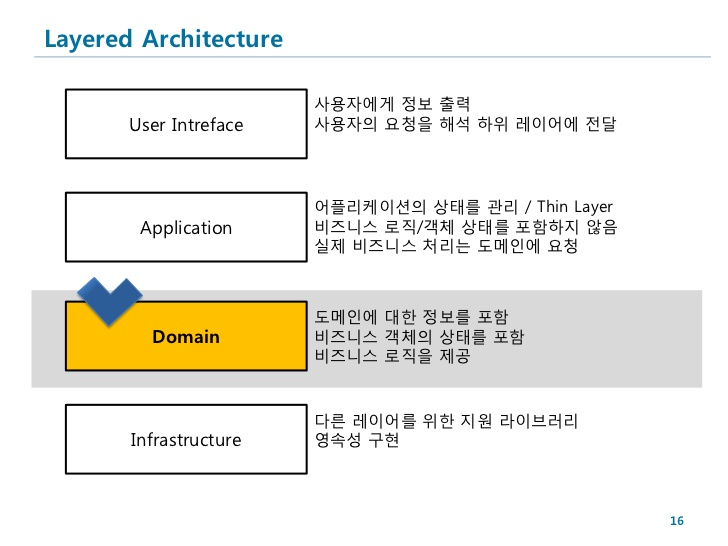

# 도메인 모델

## 도메인

소프트웨어로 해결하고자 하는 `문제 영역`

한 도메인은 다시 하위 도메인으로 나눌 수 있다.

**e.g.)**



한 하위 도메인은 다른 하위 도메인과 연동하여 완전한 기능을 제공한다.



하지만 소프트웨어가 도메인의 모든 기능을 제공하지는 않는다.

## 도메인 모델

여러 정의가 있지만 기본적으로 도메인 모델은 특정 도메인을 개념적으로 표현한 것이다.





도메인 모델은 기본적으로 **도메인 자체를 이해하기 위한 개념 모델**이다.
도메인을 이해하는데 도움이 된다면 표현 방식이 무엇인지는 중요하지 않다.

### 하위 도메인과 모델

각 하위 도메인이 다루는 영역이 서로 다르기 때문에 같은 용어라도 하위 도메인마다 의미가 달라질 수 있다.
모델의 각 구성요소는 특정 도메인을 한정할 때 비로소 의미가 완전해지므로 각 하위 도메인마다 별도로 모델을 만들어야한다.

## 도메인 모델 패턴



도메인 계층을 구현할 때 사용하는 객체 모델을 언급 할 때도 `도메인 모델`이란 용어를 사용한다.

`개념모델`은 데이터베이스, 트랜잭션, 성능, 인프라 등을 고려하지 않은 순수하게 문제를 분석한 결과물이다.

## 도메인 모델 도출

도메인을 모델링할 때 기본이 되는 작업은 **모델을 구성하는 핵심 구성요소, 규칙, 기능을 찾는 것**이다.
이 과정은 `요구사항`에서 출발한다.

**e.g.)**
- 최소 한 종류 이상의 상품을 주문해야함
- 한 상품을 한 개 이상 주문할 수 있음
- 주문 취소는 상품 배송 후엔 할 수 없음

아래는 요구 사항을 토대로 구현한 Order 도메인 모델이다.

```ts
export class Order {
    private orderLines: OrderLine[]; // 주문 항목 리스트
    private totalAmount: number;
    private state: OrderState;

    constructor(orderLines: OrderLine[]) {
        // 최소 한 종류 이상의 상품을 주문해야함
        this.verifyAtLeastOneOrMoreOrderLines(orderLines);

        this.orderLines = orderLines;
        this.calculateTotalAmount();
    }

    cancel() {
        // 주문 취소는 상품 배송 후엔 할 수 없음
        this.verifyCanCancel();
        this.state = OrderState.CANCELED;
    }

    private verifyAtLeastOneOrMoreOrderLines(orderLines: OrderLine[]) {
        if (!orderLines || !orderLines.length) {
            throw new Error('No order line');
        }
    }

    private calculateTotalAmount() {
        this.totalAmount = orderLines
            .map(orderLine => orderLine.getPrice() * orderLine.getAmount())
            .reduce((sum, curr) => sum + curr);
    }

    private verifyCanCancel() {
        if (this.state !== OrderState.SHIPPING || this.state !== OrderState.CANCELED) {
            throw new Error("Can't cancel the order");
        }
    }
}
```

## 엔티티

엔티티의 가장 큰 특징은 `식별자`를 갖는 것이다.
**식별자는 엔티티 객체마다 고유**해서 각 엔티티는 서로 다른 식별자를 갖는다.
엔티티의 식별자는 바뀌지 않고 고유하기 때문에 두 엔티티 객체의 식별자가 같으면 두 엔티티는 같다고 판단할 수 있다.

### 밸류타입

밸류 타입은 개념적으로 완전한 하나를 표현할 때 사용한다.

```ts
export class ShippingInfo {
    private receiverName: string;
    private reveiverPhoneNumber: string;
    private shippingAddress1: string;
    private shippingAddress2: string;
    private shippingZipcode: string;

    // ...
}
```

위 클래스를 아래와 같이 여러개의 밸류 타입으로 분리할 수 있다.

```ts
export class Receiver {
    private name: string;
    private phoneNumber: string;

    // ...
}

export class Address {
    private shippingAddress1: string;
    private shippingAddress2: string;
    private shippingZipcode: string;

    // ...
}

export class ShippingInfo {
    private receiver: Receiver;
    private address: Address;

    // ...
}
```

꼭 두 개 이상의 데이터를 가져야하는 것은 아니다.
의미를 명확하게 표현하기 위해 밸류 타입을 사용하는 경우도 있다.

```ts
export class Money {
    private static MIN_MONEY = 0;

    private value: number;

    constructor(value) {
        if (value <= Money.MIN_MONEY) {
            throw new Error('Money must be more than ' + Money.MIN_MONEY);
        }

        this.value = value;
    }

    // Money는 immutable(불변)으로 값이 바뀌지 않는다.
    add(money: Money) {
        return new Money(this.value + money.value);
    }
}
```

immutable로 구현한 이유는 setter 등으로 영향을 받지 않게하여 코드의 안전성을 높이기 위함이다.

### 도메인 모델에 set 메서드 쓰지 않기
단순 setter는 해당 기능에 대한 충분한 의미를 담지 못한다.
`completePayment()` vs `setOrderState()`
setter를 사용하지 않게 도메인 객체를 생성할 때 필요한 모든 값들을 전달해줘야한다.

---

### `DTO`
DTO는 Data Transfer Object의 약자로 프레젠테이션 계층과 도메인 계층이 데이터를 서로 주고받을 때 사용하는 일종의 구조체이다.

---

## 도메인 용어

코드를 작성할 때 도메인에서 사용하는 용어는 매우 중요하다.

```ts
// Which one can you understand its meaning?

export enum OrderState {
    STEP1, STEP2, STEP3, STEP4
}

export enum OrderState {
    PAYMENT_WAITING, PREPARING, SHIPPING, DELIVERY_COMPLETED
}
```

도메인에 어울리지 않는 단어를 사용하면 코드는 도메인과 점점 멀어지게 된다.
그러니, 도메인 용어에 알맞는 단어를 찾는 시간을 아깐워하지 말자.