# 아키텍쳐 구조

## 네 개의 영역

- 표현(UI) 영역:
`사용자의 요청을 받아 응용 영역에 전달`하고 응용 영역의 `처리 결과를 다시 사용자에게 보여주는 역할`

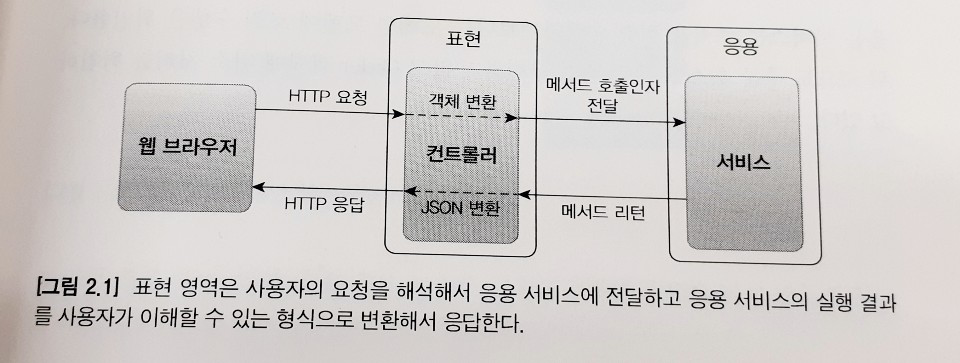

- 응용 영역:
표현 영역을 통해 사용자의 요청을 전달받는 응용 영역은 `시스템이 사용자에게 제공해야 할 기능을 구현`한다.
응용 영역은 로직을 직접 수행하기보다는 `도메인 모델에 로직 수행을 위임`한다.

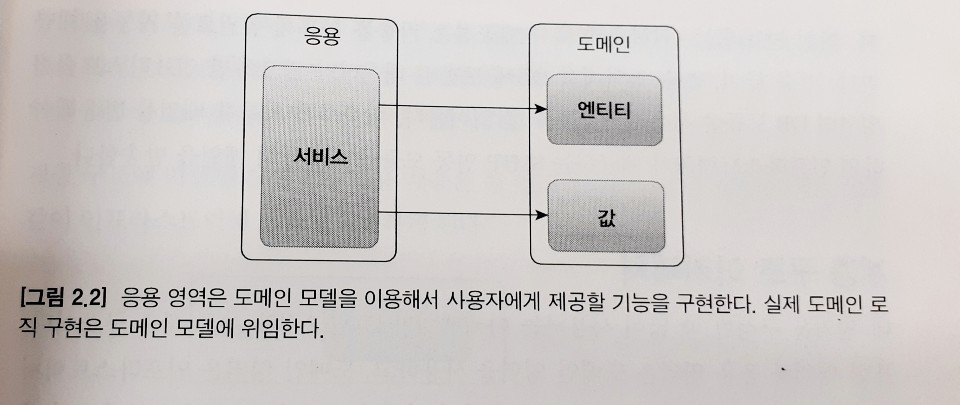

- 도메인 영역:
도메인 모델이 이 영역에 위치한다.
도메인 모델은 `도메인의 핵심 로직`을 구현한다.

- 인프라스트럭쳐 영역:
구현 기술에 대한 다룬다.
논리적인 개념을 표현하기보다는 `실제 구현`을 다룬다.

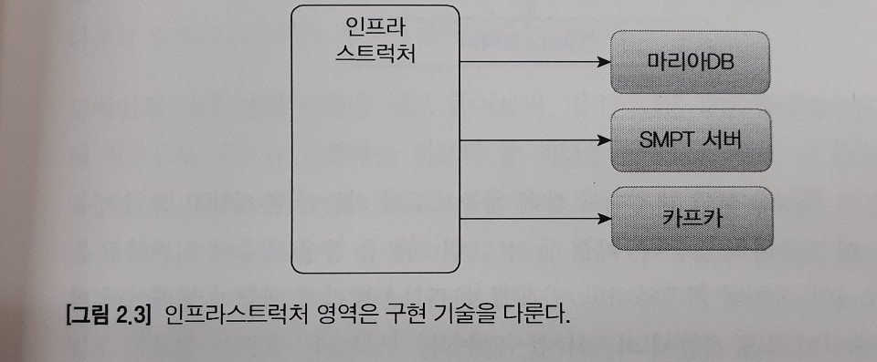

## 계층 구조 아키텍쳐

계층 구조는 그 특성상 `상위 계층에서 하위 계층으로의 의존`만 존재한다.

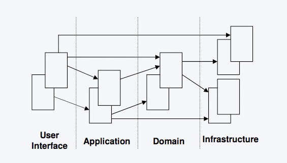

표현, 응용, 도메인 계층은 상세한 구현 기술을 다루는 인프라스트럭쳐 계층에 종속된다.

### DIP

- 고수준 모듈: 의미 있는 단일 기능을 제공하는 모듈
- 저수준 모듈: 하위 기능을 실제로 구현한 것

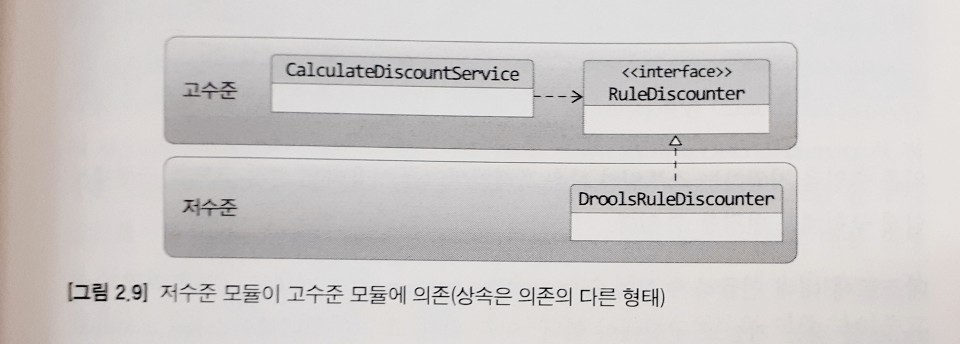

CalculatorDiscountService는 고수준 모듈이다.
고수준 모듈에서는 `고객 정보에서 룰을 이용해 할인 금액을 구하는` 기능이 어떤 기술로 구현했는지는 중요하지 않다.
그 역할과 기능이 중요하다.


```ts
export interface RuleDiscounter {
    Money applyRules(customer: Customer, orderLines: OrderLine[]);
}
```

```ts
export class CalculateDiscountService {
    private ruleDiscounter: RuleDiscounter;

    constructor(ruleDiscounter: RuleDiscounter) {
        this.ruleDiscounter = ruleDiscounter;
    }

    calculateDiscount(customerId: string, orderLines: OrderLine[]) : Money {
        const customer = this.findCustomer(customerId);
        return this.ruleDiscounter.applyRule(customer, orderLines);
    }
}
```

이러면 CalculateDiscountService는 구현 기술(저수준 모듈)에 의존하지 않게된다.
`DIP(Dependency Inversion Principle, 의존 역전 원칙)`를 적용하면 `저수준 모듈이 고수준 모듈에 의존`하게 된다.

---

### `DIP 주의사항`

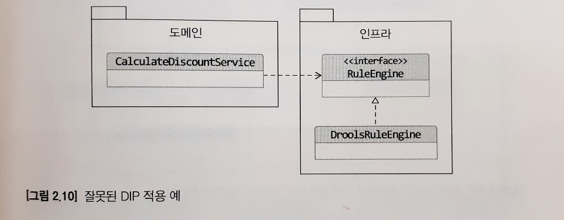

저수준 모듈에서 인터페이스를 추출하는 것은 DIP가 적용된 것이 아니다.
특정 구현은 응용 계층에서 중요하지 않다.
단지 규칙에 따라 로직을 수행하는 것이 중요할 뿐이다.

---

## 도메인 영역의 주요 구성요소

| 요소 | 설명 |
| - | - |
| Entity | `고유의 식별자`를 갖는 객체로 자신의 라이프사이클을 갖는다. |
| Value | 개념적으로 하나인 도메인 객체의 속성을 표현할 때 사용한다. |
| Aggregate | 관련된 엔티티와 밸류 객체를 개념적으로 하나로 묶은 것 |
| Repository | 도메인 모델의 영속성을 처리한다. |
| Domain Service | 특정 엔티티에 속하지 않은 도메인 로직을 제공한다.<br/>도메인 로직이 여러 엔티티와 밸류를 필요로 할 경우 `도메인 서비스`에서 로직을 구현한다.|

### 엔티티와 밸류

- 엔티티

실제 도메인 모델의 엔티티와 DB 관계형 모델의 엔티티는 같은 것이 아니다.
가장 큰 차이점은 `도메인 모델의 엔티티는 데이터와 함께 도메인 기능을 함께 제공`한다는 점이다.

도메인 모델의 엔티티는 단순히 데이터를 담고 있는 데이터 구조라기보다는 데이터와 함께 기능을 제공하는 객체이다.
도메인 관점에서 기능을 구현하고 기능 구현을 캡슐화해서 데이터가 임의로 변경되는 것을 막는다.

- 밸류

밸류는 불변으로 구현하는 것을 권장한다.
이는 밸류 타입 데이터를 변경할 때 객체 자체를 완전히 교체한다는 것을 의미한다.

###  애그리거트

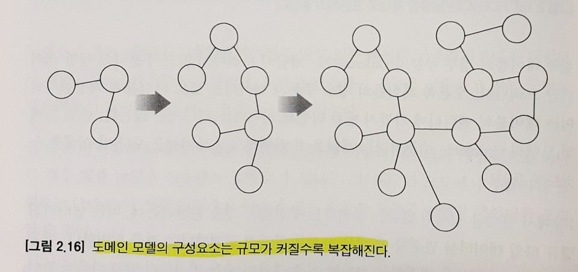

도메인이 커질수록 도메인 모델도 커지면서 많은 엔티티와 밸류가 출현한다.

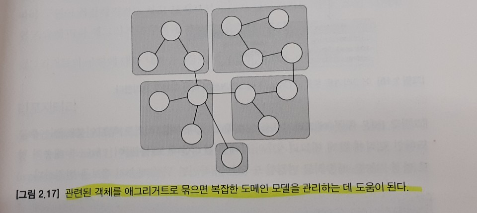

애그리거트는 `관련 객체를 하나로 묶은 군집`이다.
애그리거트를 사용하면 개별 객체가 아닌 관련 객체를 묶어서 객체 군집 단위로 모델을 바라볼 수 있게 된다.

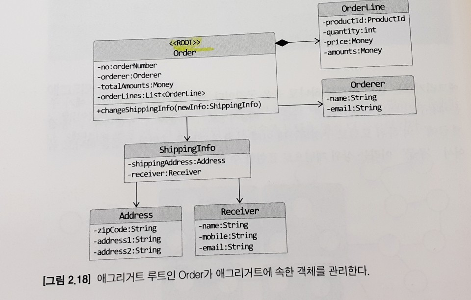

루트 엔티티는 애그리거트에 속해 있는 엔티티와 밸류 객체를 이용해서 애그리거트가 구현해야할 기능을 제공한다.

### 리포지터리

엔티티나 밸류가 요구사항에서 도출되는 도메인 모델이라면 리포지터리는 구현을 위한 도메인 모델이다.
도메인 모델 관점에서 리포지터리는 도메인 객체를 영속화하는 데 필요한 기능을 추상화한 것으로 `고수준 모듈`에 속한다.

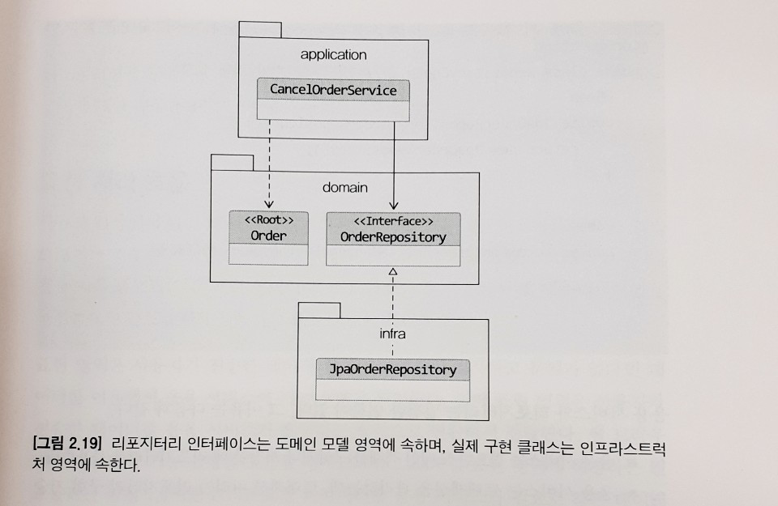

가장 기본이 되는 메서드는 다음의 두 메서드이다.
- 애그리거트를 저장하는 메서드
- 애그리거트 루트 식별자로 애그리거트를 조회하는 메서드

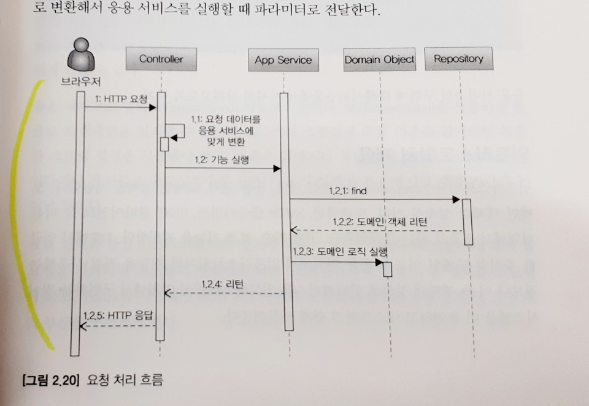

## 인프라스트럭쳐 개요

다른 영역에서 필요로 하는 프레임워크, 구현 기술, 보조 기능을 지원한다.
DIP에서 처럼 응용 영역에서 인프라스트럭쳐의 기능을 직접 사용하는 것보다,
이 두 영역에서 정의한 인터페이스를 인프라스트럭쳐 영역에서 구현하는 것이 시스템을 더 유연하고 테스트하기 쉽게 만들어준다.
