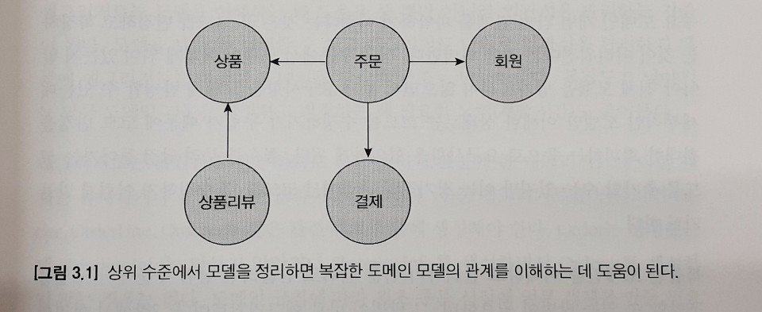
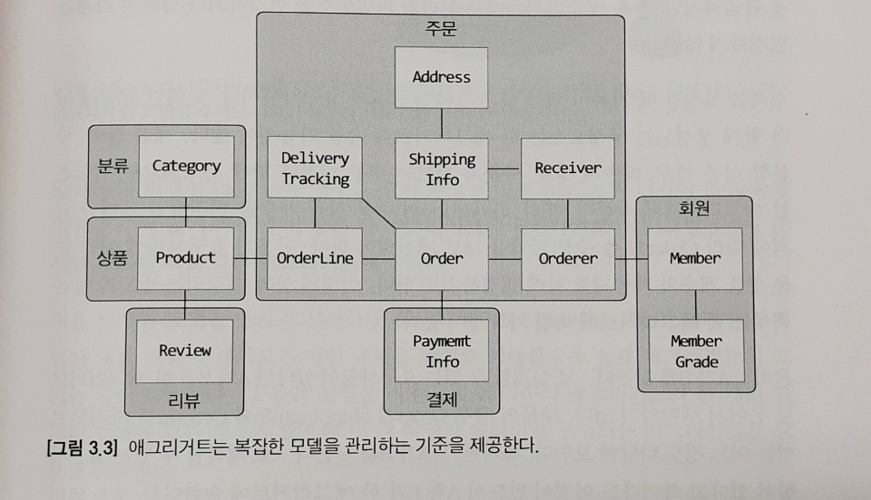
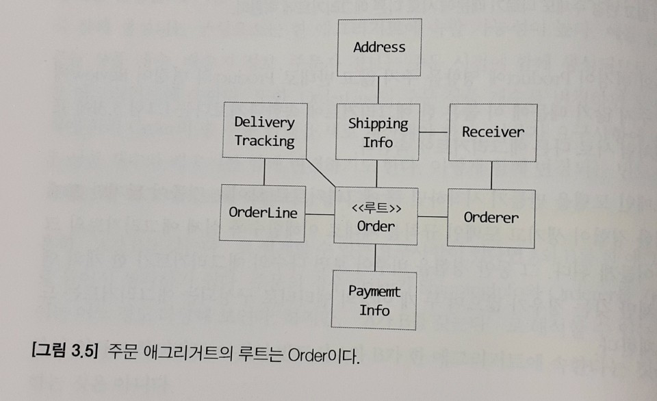
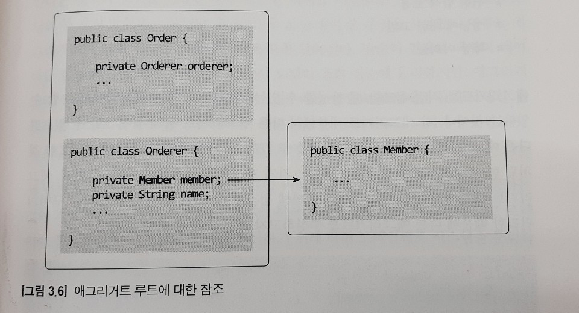
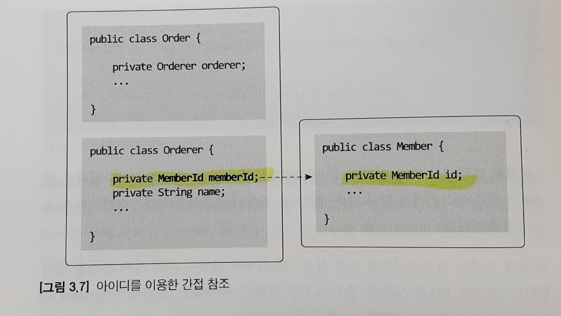
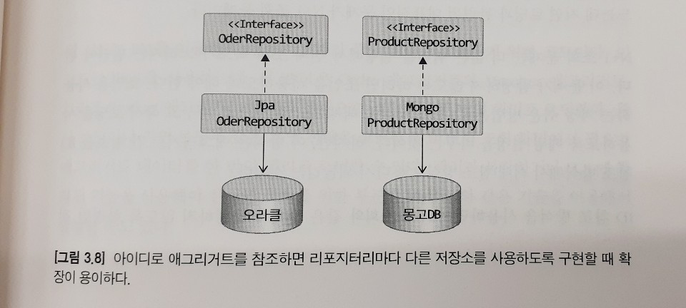

# Aggregate

## 애그리거트

도메인 객체 모델이 복잡해지면 개별 구성요소 위주로 모델을 이해하게 되고 전반적인 구조나 큰 수준에서 도메인 간의 관계를 파악하기 어려워진다.



복잡한 도메인을 이해하고 관리하기 쉬운 단위로 만들려면 `상위 수준에서 모델을 조망할 수 있는 방법`이 필요한데, 그 방법이 바로 애그리거트이다.
수많은 객체를 애그리거트로 묶어서 바라보면 좀 더 상위 수준에서 도메인 모델 간의 관계를 파악할 수 있다.



한 애그리거트에 속한 객체는 유사하거나 동일한 라이프사이클을 갖는다.

`애그리거트는 독립된 객체 군`이며, 각 애그리거트는 `자기 자신을 관리할 뿐 다른 애그리거트를 관리하지 않는다`.

'A가 B를 갖는다'로 해석할 수 있는 요구사항이 있다고 하더라도 이것은 반드시 A와 B가 한 애그리거트에 속한다는 것을 의미하는 것은 아니다
e.g.) 상품은 리뷰를 갖고 있다.

도메인에 대한 경험이 생기고 도메인 규칙을 제대로 이해할수록 실제 애그리거트의 크기는 줄어들게 된다.

## 애그리거트 루트

도메인 규칙을 지키려면 애그리거트에 속한 모든 객체가 정상 상태를 가져야한다.



### 도메인 규칙과 일관성

애그리거트 루트의 핵심 역할은 애그리거트의 일관성이 깨지지 않도록 하는 것이다.
이를 위해 `애그리거트 루트는 애그리거트가 제공해야 할 도메인 기능을 구현`한다.

애그리거트 루트가 아닌 다른 객체가 애그리거트에 속한 객체를 직접 변경하면 안된다.
이는 애그리거트 루트가 강제하는 규칙을 적용할 수 없어 모델의 일관성을 깨는 원인이 된다.

setter메서드를 사용하지 않는 것만으로도 자연스럽게 cancel이나 changePassword 처럼 의미가 더 잘 드러나는 이름을 사용하는 빈도가 높아진다.

### 애그리거트 루트의 기능 구현

애그리거트 루트는 애그리거트 내부의 다른 객체를 조합해서 기능을 완성한다.

```ts
export class Order {
    private OrderLines orderLines;

    changeOrderLines(newLines: OrderLine[]) {
        // 내부 객체의 기능을 조합해서 사용
        this.orderLines.changeOrderLines(newLines);
        this.totalAmounts = orderLines.getTotalAmounts();
    }
}
```

### 트랜잭션 범위

트랜잭션 범위는 `작을수록 좋다`.
잠금 대상이 많아진다는 것은 그만큼 동시에 처리할 수 있는 트랜잭션 갯수가 줄어든다는 것을 뜻하고 이는 전체적인 성능(처리량)을 떨어뜨린다.

동일하게 `한 트랜잭션에서는 한 개의 애그리거트만 수정`해야 한다.
부득이 하게 한 트랜잭션으로 두 개 이상의 애그리거트를 수정해야 한다면,
애그리거트에서 다른 애그리거트를 직접 수정하지 말고 응용 서비스에서 두 애그리거트를 수정하도록 구현해야한다.

```ts
export class OrderService {

    changeShippingInfo(id: OrderId, newShippingInfo: shippingInfo,
            useNewShippingAddressAsMemberAddress: boolean) {
        const order = this.orderRepository(orderId);
        order.shipTo(newShippingInfo);

        if (useNewShippingAddressAsMemberAddress) {
            order.getOrderer()
                .getCustomer()
                .changeAddress(newShippingInfo.getAddres());
        }
    }
}
```

## 리포지터리와 애그리거트

애그리거트는 개념적으로 하나이므로 리포지터리는 애그리거트 전체를 저장소에 영속화해야 한다.
리포지터리가 완전한 애그리거트를 제공하지 않으면, 필드나 값이 올바르지 않아 애그리거트 기능을 실행하는 도중 NPE 같은 문제가 발생할 수 있다.

## ID를 이용한 애그리거트 참조

한 객체가 다른 객체를 참조하는 것처럼 애그리거트도 다른 애그리거트를 참조한다.
애그리거트의 관리 주체가 애그리거트 루트이므로 애그리거트에서 다른 애그리거트를 참조한다는 것은 애그리거트의 루트를 참조한다는 것과 같다.



필드를 이용한 애그리거트 참조는 다음의 문제를 야기할 수 있다.
- 편한 탐색 오용
한 애그리거트 내부에서 다른 애그리거트 객체에 접근할 수 있으면 다른 애그리거트의 상태를 쉽게 변경할 수 있게 된다.
트랙잭션 범위에서 언급한 것 처럼 한 애그리거트가 관리하는 범위는 자기 자신으로 한정해야 한다.

- 성능에 대한 고민
JPA를 사용할 경우 참조한 객체를 lazy 로딩과 eager 로딩으로 가져올 수 있는데 이때문에 다양한 수에 대해 고민하게 된다.

- 확장의 어려움
사용자가 늘고 트래픽이 증가하면 자연스럽게 부하를 분산하기 위해 하위 도메인별로 시스템을 분리하기 시작한다.
이 과정에서 서로 다른 DMBS나 다른 종류의 데이터 저장소를 사용하기도 한다.
이는 더 이상 다른 애그리거트 루트를 참조하기 위해 단일 기술을 사용할 수 없음을 의미한다.



이 문제들을 완화하기 위해 ID를 이용하여 다른 애그리거트를 참조하는 것이다.



## 애그리거트를 팩토리로 사용하기

```ts
export class RegisterProductService {

    registerNewProduct(req: NewProductRequest): ProductId {
        const store = this.accoutRepository.findStoreById(req.getStoreId());
        
        // 코드가 나빠 보이진 않지만 중요한 도메인 로직 처리가 응용 서비스에 노출됨
        if (store.isBlocked()) {
            throw new Error('Store is blocked');
        }

        const productId = this.productRepository.nextId();
        this.productRepository.save(new Product(productId, store.getId(), req.getFoo()));

        return productId;
    }
}
```

```ts
export class Store {

    createProduct(newProductId: ProductId, foo: Foo): Product {
        if (this.isBlocked()) {
            throw new Error('Store is blocked');
        }

        return new Product(newProductId, this.id, foo);
    }

}

export class RegisterProductService {

    registerNewProduct(req: NewProductRequest): ProductId {
        const store = this.accoutRepository.findStoreById(req.getStoreId());
        const productId = this.productRepository.nextId();
        const product = store.createProduct(productId, req.getFoo());
        this.productRepository.save(product);

        return productId;
    }
}
```

Store의 Product를 생성하는 팩토리 메서드를 추가하면 Product를 생성할 때 필요한 데이터의 일부를 직접 제공하면서 동시에 중요한 도메인 로직을 함께 구현할 수 있게 된다.