# Bounded Context

## 도메인 모델과 경계

한 개의 모델로 여러 하위 도메인을 모두 표현하려고 시도하게 되면 하위 도메인에 맞지 않는 모델을 만들게 된다.
e.g.) 재고관리 - 상품, 배송 - 상품, 주문 - 상품

또한 논리적으로 같은 존재처럼 보이지만 하위 도메인에 따라 다른 용어를 사용하는 경우도 있다.
e.g.) 주문에서 상품이 -> 검색에서는 문서

하위 도메인마다 같은 용어라도 의미가 다르고 같은 대상이라도 지칭하는 용어가 다를 수 있기 때문에 한 개의 모델로 모든 하위 도메인을 표현하려는 시도는 올바른 방법이 아니며 표현할 수도 없다.

하위 도메인마다 사용하는 용어가 다르기 때문에 올바른 도메인 모델을 개발하려면 하위 도메인마다 모델을 만들어야 한다.
각 모델은 명시적으로 `구분되는 경계`를 가져서 섞이지 않도록 해야한다.

모델은 특정한 컨텍스트 아래에서 완전한 의미를 갖는다.
같은 제품이라도 카탈로그 컨텍스트와 재고 컨텍스트에서 의미가 서로 다르다.
이렇게 구분되는 경계를 `Bounded Context`라고 한다.

## Bounded Context

Bounded Context는 모델의 경계를 결정하며 한 개의 Bounded Context는 논리적으로 한 개의 모델을 갖는다.
`Bounded Context는 용어를 기준으로 구분`한다.
e.g.) 카탈로그 컨텍스트와 재고 컨텍스트는 다른 용어를 사용하므로 이 용어를 기준으로 컨텍스트를 분리할 수 있다.

Bounded Context는 도메인 모델을 구분하는 경계가 되기 때문에 Bounded Context는 구현하는 하위 도메인에 알맞은 모델을 포함한다.

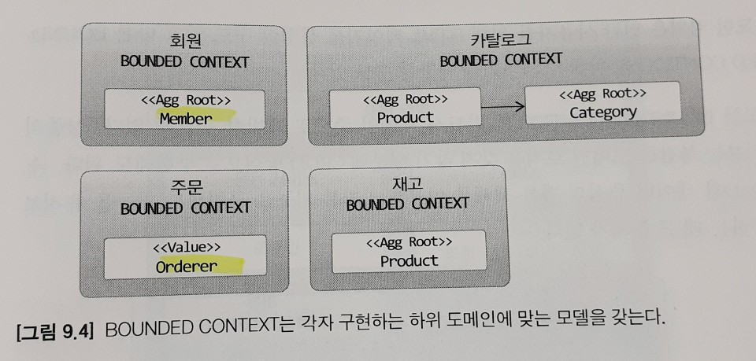

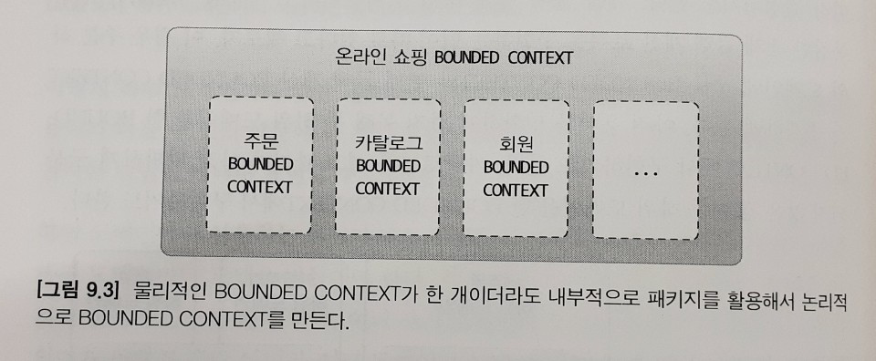

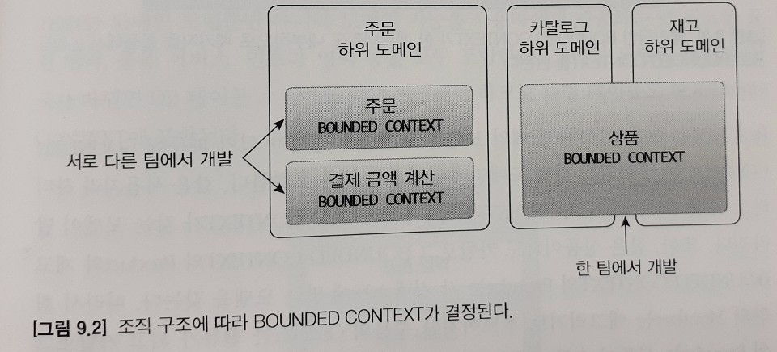

### Bounded Context의 구현

Bounded Context는 도메인 모델뿐만 아니라 도메인 기능을 사용자에게 제공하는 데 필요한 `표현 영역, 응용 서비스, 인프라 영역 등을 모두 포함`한다.

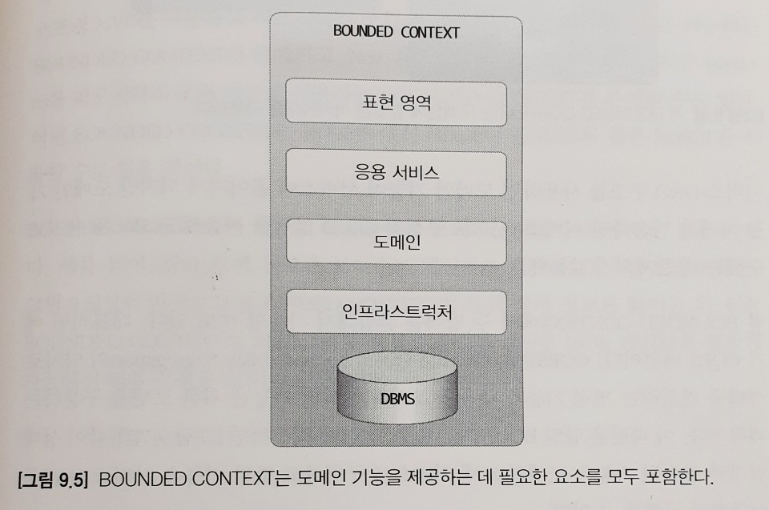

모든 Bounded Context를 반드시 도메인 주도로 개발할 필요는 없다.
간단한 경우엔 CRUD 방식으로 구현해도 된다. (유지 보수에 큰 문제가 없다.)

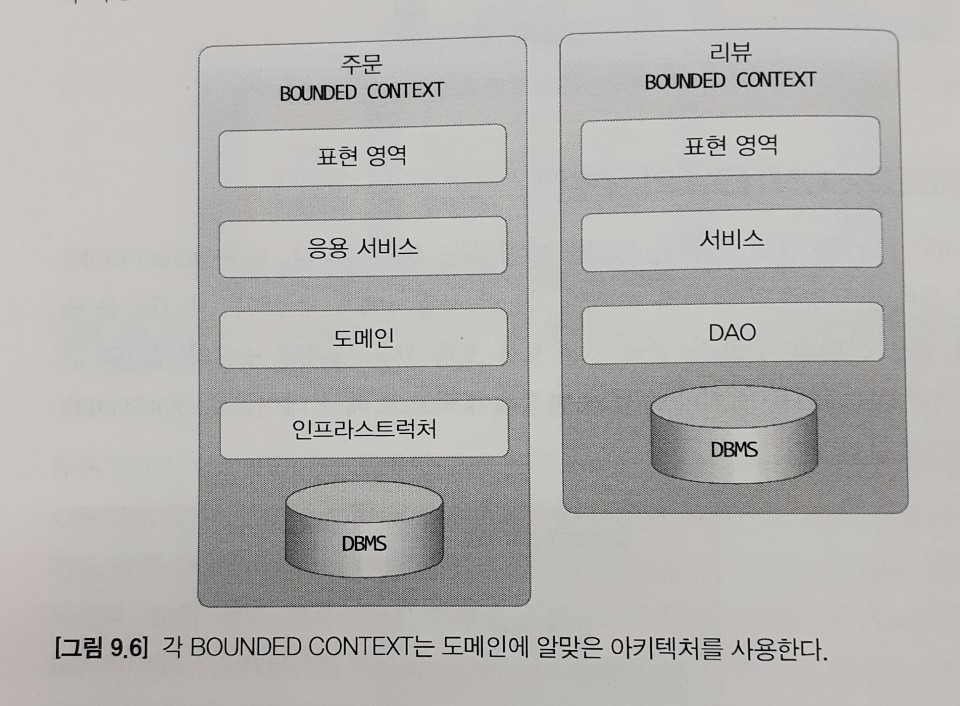

### Bounded Context 간 통합

관련된 Bounded Context를 개발하면 자연스럽게 두 Bounded Context 간 통합이 발생한다.

e.g.) 
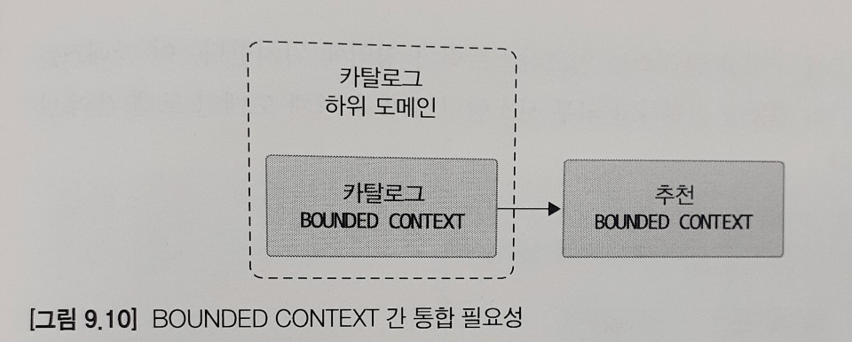

사용자 제품 상세 페이지를 볼 때, 보고 있는 상품과 유사한 상품 목록을 하단에 보여준다.

카탈로그 Bounded Context는 추천 Bounded Context로부터 추천 정보를 읽어와 추천 제품 목록을 제공한다.

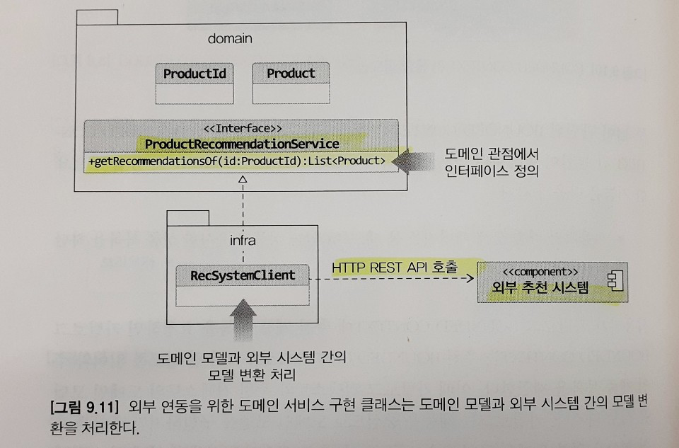

외부 추천 API Client는 추천 시스템의 모델을 받아와 카탈로그의 모델로 변환하는 작업을 처리한다.

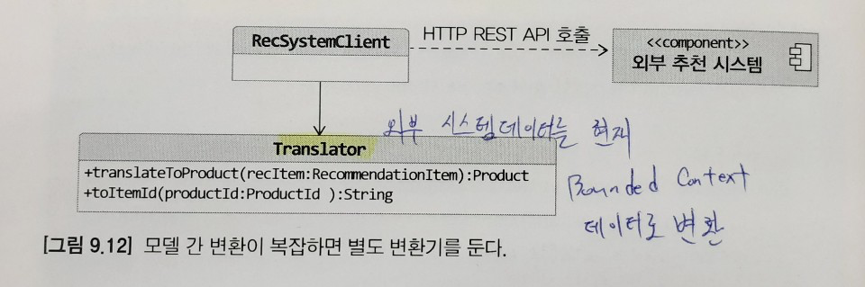

이 변환 과정이 복잡하다면 변환 처리를 위한 별도의 클래스(`Translator`)를 만들고 이 클래스에서 변환을 처리해도 된다.

### Bounded Context 간 관계

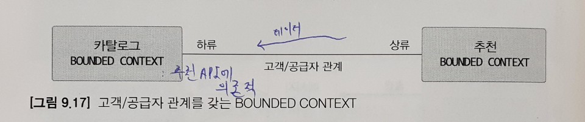

downstream 컴포넌트인 카탈로그 컨텍스트는 upstream 컴포넌트인 추천 컨텍스트가 제공하는 데이타와 기능에 의존한다.
그렇기 때문에 upstream 팀과 downstream 팀은 개발 계획을 서로 공유하고 일정을 협의해서 결정해야 한다.

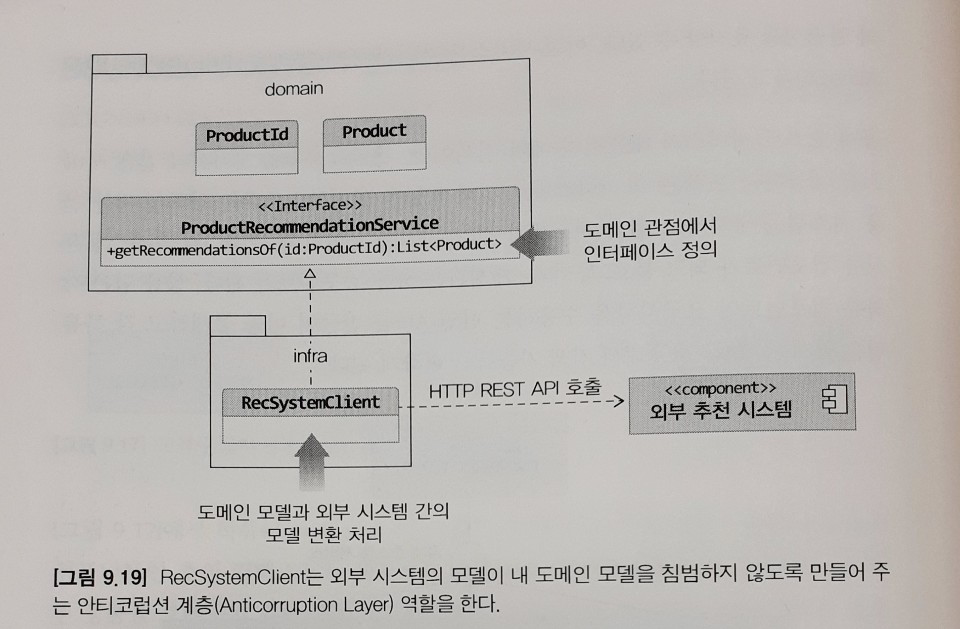

외부 시스템과의 연동을 처리하는데 `외부 시스템의 도메인이 내부 도메인 모델을 침범하지 않도록` 해야한다.
즉 내 모델이 깨지는 것을 막아주는 `Anticorruption Layer`가 필요하다.
이 계층을 통해 두 Bounded Context 간의 모델 변환을 처리해 주기 때문에 다른 Bounded Context의 모델에 영향을 받지 않고 내 도메인 모델을 유지할 수 있다.

혹은 두 Bounded Context가 `같은 모델을 공유하는 경우`도 있다.
두 팀이 공유하는 모델을 `공유 커널(Shared Kernel)`이라고 부른다.
공유 커널의 장점은 중복을 줄여준다는 것이다.

독립 방식 관계는 서로 통합하지 않는 방식이다.
두 Bounded Context 간에 통합을 하지 않으므로 서로 독립적으로 모델을 발전시킨다.

## Context Map

개별 Bounded Context에 매몰되면 전체를 보지 못할 때가 있다.
전체 비지니스를 조망할 수 있는 지도가 필요한데, 그것이 바로 컨텍스트 맵이다.

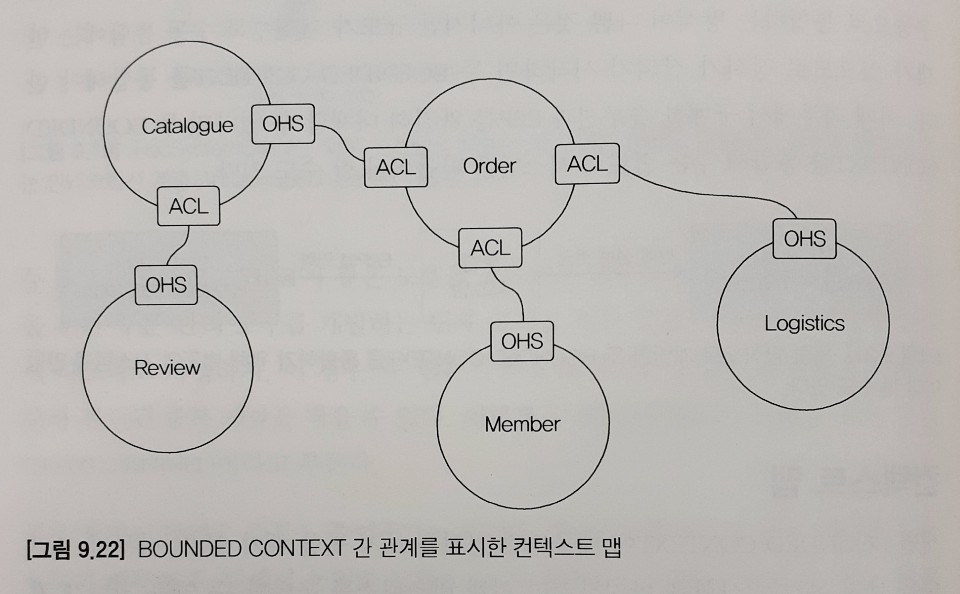