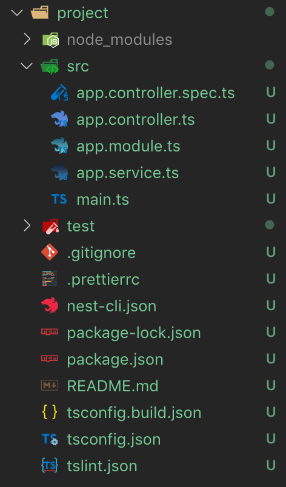

## 첫 단계
이 아티클에서는, Nest의 코어 기본을 배우게 될 겁니다.
Nest 애플리케이션의 기초 구조(building) 친숙해지기 위해서, 우리는 입문 레벨에서 많은 것들을 아우르는 간단한 CRUD 애플리케이션을 만들겁니다.

## 언어
우리는 Typescript와 사랑에 빠졌습니다. 하지만 무엇보다도 우린 Node.js를 사랑합니다.
그것이 Nest가 Typescript와 순수한 JavaScript 둘 다 호환 가능한 이유죠.
Nest는 최신 언어의 기능들의 이점들을 가져갑니다, 바닐라 JavaScript와 그 기능들을 사용하기 위해 우리는 Babel 컴파일러를 사용합니다.

## 전제 조건
여러분의 OS에 Node.js(>= 8.9.0)가 설치되어 있는지 확인해주세요.
Please make sure that Node.js (>= 8.9.0) is installed on your operating system.

## 구성
새로운 프로젝트를 구성하는 것은 Nest CLI를 사용하면 꽤나 간단합니다.
npm에 Nest CLI를 설치한 후, OS 터미널에서 아래 커맨드로 Nest 프로젝트를 생성할 수 있습니다.

```bash
$ npm i -g @nestjs/cli
$ nest new project
```

`project` 디렉토리가 `src/` 디렉토리 내에 위치한 몇 개의 코어 파일들과 생성됩니다.



컨벤션에 따라, 새로 생성된 모듈들은 각자의 전용 디렉토리가 있어야합니다.

| 파일 | 설명 |
| - | - |
| main.ts | 애플리케이션의 시작파일입니다. Nest 애플리케이션 인스턴스를 생성하기 위해 `NestFactofy`를 사용합니다 |
| fcm-push.module.ts | 애플리케이션의 루트 모듈인, AppModule을 정의합니다. |
| app.controller.ts | 단일 라우트를 가진 기본 컨트롤러 |

`main.ts`는 우리의 애플리케이션을 bootstrap하는 async 함수가 포함되어있습니다.

```ts
import { NestFactory } from '@nestjs/core';
import { ApplicationModule } from './app.module';

async function bootstrap() {
  const app = await NestFactory.create(ApplicationModule);
  await app.listen(3000);
}
bootstrap();
```

Nest 애플리케이션 인스턴스를 생성하기 위해, 우리는 `NestFactory`를 사용합니다.
`NestFactory`는 애플리케이션을 생성하기 위한 몇개의 static 메서드들을 노출하는, 가장 기초가 되는 class 중에 하나입니다, 
To create a Nest application instance, we are using the NestFactory. NestFactory is one of the most fundamental classes, it exposes a few static methods that allows creating application instance. 
`create()` 메서드는 `INestApplication` 인터페이스 기능을 수행하고, 이어지는 장들에서 설명되는 사용가능한 메서드 집합을 제공하는 객체를 반환합니다.

## 애플리케이션 실행하기

설치 과정이 완료되면, 다음 커맨드를 실행시켜 HTTP 서버를 시작시킬 수 있습니다.

```bash
$ npm run start
```

이 커맨드는 `src/main.ts` 내부에 선언된 port 위에 HTTP 서버를 실행시킵니다.

```ts
// src/main.ts
import { NestFactory } from '@nestjs/core';
import { FcmPushModule } from './app.module';

async function bootstrap() {
  const app = await NestFactory.create(FcmPushModule);
  await app.listen(3000);
}
bootstrap();
```

애플리케이션이 동작하는 동안, 브라우저를 열고 `http://localhost:3000`에 접속해보세요.
`Hello world!` 메시지를 확인할 수 있어야합니다.
