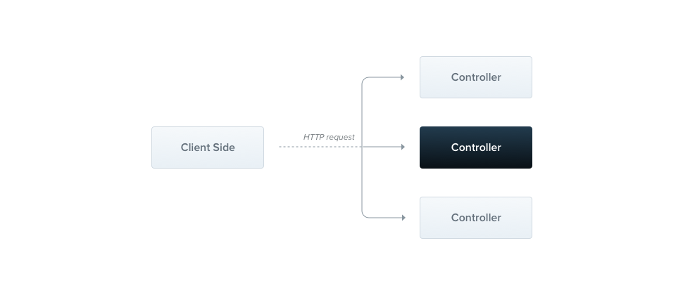

## 컨트롤러

컨트롤러는 들어오는 request를 핸들링하고 client로 응답을 반환하는 역할을 합니다.



컨트롤러의 목적은 애플리케이션을 위한 특정 요청을 받는 것입니다.
라우팅 메커니즘은 컨트롤러가 어떤 요청을 받을지를 제어합니다.
흔히, 각 컨트롤러는 다른 역할을 수행하기 위해 하나 이상, 다른 라우트를 가집니다.

기본 컨트롤러를 생성하기 위해, 우린 클래스와 데코레이터를 사용합니다.

데이레이터는 필요로하는 메타데이타와 함께 클래스와 결합되고, Nest가 라우팅 맵(요청을 이에 대응하는 컨트롤러와 묶습니다.)을 생성하게 합니다.

## 라우팅

In the following example we'll use the @Controller() decorator which is required to define a basic controller. We'll specify an optional prefix of cats. Using a prefix in a Controller decorator allows us to avoid repeating ourselves when routes could potentially share a common prefix.

```ts
// cats.controller.ts
import { Controller, Get } from '@nestjs/common';

@Controller('cats')
export class CatsController {
  @Get()
  findAll() {
    return 'This action returns all cats';
  }
}
```

### HINT

CLI를 사용하여 컨트롤러를 생성하려면, 단순히 아래 커맨드를 실행하면 됩니다.
```bash
$ nest g controller cats
```

---

findAll() 메서드의 @Get() 데코레이터는 Nest가 

- Standard (추천):
JavaScript 객체나 배열을 리턴할 때, 자동으로 JSON으로 serialize 된다.
하지만 string을 리턴할 때, Nest는 serialize 하지 않은 채 string을 보낸다.
더 나아가, 201을 사용하는 POST 요청을 제외하고, 응답의 상태 코드는 기본으로 200이다.
이는 핸들러 레벨에서 `@HttpCode(...)` 데코레이터를 추가하여 쉽게 변경할 수 있다.

- Library-specific:
우리는 함수내에 `@Res()` 데코레이터를 사용하여, 라이브러리에 특정한 응답 객체를 주입하여 사용할 수 있습니다.
(e.g. findAll(@Res() response)).

### ** 경고 **

두 개의 접근 방식을 동시에 사용하는 것은 금지됩니다.
Nest는 핸들러가 `@Res()`를 사용하는지, `@Next()`를 사용하는지 감지합니다.
만약 두 접근 방식이 동시에 사용된다면, 
기본 접근 방식은 자동으로 기능이 꺼지고(disabled), 더 이상 기대하는 대로 동작하지 않게됩니다.

---

## Request 객체

많은 엔드포인트들은 클라이언트 요청 상세 정보에 접근해야합니다.
사실, Nest는 라이브러리에 특정한(기본으로 express) request 객체를 사용합니다.
결과적으로, 우리는 Nest가 @Req() 데코레이터를 사용하여 핸들러에 request 객체를 주입하도록 할 수 있습니다.

```ts
// cats.controller.ts
import { Controller, Get, Req } from '@nestjs/common';

@Controller('cats')
export class CatsController {
  @Get()
  findAll(@Req() request) {
    return 'This action returns all cats';
  }
}
```

request 객체는 HTTP request를 나타내고 query string, parameter, HTTP headers, body(여기에서 더 읽어보세요 http://expressjs.com/en/api.html#req)와 같은 프로퍼티를 갖고있습니다.
대부분의 경우, 이 프로퍼티를 직접 가져올 필요는 없습니다.
대신에 `@Body()`나 `@Query()`와 같은 바로 사용가능한 전용 데코레이터를 사용할 수 있습니다.
아래는 기본 express 객체와 Nest에서 제공하는 데코레이터를 비교한 표입니다.

| Nest Decorator | express object |
| - | - |
| @Request() | req |
| @Response() | res |
| @Next() | next |
| @Session() | req.session |
| @Param(param?: string) | req.params / req.params[param] |
| @Body(param?: string) | req.body / req.body[param] |
| @Query(param?: string) | req.query / req.query[param] |
| @Headers(param?: string) | req.headers / req.headers[param] |

### Hint
커스텀 데코레이터를 생성하는 법을 배우려면 [이 챕터](https://docs.nestjs.com/v5/custom-decorators)를 참고하세요.

## Resources

우리는 GET 라우트로 `cats` 리소스를 가져오는 엔드포인트를 정의했습니다.
새로운 리소스들을 생성하는 방법을 제공하는 것도 좋을 겁니다.
이를 위해서, POST 핸들러를 만들어봅시다.

We defined an endpoint to fetch the cats resource (GET route). It'll also be great to provide a way of creating new records as well. For this, let's create the POST handler:

```ts
//cats.controller.ts
import { Controller, Get, Post } from '@nestjs/common';

@Controller('cats')
export class CatsController {
  // new POST handler
  @Post()
  create() {
    return 'This action adds a new cat';
  }

  @Get()
  findAll() {
    return 'This action returns all cats';
  }
}
```

이렇게나 간단합니다.
Nest는 같은 방식으로 다른 HTTP Method들에 대해, 다음과 같이 제공합니다.
`@Put()`, `@Delete()`, `@Patch()`, `@Options()`, `@Head()`, `@All()`.
모두 각자 해당하는 HTTP Method를 나타냅니다.

## 라우트 와일드카드

패턴에 기반한 라우트도 또한 지원합니다.
예를 들어 *(asterisk)가 와일드카드로 사용되면, 문자들의 어떤 조합이든 매칭됩니다.

```ts
@Get('ab*cd')
findAll() {
  return 'This route uses a wildcard';
}
```

위 라이트 경로는 `abcd`, `ab_cd`, `abecd` 등등에 매칭됩니다.
`?`, `+`, `*`, `()`는 정규 표현식에 대응됩니다.
`-`과 `.`은 해당 문자 그대로 경로로 인식됩니다.

## 상태 코드

위에서 언

```ts
@Post()
@HttpCode(204)
create() {
  return 'This action adds a new cat';
}
```