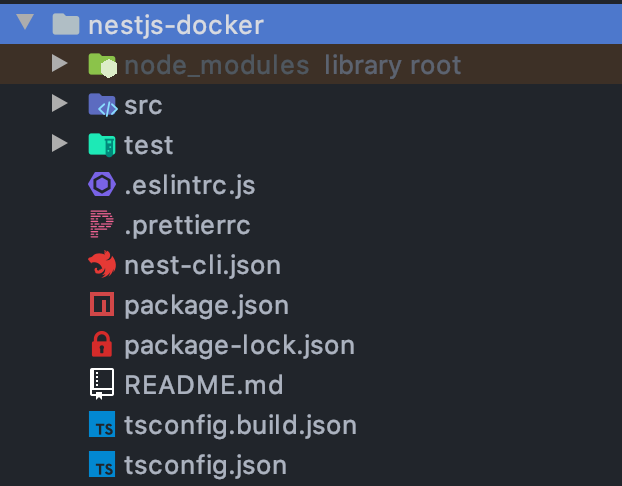
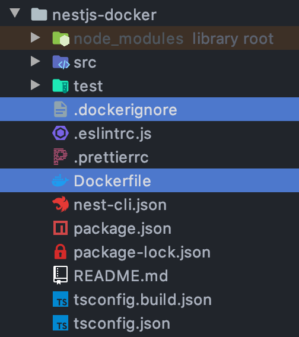

Nest.js 기본 프로젝트를 Docker image로 만들어보고 해당 image를 container로 실행시키는 과정을 알아보자

코드 예제는 [여기](https://github.com/ivvve/What-I-study/tree/master/JS/NestJS/nestjs-docker)에 있다.

1. 프로젝트 생성

먼저 Nest.js CLI를 통해 프로젝트를 생성한다.

```bash
$ nest new nestjs-docker
```



2. Docker image 생성을 위한 세팅

다음 Docker image를 만들기 위해 프로젝트 디렉토리에 다음과 같이 `Dockerfile`을 생성한다.

```docker
# Step 1
## base image for Step 1: Node 10
FROM node:10 AS builder
WORKDIR /app
## 프로젝트의 모든 파일을 WORKDIR(/app)로 복사한다
COPY . .
## Nest.js project를 build 한다
RUN npm install
RUN npm run build


# Step 2
## base image for Step 2: Node 10-alpine(light weight)
FROM node:10-alpine
WORKDIR /app
## Step 1의 builder에서 build된 프로젝트를 가져온다
COPY --from=builder /app ./
## application 실행
CMD ["npm", "run", "start:prod"]
```

image build는 위와 같이 2 Step으로 이뤄지며,
`Step 1`은 `ts->js`compile을 하기 위한 것이고,
`Step 2`는 가벼운 node alpine image로 compile된 application을 실행하기 위함이다.

여기서 `Step 1`에서 프로젝트의 파일을 옮길 때 옮길 필요없는 `dist`, `node_mouldes` 파일은 ignore하기 위해 `.dockerignore`파일을 생성한다.

```
node_modules
dist
```



3. Docker image build

이제 build를 해보자

```bash
$ docker build -t devson/nestjs-docker-example .
```

정상적으로 build가 됐다면 local Docker에 생성한 Docker image가 있을 것이다.

```bash
$ docker images

REPOSITORY                     TAG                 IMAGE ID            CREATED             SIZE
devson/nestjs-docker-example   latest              7be3ab375f98        13 minutes ago      252MB
```

4. Run Docker image

이제 Docker image가 제대로 build가 되었는지 실행해보자

```bash
$ docker run devson/nestjs-docker-example

> nestjs-docker@0.0.1 start:prod /app
> node dist/main

[Nest] 17   - 03/23/2020, 1:51:19 PM   [NestFactory] Starting Nest application...
[Nest] 17   - 03/23/2020, 1:51:19 PM   [InstanceLoader] AppModule dependencies initialized +32ms
[Nest] 17   - 03/23/2020, 1:51:19 PM   [RoutesResolver] AppController {}: +10ms
[Nest] 17   - 03/23/2020, 1:51:19 PM   [RouterExplorer] Mapped {, GET} route +7ms
[Nest] 17   - 03/23/2020, 1:51:19 PM   [NestApplication] Nest application successfully started +4ms
```

위와 같이 Application이 정상적으로 잘 실행되는 것을 확인할 수 있다.

---

참고:
- https://dev.to/abbasogaji/how-to-dockerize-your-nestjs-app-for-production-2lmf
- https://javacan.tistory.com/entry/docker-start-7-create-image-using-dockerfile
