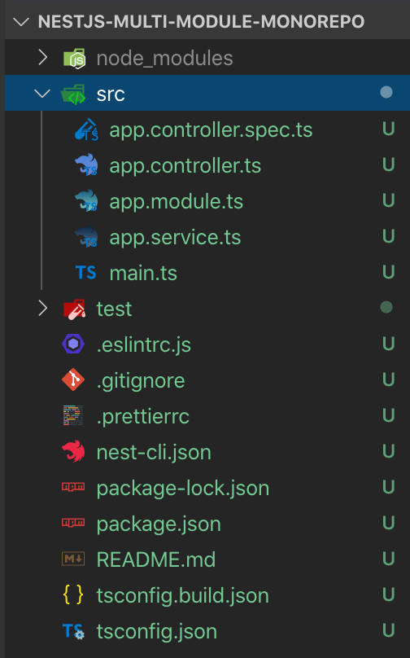
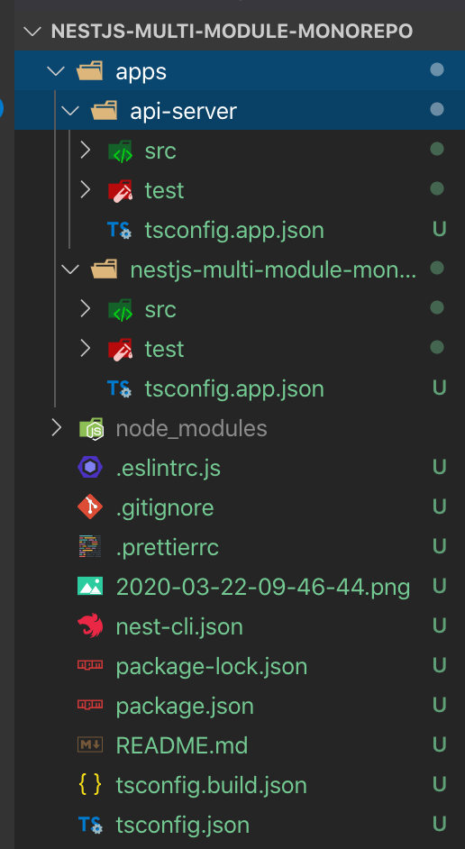
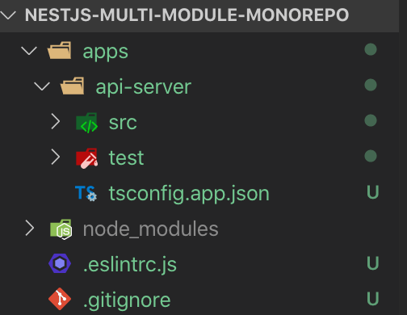

서비스가 커짐에 따라서 여러 기능이 추가가 되는데, 그러면서 애플리케이션의 복잡도가 높아져갈 수 밖에 없다.
개인적으로 개발자로서 중요한 것들 중 하나는 이러한 복잡도를 효율적으로 다루면서 동시에 잘 짜여진 구조를 만들어가는 것이라고 생각한다.
이러한 복잡도를 줄이는 방법으로는 여러가지가 있겠지만, 그 중에서 애플리케이션의 기능을 여러 모듈로 쪼갠 뒤 이를 조합하여 하나 또는 여러개의 애플리케이션을 만드는 Multi Module 방식이 있다.

이번 포스팅에서는 Nest.js에서 제공하는 [Monorepo Mode](https://docs.nestjs.com/cli/monorepo) 기능을 통해 Multi Module + Monorepo project를 구축해보도록 하겠다.

코드는 [여기](https://github.com/ivvve/What-I-study/tree/master/JS/NestJS/nestjs-multi-module-monorepo)에서 확인 가능하다

## 프로젝트 생성

```bash
$ nest new nestjs-multi-module-monorepo
```



전형적인 Nest.js project를 생성할 때 볼 수 있는 패키지 구조이다.
이 형태는 standard mode로 하나의 application을 만드는 구조이다.

## Monorepo Mode

standard mode CLI를 통해 Nest.js의 monorepo mode로 손쉽게 변경할 수 있다.

```bash
$ nest generate app api-server
```

그러면 기존 `src` 디렉토리가 아래와 같이 `apps`로 바뀌고,
`apps` 디렉토리 밑에 기존 standard mode일 때의 app과 방금 만든 `api-server` app이 있다.



이런 식으로 Nest.js에서 하나의 repository에서 여러개의 application을 관리할 수 있게된다.

프로젝트 root 디렉토리의 nest-cli.json을 보면 projects에 다음과 같이 2개의 application이 있는 것을 확인할 수 있다.

```js
// nest-cli.json
{
  "collection": "@nestjs/schematics",
  "sourceRoot": "apps/nestjs-multi-module-monorepo/src",
  "monorepo": true,
  "root": "apps/nestjs-multi-module-monorepo",
  "compilerOptions": {
    "webpack": true,
    "tsConfigPath": "apps/nestjs-multi-module-monorepo/tsconfig.app.json"
  },
  "projects": {
    "nestjs-multi-module-monorepo": { // app 1
      "type": "application",
      "root": "apps/nestjs-multi-module-monorepo",
      "entryFile": "main",
      "sourceRoot": "apps/nestjs-multi-module-monorepo/src",
      "compilerOptions": {
        "tsConfigPath": "apps/nestjs-multi-module-monorepo/tsconfig.app.json"
      }
    },
    "api-server": { // app 2
      "type": "application",
      "root": "apps/api-server",
      "entryFile": "main",
      "sourceRoot": "apps/api-server/src",
      "compilerOptions": {
        "tsConfigPath": "apps/api-server/tsconfig.app.json"
      }
    }
  }
}
```

`api-server`를 사용할 것이기 때문에 `nestjs-multi-module-monorepo`를 지우고, `apps/nestjs-multi-module-monorepo` 디렉토리도 지운다.

```js
// nest-cli.json
{
  "collection": "@nestjs/schematics",
  "sourceRoot": "apps/nestjs-multi-module-monorepo/src",
  "monorepo": true,
  "root": "apps/nestjs-multi-module-monorepo",
  "compilerOptions": {
    "webpack": true,
    "tsConfigPath": "apps/nestjs-multi-module-monorepo/tsconfig.app.json"
  },
  "projects": {
    "api-server": {
      "type": "application",
      "root": "apps/api-server",
      "entryFile": "main",
      "sourceRoot": "apps/api-server/src",
      "compilerOptions": {
        "tsConfigPath": "apps/api-server/tsconfig.app.json"
      }
    }
  }
}
```



CLI를 통해 monorepo mode를 관리할 때 이 `nest-cli.json`이 중요하기 때문에 어떤 설정이 있는지 확인하는 걸 추천한다.

이제 `api-server` app을 실행해서 정상적으로 app이 추가됐는지 확인해보자

```bash
$ nest start api-server # nest-cli.json의 projects에 있는 그 `api-server` 이다

Starting type checking service...
Hash: 808e82ee29f10781548e
Version: webpack 4.42.0
Time: 5539ms
Built at: 03/22/2020 9:54:00 AM
Entrypoint main = apps/api-server/main.js
[Nest] 98604   - 03/22/2020, 9:54:00 AM   [NestFactory] Starting Nest application...
[Nest] 98604   - 03/22/2020, 9:54:00 AM   [InstanceLoader] AppModule dependencies initialized +17ms
[Nest] 98604   - 03/22/2020, 9:54:00 AM   [RoutesResolver] AppController {}: +6ms
[Nest] 98604   - 03/22/2020, 9:54:00 AM   [RouterExplorer] Mapped {, GET} route +3ms
[Nest] 98604   - 03/22/2020, 9:54:00 AM   [NestApplication] Nest application successfully started +2ms
```

> `--watch`, `-w` 옵션을 추가하면 코드가 변경될 때마다 hot reload 된다.

프로젝트를 생성하고 이를 Monorepo Mode로 변경하면서 애플리케이션을 만드는 방법에 대해 짧게 알아보았다.
다음은 이 `api-server` 애플리케이션에서 사용할 Module을 만들도록 하겠다.
