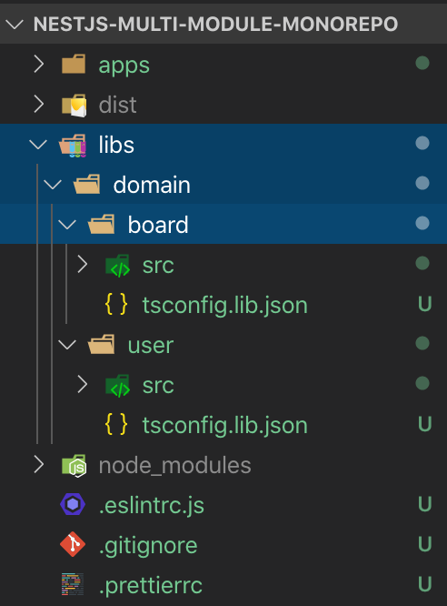

생성한다
```bash
$ nest generate library user 

? What prefix would you like to use for the library (default: @app)? @domain # 해당 library의 prefix 입력
CREATE libs/user/tsconfig.lib.json (218 bytes)
CREATE libs/user/src/index.ts (63 bytes)
CREATE libs/user/src/user.module.ts (182 bytes)
CREATE libs/user/src/user.service.spec.ts (446 bytes)
CREATE libs/user/src/user.service.ts (88 bytes)
UPDATE nest-cli.json (788 bytes)
UPDATE package.json (2156 bytes)
UPDATE tsconfig.json (486 bytes)
```

다음과 같이 


```json
// tsconfig.json
{
  "name": "nestjs-multi-module-monorepo",
  "version": "0.0.1",
  // ...
  "jest": {
    // ...
    "roots": [
      "<rootDir>/apps/",
      "<rootDir>/libs/"
    ],
    "moduleNameMapper": {
      "@domain/user/(.*)": "<rootDir>/libs/user/src/$1",
      "@domain/user": "<rootDir>/libs/user/src"
    }
  }
}
```

```json
// tsconig.json
{
  "compilerOptions": {
    "module": "commonjs",
    // ...
    "paths": {
      "@domain/user": [
        "libs/user/src"
      ],
      "@domain/user/*": [
        "libs/user/src/*"
      ]
    }
  },
  // ...
}
```

```json
// nest-cli.json
{
  "collection": "@nestjs/schematics",
  "sourceRoot": "apps/nestjs-multi-module-monorepo/src",
  "monorepo": true,
  "root": "apps/nestjs-multi-module-monorepo",
  "compilerOptions": {
    "webpack": true,
    "tsConfigPath": "apps/nestjs-multi-module-monorepo/tsconfig.app.json"
  },
  "projects": {
    "api-server": {
      "type": "application",
      "root": "apps/api-server",
      "entryFile": "main",
      "sourceRoot": "apps/api-server/src",
      "compilerOptions": {
        "tsConfigPath": "apps/api-server/tsconfig.app.json"
      }
    },
    "user": {
      "type": "library",
      "root": "libs/user",
      "entryFile": "index",
      "sourceRoot": "libs/user/src",
      "compilerOptions": {
        "tsConfigPath": "libs/user/tsconfig.lib.json"
      }
    }
  }
}
```

libs 하위를 카테고리화 시켜서 더 나누겠음

디렉토리를 옮긴 뒤 변경할 것
1. /libs/domain/user/tsconfig.lib.json
`extends`, `compilerOptions.outDir`

```json
{
  "extends": "../../../tsconfig.json", // 변경
  "compilerOptions": {
    "declaration": true,
    "outDir": "../../../dist/libs/domain/user" // 변경
  },
  "include": ["src/**/*"],
  "exclude": ["node_modules", "dist", "test", "**/*spec.ts"]
}
```

2. /package.json
```json
{
  "name": "nestjs-multi-module-monorepo",
  "version": "0.0.1",
  // ...
  "jest": {
    // ...
    "roots": [
      "<rootDir>/apps/",
      "<rootDir>/libs/"
    ],
    "moduleNameMapper": {
      "@domain/user/(.*)": "<rootDir>/libs/domain/user/src/$1", // 변경
      "@domain/user": "<rootDir>/libs/domain/user/src" // 변경
    }
  }
}
```

3. /tsconfig.json
```json
{
  "compilerOptions": {
    "module": "commonjs",
    "declaration": true,
    "removeComments": true,
    "emitDecoratorMetadata": true,
    "experimentalDecorators": true,
    "target": "es2017",
    "sourceMap": true,
    "outDir": "./dist",
    "baseUrl": "./",
    "incremental": true,
    "paths": {
      "@domain/user": [
        "libs/domain/user/src" // 변경
      ],
      "@domain/user/*": [
        "libs/domain/user/src/*" // 변경
      ]
    }
  },
  "exclude": [
    "node_modules",
    "dist"
  ]
}
```

4. /nest-cli.json
```json
{
  "collection": "@nestjs/schematics",
  "sourceRoot": "apps/nestjs-multi-module-monorepo/src",
  "monorepo": true,
  "root": "apps/nestjs-multi-module-monorepo",
  "compilerOptions": {
    "webpack": true,
    "tsConfigPath": "apps/nestjs-multi-module-monorepo/tsconfig.app.json"
  },
  "projects": {
    "api-server": {
      "type": "application",
      "root": "apps/api-server",
      "entryFile": "main",
      "sourceRoot": "apps/api-server/src",
      "compilerOptions": {
        "tsConfigPath": "apps/api-server/tsconfig.app.json"
      }
    },
    "domain-user": { // 변경 user => domain-user
      "type": "library",
      "root": "libs/domain/user", // 변경
      "entryFile": "index",
      "sourceRoot": "libs/domain/user/src",
      "compilerOptions": {
        "tsConfigPath": "libs/domain/user/tsconfig.lib.json" // 변경
      }
    }
  }
}
```

build 해서 테스트

```bash
$ nest build domain-user
Starting type checking service...
Hash: e9952824a27401aaa482
Version: webpack 4.42.0
Time: 5851ms
Built at: 03/22/2020 10:21:05 AM
Entrypoint main = libs/domain/user/index.js
```


이 과정이 번거로울 순 있지만 좀 더 다양한 환경에서 사용하는 케이스를 생각하고 해보았다.


---

board도 동일하게 생성한 뒤 libs/domain 으로 옮기고 위 4개의 파일을 수정한다.


```bash
$ nest generate library board

? What prefix would you like to use for the library (default: @app)? @domain
CREATE libs/board/tsconfig.lib.json (219 bytes)
CREATE libs/board/src/index.ts (65 bytes)
CREATE libs/board/src/board.module.ts (187 bytes)
CREATE libs/board/src/board.service.spec.ts (453 bytes)
CREATE libs/board/src/board.service.ts (89 bytes)
UPDATE nest-cli.json (1047 bytes)
UPDATE package.json (2280 bytes)
UPDATE tsconfig.json (622 bytes)
```



```json
// libs/domain/board/tsconfig.lib.json
{
  "extends": "../../../tsconfig.json",
  "compilerOptions": {
    "declaration": true,
    "outDir": "../../../dist/libs/domain/board"
  },
  "include": ["src/**/*"],
  "exclude": ["node_modules", "dist", "test", "**/*spec.ts"]
}
```

```json
// package.json
{
  "name": "nestjs-multi-module-monorepo",
  "version": "0.0.1",
  // ...
  "jest": {
    "moduleFileExtensions": [
      "js",
      "json",
      "ts"
    ],
    "rootDir": ".",
    "testRegex": ".spec.ts$",
    "transform": {
      "^.+\\.(t|j)s$": "ts-jest"
    },
    "coverageDirectory": "./coverage",
    "testEnvironment": "node",
    "roots": [
      "<rootDir>/apps/",
      "<rootDir>/libs/"
    ],
    "moduleNameMapper": {
      "@domain/user/(.*)": "<rootDir>/libs/domain/user/src/$1",
      "@domain/user": "<rootDir>/libs/domain/user/src",
      "@domain/board/(.*)": "<rootDir>/libs/domain/board/src/$1",
      "@domain/board": "<rootDir>/libs/domain/board/src"
    }
  }
}
```

```json
// tsconfig.json
{
  "compilerOptions": {
    "module": "commonjs",
    "declaration": true,
    "removeComments": true,
    "emitDecoratorMetadata": true,
    "experimentalDecorators": true,
    "target": "es2017",
    "sourceMap": true,
    "outDir": "./dist",
    "baseUrl": "./",
    "incremental": true,
    "paths": {
      "@domain/user": [
        "libs/domain/user/src"
      ],
      "@domain/user/*": [
        "libs/domain/user/src/*"
      ],
      "@domain/board": [
        "libs/domain/board/src"
      ],
      "@domain/board/*": [
        "libs/domain/board/src/*"
      ]
    }
  },
  "exclude": [
    "node_modules",
    "dist"
  ]
}
```

```json
// nest-cli.json
{
  "collection": "@nestjs/schematics",
  "sourceRoot": "apps/nestjs-multi-module-monorepo/src",
  "monorepo": true,
  "root": "apps/nestjs-multi-module-monorepo",
  "compilerOptions": {
    "webpack": true,
    "tsConfigPath": "apps/nestjs-multi-module-monorepo/tsconfig.app.json"
  },
  "projects": {
    "api-server": {
      "type": "application",
      "root": "apps/api-server",
      "entryFile": "main",
      "sourceRoot": "apps/api-server/src",
      "compilerOptions": {
        "tsConfigPath": "apps/api-server/tsconfig.app.json"
      }
    },
    "domain-user": {
      "type": "library",
      "root": "libs/domain/user",
      "entryFile": "index",
      "sourceRoot": "libs/domain/user/src",
      "compilerOptions": {
        "tsConfigPath": "libs/domain/user/tsconfig.lib.json"
      }
    },
    "domain-board": {
      "type": "library",
      "root": "libs/domain/board",
      "entryFile": "index",
      "sourceRoot": "libs/domain/board/src",
      "compilerOptions": {
        "tsConfigPath": "libs/domain/board/tsconfig.lib.json"
      }
    }
  }
}
```

build 테스트

```bash
$ nest build domain-board

Starting type checking service...
Hash: 1981b46b6233aa56d0bc
Version: webpack 4.42.0
Time: 4976ms
Built at: 03/22/2020 10:26:44 AM
Entrypoint main = libs/domain/board/index.js
```


마지막으로

util module을 생성하되 domain이 아닌 common으로 하겠다.

```json
// libs/common/util/tsconfig.lib.json
{
  "extends": "../../../tsconfig.json",
  "compilerOptions": {
    "declaration": true,
    "outDir": "../../../dist/libs/common/util"
  },
  "include": ["src/**/*"],
  "exclude": ["node_modules", "dist", "test", "**/*spec.ts"]
}
```

```json
// package.json
{
  "name": "nestjs-multi-module-monorepo",
  "version": "0.0.1",
  // ...
  "jest": {
    "moduleFileExtensions": [
      "js",
      "json",
      "ts"
    ],
    "rootDir": ".",
    "testRegex": ".spec.ts$",
    "transform": {
      "^.+\\.(t|j)s$": "ts-jest"
    },
    "coverageDirectory": "./coverage",
    "testEnvironment": "node",
    "roots": [
      "<rootDir>/apps/",
      "<rootDir>/libs/"
    ],
    "moduleNameMapper": {
      "@domain/user/(.*)": "<rootDir>/libs/domain/user/src/$1",
      "@domain/user": "<rootDir>/libs/domain/user/src",
      "@domain/board/(.*)": "<rootDir>/libs/domain/board/src/$1",
      "@domain/board": "<rootDir>/libs/domain/board/src",
      "@common/util/(.*)": "<rootDir>/libs/common/util/src/$1",
      "@common/util": "<rootDir>/libs/common/util/src"
    }
  }
}
```

```json
// tsconfig.json
{
  "compilerOptions": {
    "module": "commonjs",
    "declaration": true,
    "removeComments": true,
    "emitDecoratorMetadata": true,
    "experimentalDecorators": true,
    "target": "es2017",
    "sourceMap": true,
    "outDir": "./dist",
    "baseUrl": "./",
    "incremental": true,
    "paths": {
      "@domain/user": [
        "libs/domain/user/src"
      ],
      "@domain/user/*": [
        "libs/domain/user/src/*"
      ],
      "@domain/board": [
        "libs/domain/board/src"
      ],
      "@domain/board/*": [
        "libs/domain/board/src/*"
      ],
      "@common/util": [
        "libs/common/util/src"
      ],
      "@common/util/*": [
        "libs/common/util/src/*"
      ]
    }
  },
  "exclude": [
    "node_modules",
    "dist"
  ]
}
```

```json
// nest-cli.json
{
  "collection": "@nestjs/schematics",
  "sourceRoot": "apps/nestjs-multi-module-monorepo/src",
  "monorepo": true,
  "root": "apps/nestjs-multi-module-monorepo",
  "compilerOptions": {
    "webpack": true,
    "tsConfigPath": "apps/nestjs-multi-module-monorepo/tsconfig.app.json"
  },
  "projects": {
    "api-server": {
      "type": "application",
      "root": "apps/api-server",
      "entryFile": "main",
      "sourceRoot": "apps/api-server/src",
      "compilerOptions": {
        "tsConfigPath": "apps/api-server/tsconfig.app.json"
      }
    },
    "domain-user": {
      "type": "library",
      "root": "libs/domain/user",
      "entryFile": "index",
      "sourceRoot": "libs/domain/user/src",
      "compilerOptions": {
        "tsConfigPath": "libs/domain/user/tsconfig.lib.json"
      }
    },
    "domain-board": {
      "type": "library",
      "root": "libs/domain/board",
      "entryFile": "index",
      "sourceRoot": "libs/domain/board/src",
      "compilerOptions": {
        "tsConfigPath": "libs/domain/board/tsconfig.lib.json"
      }
    },
    "common-util": {
      "type": "library",
      "root": "libs/common/util",
      "entryFile": "index",
      "sourceRoot": "libs/common/util/src",
      "compilerOptions": {
        "tsConfigPath": "libs/common/util/tsconfig.lib.json"
      }
    }
  }
}
```

기본 세팅은 끝났고 이제 모듈 내부 개발을 하도록 하겠다.


