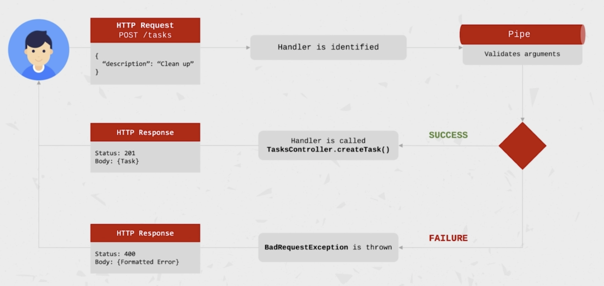

# Udemy Nest.js course

## init project

```bash
# using Nest.js CLI
nest new task-app

npm run start
# or
npm run start:dev
```

## Module

### @Module
- providers: 
  D.I.를 통해 해당 module 내에서 인스턴스화 되어 사용가능한 Components
- controllers: 
  해당 module 내에서 인스턴스화되는 Controllers
- exports: 
  다른 module로 export되는 Components
- imports: 
  해당 module이 필요로하는 modules, 다른 module에서 export된 Components을 D.I를 통해 사용할 수 있다. 

## NestJS Pipes
- Pipes는 request handler가 호출되기 전에 인자를 가공하는 기능을 수행한다.
- Pipes는 **데이터 변경**이나 **validation**을 수행한다.
- Pipes는 Exception을 던질수 있고, 이는 NestJS가 error response로 파싱할 수 있다.
- Pipes는 `async`일 수 있다.
- `PipeTransform interface`를 implement 해서 `transform()` 메서드를 구현해야한다.
- Usage
  - Handler-level:
  @UsePipes()로 지정한다
    - ```ts
      @Post()
      @UsePipes(SomePipe)
      createTask(@Body() desc: string) {
        foo();
      }
      ```
  - Parameter-level:
    특정 파라미터의 데코레이터에서 사용한다
    - ```ts
      @Post()
      createTask(@Body('desc', SimePipe) desc: string) {
        foo();
      }
      ```
  - Global pipe:
   app level에서 사용되며 모든 들어오는 요청에 적용된다.
    - ```ts
      const app = await NestFactory.create(AppModule);
      app.useGlobalPipes(SomePipe);
      ```




---

## ORM using Typeorm

- entity

```ts
@Entity()
export class Task extends BaseEntity {
  @PrimaryGeneratedColumn()
  id: number;

  @Column()
  title: string;

  @Column()
  description: string;

  @Column()
  status: TaskStatus;

  constructor(title: string, description: string) {
    super();
    this.title = title;
    this.description = description;
    this.status = TaskStatus.OPEN;
  }

  changeStatus(status: TaskStatus) {
    this.status = status;
  }
}
```

- entity 등록
```ts
export const typeOrmConfig: TypeOrmModuleOptions = {
  type: 'postgres',
  host: '127.0.0.1',
  port: '8300',
  username: 'wave',
  password: 'wave1234',
  database: 'taskmanagement',
  entities: [Task],
  synchronize: true,
  logging: 'all'
};
```

```ts

@Module({
  imports: [
    TypeOrmModule.forRoot(typeOrmConfig), // config
    TypeOrmModule.forFeature([TaskRepository]) // repository
  ],
  controllers: [TasksController],
  providers: [TasksService]
})
export class TasksModule {}
```

- repository

```ts
import {EntityRepository, Repository} from "typeorm";
import {Task} from "./task.entity";

@EntityRepository(Task)
export class TaskRepository extends Repository<Task> {
}
```

가져다 쓸 때는 
```ts
@Injectable()
export class TasksService {
  constructor(
    @InjectRepository(TaskRepository)
    private readonly taskRepository: TaskRepository
  ) {}
}
```

- query builder

```ts
// parameter는 alias로 아래 query에서 사용된다
const query = this.taskRepository.createQueryBuilder('task');

if (status) {
  query.andWhere('task.status = :status', { status });
}

if (search) {
  // ()로 묶어주지 않으면 위 query에 같이 묶여져서
  // WHERE status AND description OR title
  // 이렇게 query가 생성된다
  query.andWhere(
    '(task.description LIKE :search OR task.title LIKE :search)',
    { search: `%${search}%` });
}

return query.getMany();
```

----

# auth

## JWT token 적용

- package 설

```bash
npm i @nestjs/jwt @nestjs/passport passport passport-jwt
```

- Module 설정

```ts
@Module({
  imports: [
    PassportModule.register({
      defaultStrategy: 'jwt'
    }),
    JwtModule.register({
      secret: 'chris-secret-1234',
      signOptions: {
        expiresIn: 60 * 60
      }
    }),
    TypeOrmModule.forFeature([User])
  ],
  controllers: [AuthController],
  providers: [AuthService]
})
export class AuthModule {}
```

```ts
@Injectable()
export class AuthService {
  constructor(
    @InjectRepository(UserRepository)
    private readonly userRepository: UserRepository,
    private jwtService: JwtService // JWT service inject
  ) {}

  async signIn(username: string, password: string): Promise<AccessTokenDto> {
    const user = await this.userRepository.findOne({ username });

    if (!user) {
      throw new NotFoundException('User not found');
    }

    const passwordMatched = await user.isPasswordMatched(password);

    if (!passwordMatched) {
      throw new UnauthorizedException('password not matched');
    }

    const payload = { id: user.id, username };
    const accessToken = this.jwtService.sign(payload); // token 생성
    return { accessToken };
  }
}
```

- token validation

```ts
import {PassportStrategy} from "@nestjs/passport";
import { Strategy, ExtractJwt } from 'passport-jwt';
import {Injectable, UnauthorizedException} from "@nestjs/common";
import {JwtPayload} from "./jwt-payload";
import {InjectRepository} from "@nestjs/typeorm";
import {UserRepository} from "./user.repository";
import {User} from "./user.entity";

@Injectable()
export class JwtStrategy extends PassportStrategy(Strategy) {
  constructor(
    @InjectRepository(UserRepository)
    private userRepository: UserRepository
  ) {
    super({
      // bearer Auth 로 부터 읽어옴 (in Authorization header)
      jwtFromRequest: ExtractJwt.fromAuthHeaderAsBearerToken(),
      secretOrKey: 'chris-secret-1234'
    });
  }

  async validate(payload: JwtPayload): Promise<User> {
    // request token을 decoding하여 payload를 가져옴
    console.log(payload);

    const user = await this.userRepository.findOne({ id: payload.id });

    if (!user) {
      throw new UnauthorizedException('user not found');
    }

    console.log('validate success');
    return user;
  }
}
```

모듈에다가 위 설정을 추가한다.

```ts
@Module({
  imports: [
    PassportModule.register({
      defaultStrategy: 'jwt'
    }),
    JwtModule.register({
      secret: 'chris-secret-1234',
      signOptions: {
        expiresIn: 60 * 60
      }
    }),
    TypeOrmModule.forFeature([User])
  ],
  controllers: [AuthController],
  providers: [AuthService, JwtStrategy], // 위에 만든 JwtStrategy 추가
  exports: [JwtStrategy, PassportModule] // export
})
export class AuthModule {}
```

```ts
@Controller()
export class AuthController {
  @Post('/test')
  @UseGuards(AuthGuard()) // @UserGuards(AuthGuard())를 추가한다
  test(@Req() req) {
    console.log('req-----------');
    console.log(req);
  }
}
```