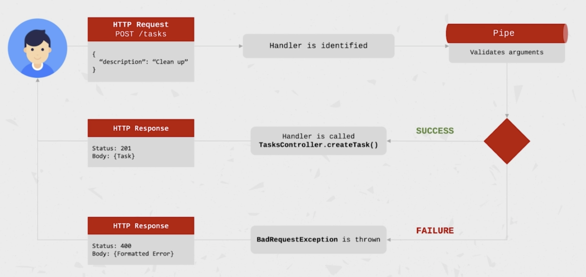

- init project

```bash
nest new task-app
```

- @Module
  - providers: D.I.를 통해 module 내에서 사용가능한 Components
  - controllers: module 내에서 인스턴스화되는 Controllers
  - exports: 다른 module로 export되는 Components
  - imports: 해당 module이 필요로하는 modules, 다른 module에서 export된 Components을 D.I를 통해 사용할 수 있다. 

- NestJS Pipes
  - Pipes는 handler가 호출되기 전에 router handler가 인자를 가공하는 기능을한다
  - Pipes는 데이터 변경이나 validation을 수행한다.
  - Pipes는 Exception을 던질수 있고, 이는 NestJS가 error response로 파싱한다
  - Pipes는 async일 수 있다
  - Pipes는 @Injectable() 데코레이터가 붙은 class
  - PipeTransform interface를 implement 해서 transform() 메서드를 구현해야한다.
  - Handler-level pipes는 @UsePipes()로 지정한다
    - ```ts
      @Post()
      @UsePipes(SomePipe)
      createTask(@Body() desc: string) {
        foo();
      }
    ```
  - Parameter-level pipes는 특정 파라미터에 사용한다
    - ```ts
      @Post()
      createTask(@Body('desc', SimePipe) desc: string) {
        foo();
      }
    ```
  - Global pipe는 app level에서 사용되며 모든 들어오는 요청에 적용된다.
    - ```ts
      const app = await NestFactory.create(AppModule);
      app.useGlobalPipes(SomePipe);
    ```

