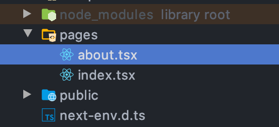
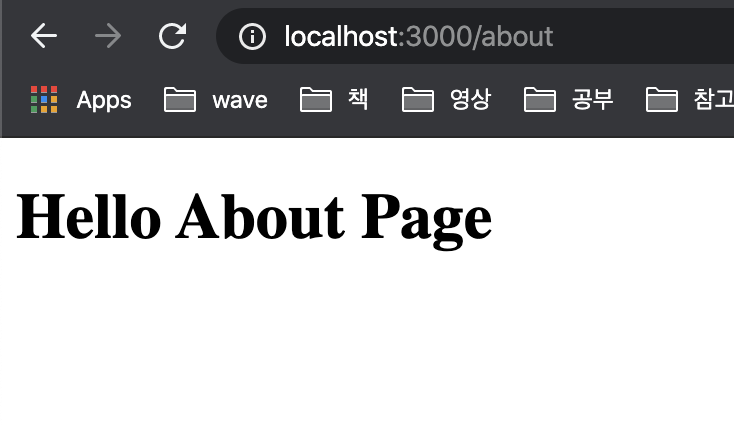
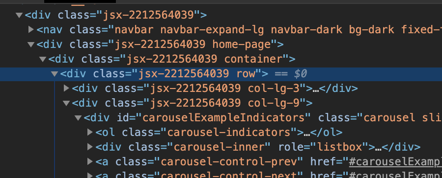

- init project

```bash
npx create-next-app

# or

npm install --save react react-dom next
```

- start app

```bash
npm run dev
```

http://localhost:3000/

- Nav component

index.js의 Nav는 components의 nav.js이다.
이를 주석처리하면 index 페이지 상단에 Nav bar가 없어지는 걸 확인할 수 있다.

---

- Functional Components



pages에 추가하면 해당 파일명으로 path가 생성된다.

```tsx
// about.tsx
// functional component
const About = () => {
  const message = 'Hello World';
  return (
    <h1>Hello About Page - {message}</h1>
  );

  // return React.createElement('div', null, `React.createElement`);
};

export default About;
```

http://localhost:3000/about



- Class Components

```tsx
import React from "react";

class About extends React.Component<any, any> {
  render() {
    const message = "Hello World!";
    return (
      <h1>I'm class component: {message}</h1>
    )
  }
}

export default About;
```

- basic styles
```tsx
<div className="home-page"> {/* home-page */}
  <div className="container">
    <div className="row">
      <div className="col-lg-3">
        <SideMenu/>
      </div>

      <div className="col-lg-9">
        <Carousel/>
        <div className="row">
          <MovieList/>
        </div>
      </div>

    </div>
  </div>
</div>
<Footer/>

{/* home-page class에 css 설정 */}
<style jsx>{`
  .home-page {
    padding-top: 80px;
  }
`}</style>
```



하면 위와 같이 class에 jsx가 추가된다.

- state

## Class Components

```tsx
class Count extends React.Component<any, any> {
  constructor(props: any, context: any) {
    super(props, context);

    this.state = {
      count: 0
  }
  
  increment() {
    const count = this.state.count;
    this.setState({ count: count + 1 }); // state 바꿀 때는 직접 바꾸지 않는다
  };

  decrement() {
    const count = this.state.count;
    this.setState({count: count - 1});
  };

  render(): React.ReactElement<any, string | React.JSXElementConstructor<any>> | string | number | {} | React.ReactNodeArray | React.ReactPortal | boolean | null | undefined {
    return (
      <>
        <div>
          <button onClick={() => this.increment()} className="btn btn-primary">Increment Number</button>
          <button onClick={() => this.decrement()} className="btn btn-primary">Decrement Number</button>

          <span>{this.state.count}</span> {/* state 값 가져오기 */}
        </div>
    )
  }
}
```

## Functional Components

```tsx
import React, {useState} from 'react';

const SideMenu = () => {
  const [ count, setCount ] = useState(0); // 새로운 state를 생성해준다
  // setCount는 꼭 setter 형식이 아니어도 된다

  const increment = () => {
    const newCount = count + 1;
    setCount(newCount);
  };

  const decrement = () => {
    const newCount = count - 1;
    setCount(newCount);
  };

  return (
    <div>
      <div>
        <button onClick={() => increment()} className="btn btn-primary">Increment</button>
        <button onClick={() => decrement()} className="btn btn-primary">Increment</button>
        <span>{count}</span>
      </div>
    </div>
  )
};
```

# prop 부터