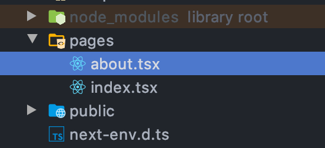
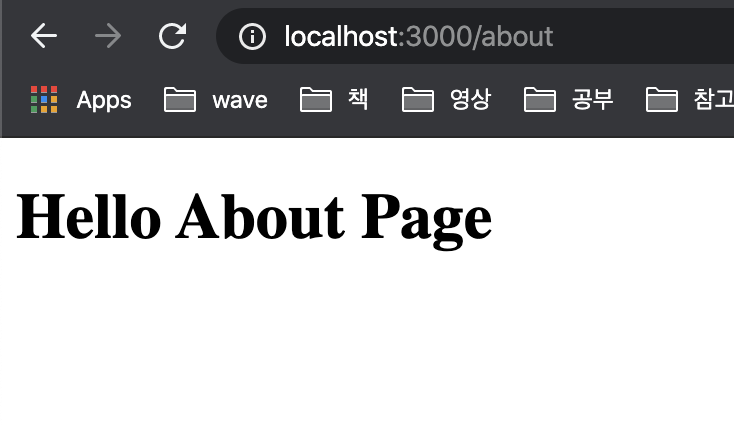
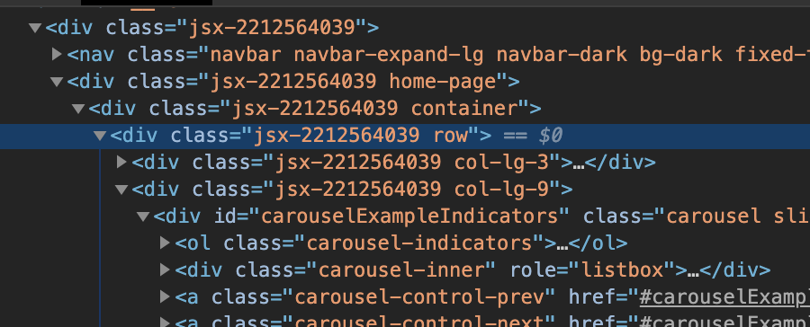

# Udemy Next.js course

## Next.js start
- init project

```bash
# npx로 기본 프로젝트 생성하기
npx create-next-app

# 혹은 수동으로 npm package 다운받기
npm i react react-dom next
```

- start app as dev

```bash
npm run dev
```

http://localhost:3000/

- Nav component

index.js의 Nav는 components의 nav.js이다.
이를 주석처리하면 index 페이지 상단에 Nav bar가 없어지는 걸 확인할 수 있다.

## Functional Components

- Next.js Route 기능



pages에 추가하면 해당 파일명으로 path가 생성된다.

- Functional Components

함수로만 Component를 생성한다

```tsx
// about.tsx
const About = () => {
  const message = 'Hello World';
  return (
    <h1>Hello About Page - {message}</h1>
  );

  // return React.createElement('div', null, `React.createElement`);
};

export default About;
```

http://localhost:3000/about



## Class Components

React.Component를 상속받은 class로 Component를 생성한다.

```tsx
// about.tsx
import React from "react";

class About extends React.Component<any, any> {
  render() {
    const message = "Hello World!";
    return (
      <h1>I'm class component: {message}</h1>
    )
  }
}

export default About;
```

## Basic Styles
```tsx
<div className="home-page"> {/* home-page */}
  <div className="container">
    <div className="row">
      <div className="col-lg-3">
        <SideMenu/>
      </div>

      <div className="col-lg-9">
        <Carousel/>
        <div className="row">
          <MovieList/>
        </div>
      </div>

    </div>
  </div>
</div>
<Footer/>

{/* .home-page에 css를 설정 */}
<style jsx>{`
  .home-page {
    padding-top: 80px;
  }
`}</style>
```

`<style jsx></style>`을 통해 css를 설정하면 아래와 같이 jsx 클래스도 추가된다.



## state

### Class Components에서 state 관리

```tsx
class Count extends React.Component<any, any> {
  constructor(props: any, context: any) {
    super(props, context);

    // state 초기화
    this.state = {
      count: 0
    }
  }
  
  increment() {
    const count = this.state.count;
    this.setState({ count: count + 1 });
    // state 바꿀 때는 직접 바꾸지 않는다
  };

  decrement() {
    const count = this.state.count;
    this.setState({count: count - 1});
  };

  render(): React.ReactElement<any, string | React.JSXElementConstructor<any>> | string | number | {} | React.ReactNodeArray | React.ReactPortal | boolean | null | undefined {
    return (
      <>
        <div>
          {/* onClick event handler */}
          <button onClick={() => this.increment()} className="btn btn-primary">Increment Number</button>
          <button onClick={() => this.decrement()} className="btn btn-primary">Decrement Number</button>

          {/* state 값 가져오기 */}
          <span>{this.state.count}</span>
        </div>
      </>
    )
  }
}
```

### Functional Components에서 state 관리

```tsx
import React, {useState} from 'react';

const SideMenu = () => {
  // useState(초기값): 지정한 초기값을 가진 새로운 state와 setState 함수를 생성한다
  const [ count, setCount ] = useState(0); 
  // setState 함수는 해당 state의 값만을 관리하며, 함수명은 자유롭게 지정할 수 있다.

  const increment = () => {
    const newCount = count + 1;
    setCount(newCount);
  };

  const decrement = () => {
    const newCount = count - 1;
    setCount(newCount);
  };

  return (
    <div>
      <div>
        <button onClick={() => increment()} className="btn btn-primary">Increment</button>
        <button onClick={() => decrement()} className="btn btn-primary">Increment</button>
        <span>{count}</span>
      </div>
    </div>
  )
};
```

## prop

Parent component가 Children components로 props를 통해 값을 전달할 수 있다.

```tsx
// index.tsx
// props는 함수도 전달할 수 있다.
<div className="col-lg-3">
  <SideMenu 
    count={count} 
    shopName={'Chris'} 
    func={() => console.log('Hello Func!')}
    />
</div>
```

```tsx
const SideMenu = (prop: Readonly<{ count: number, shopName: string, func: Function }>) => {
  return (
    <h1 onClick={() => prop.func()} className="my-4">{prop.shopName}</h1>
  )
};
```

---

- How web app works?