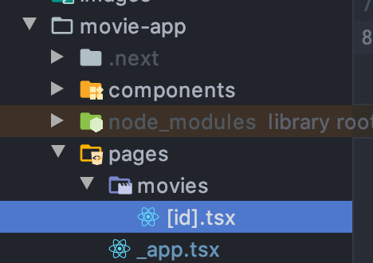

# Udemy Next.js course

## Next.js start
- init project

```bash
# npx로 기본 프로젝트 생성하기
npx create-next-app

# 혹은 수동으로 npm package 다운받기
npm i react react-dom next
```

- start app as dev

```bash
npm run dev
```

http://localhost:3000/

- Header component

index.js의 Nav는 components의 nav.js이다.
이를 주석처리하면 index 페이지 상단에 Header bar가 없어지는 걸 확인할 수 있다.

## Functional Components

- Next.js Route 기능


pages에 추가하면 해당 파일명으로 path가 생성된다.

- Functional Components

함수로만 Component를 생성한다

```tsx
// about.tsx
const About = () => {
  const message = 'Hello World';
  return (
    <h1>Hello About Page - {message}</h1>
  );

  // return React.createElement('div', null, `React.createElement`);
};

export default About;
```

http://localhost:3000/about


## Class Components

React.Component를 상속받은 class로 Component를 생성한다.

```tsx
// about.tsx
import React from "react";

class About extends React.Component<any, any> {
  render() {
    const message = "Hello World!";
    return (
      <h1>I'm class component: {message}</h1>
    )
  }
}

export default About;
```

## Basic Styles
```tsx
<div className="home-page"> {/* home-page */}
  <div className="container">
    <div className="row">
      <div className="col-lg-3">
        <SideMenu/>
      </div>

      <div className="col-lg-9">
        <Carousel/>
        <div className="row">
          <MovieList/>
        </div>
      </div>

    </div>
  </div>
</div>
<Footer/>

{/* .home-page에 css를 설정 */}
<style jsx>{`
  .home-page {
    padding-top: 80px;
  }
`}</style>
```

`<style jsx></style>`을 통해 css를 설정하면 아래와 같이 jsx 클래스도 추가된다.


## state

### Class Components에서 state 관리

```tsx
class Count extends React.Component<any, any> {
  constructor(props: any, context: any) {
    super(props, context);

    // state 초기화
    this.state = {
      count: 0
    }
  }
  
  increment() {
    const count = this.state.count;
    this.setState({ count: count + 1 });
    // state 바꿀 때는 직접 바꾸지 않는다
  };

  decrement() {
    const count = this.state.count;
    this.setState({count: count - 1});
  };

  render(): React.ReactElement<any, string | React.JSXElementConstructor<any>> | string | number | {} | React.ReactNodeArray | React.ReactPortal | boolean | null | undefined {
    return (
      <>
        <div>
          {/* onClick event handler */}
          <button onClick={() => this.increment()} className="btn btn-primary">Increment Number</button>
          <button onClick={() => this.decrement()} className="btn btn-primary">Decrement Number</button>

          {/* state 값 가져오기 */}
          <span>{this.state.count}</span>
        </div>
      </>
    )
  }
}
```

### Functional Components에서 state 관리

```tsx
import React, {useState} from 'react';

const SideMenu = () => {
  // useState(초기값): 지정한 초기값을 가진 새로운 state와 setState 함수를 생성한다
  const [ count, setCount ] = useState(0); 
  // setState 함수는 해당 state의 값만을 관리하며, 함수명은 자유롭게 지정할 수 있다.

  const increment = () => {
    const newCount = count + 1;
    setCount(newCount);
  };

  const decrement = () => {
    const newCount = count - 1;
    setCount(newCount);
  };

  return (
    <div>
      <div>
        <button onClick={() => increment()} className="btn btn-primary">Increment</button>
        <button onClick={() => decrement()} className="btn btn-primary">Increment</button>
        <span>{count}</span>
      </div>
    </div>
  )
};
```

## prop

Parent component가 Children components로 props를 통해 값을 전달할 수 있다.

```tsx
// index.tsx
// props는 함수도 전달할 수 있다.
<div className="col-lg-3">
  <SideMenu 
    count={count} 
    shopName={'Chris'} 
    func={() => console.log('Hello Func!')}
    />
</div>
```

```tsx
const SideMenu = (prop: Readonly<{ count: number, shopName: string, func: Function }>) => {
  return (
    <h1 onClick={() => prop.func()} className="my-4">{prop.shopName}</h1>
  )
};
```

## useEffect

아래와 같이 async로 데이터를 가져올 때 state를 사용하여 데이터를 가져오고 화면에 보여줄 수 있다.

```ts
export function getMovies(): Promise<MovieType[]> {
  return new Promise(resolve => {
    setTimeout(() => resolve(MOVIE_DATA), 0);
  });
}
```

```tsx
const [ movies, setMovies ] = useState<MovieType[]>([]);

getMovies().then(movies => setMovies(movies));

<MovieList movies={movies}/>
```

하지만 이 경우 시작할 때 한번만 실행되기 때문에 재사용성이 없다.
`useEffect`를 쓰면 재사용성이 높은 state 관리를 할 수 있다.

```tsx
const [ movies, setMovies ] = useState<MovieType[]>([]);
const [ count, setCount ] = useState<number>(0);

// getMovies().then(movies => setMovies(movies));

useEffect(() => {
  console.log('Movie will be loaded');

  // useEffect는 async는 지원하지 않는다 그래서 아래와 같은 trick을 쓴다
  const fetchMovies = async () => {
    const movies = await getMovies();
    setMovies(movies);
  };

  fetchMovies();
}, [count]); // <- 두 번째 인자인 state가 바뀔때도 useEffect 첫 번째 인자인 함수가 실행된다.

<button className="btn btn-warning" onClick={() => setCount(count + 1)}>Load movie</button>
// 버튼을 누르면 count state 값이 바뀌고 useEffect 첫 번째 인자인 함수가 실행된다.
<MovieList movies={movies}/>
```

```tsx
// class를 쓴다면 아래와 같이 코드를 짜야한다.
constructor() {
  this.state = {
    movies: []
  }
}

// call only once when component is mounted
async componentDidMount() {
  const movies = await getMovies();
  this.setState({ movies });
}
```

## SSR

components에 있는 Component에 적용할 수 없고 pages에 있는 Component들만 사용가능하다.

getInitialProps를 통해 사용함


## Link

anchor tag의 href 속성을 사용하지 않고 `import Link from "next/link"`의 `Link`를 사용한다.

```tsx
<ul className="navbar-nav ml-auto">
  <li className="nav-item active">
    <Link href="/">
      <a className="nav-link" href="#">Home
        <span className="sr-only">(current)</span>
      </a>
    </Link>
  </li>
  <li className="nav-item">
    <Link href="/about">
      <a className="nav-link">About</a>
    </Link>
  </li>
  <li className="nav-item">
    <Link href="services">
      <a className="nav-link">Services</a>
    </Link>
  </li>
  <li className="nav-item">
    <Link href="contact">
      <a className="nav-link" href="#">Contact</a>
    </Link>
  </li>
</ul>
```

## App container

`_app.js` or `_app.tsx`에 app contaner를 설정한다.

```tsx
// _app.tsx
import App from "next/app";
import Head from "next/head";
import Navbar from "../components/navbar";
import React from "react";
import Footer from "../components/footer";

class MovieApp extends App {
  render(): JSX.Element {
    const { Component } = this.props;

    return (
      <div>
        <Head>
          <title>Home</title>
          <link rel="stylesheet" href="https://stackpath.bootstrapcdn.com/bootstrap/4.3.1/css/bootstrap.min.css"
                integrity="sha384-ggOyR0iXCbMQv3Xipma34MD+dH/1fQ784/j6cY/iJTQUOhcWr7x9JvoRxT2MZw1T"
                crossOrigin="anonymous"/>
          <script src="https://code.jquery.com/jquery-3.3.1.slim.min.js"
                  integrity="sha384-q8i/X+965DzO0rT7abK41JStQIAqVgRVzpbzo5smXKp4YfRvH+8abtTE1Pi6jizo"
                  crossOrigin="anonymous"></script>
          <script src="https://cdnjs.cloudflare.com/ajax/libs/popper.js/1.14.7/umd/popper.min.js"
                  integrity="sha384-UO2eT0CpHqdSJQ6hJty5KVphtPhzWj9WO1clHTMGa3JDZwrnQq4sF86dIHNDz0W1"
                  crossOrigin="anonymous"></script>
          <script src="https://stackpath.bootstrapcdn.com/bootstrap/4.3.1/js/bootstrap.min.js"
                  integrity="sha384-JjSmVgyd0p3pXB1rRibZUAYoIIy6OrQ6VrjIEaFf/nJGzIxFDsf4x0xIM+B07jRM"
                  crossOrigin="anonymous"></script>
        </Head>

        <Navbar/>

        <div className="base-page">
          <Component />
        </div>

        <Footer/>

        <style jsx>{`
          .base-page {
            padding-top: 80px;
          }
        `}</style>
      </div>
    )
  }
}

export default MovieApp;
```

다른 페이지는 이제 `<Component />`에 위치하게 된다.

## ID 별로 다른 페이지 처리하기

URL을 `/movies/:id` 라고 하면
아래와 같이 pages에 추가한다.



```tsx
import {useRouter} from "next/router";

export default function Movie() {
  const { query } = useRouter();

  return (
    <div className="container">
      <h1>Movie with id: { query.id }</h1>
    </div>
  )
};
```

- SSR을 사용하여 화면에 표시하기

```tsx
import {useRouter} from "next/router";

const Movie = (props: any) => {
  const { movie } = props;

  return (
    <div className="container">
      <h1>Movie with id: { query.id }</h1>
      <h2>movie.title</h2>
    </div>
  )
};

Movie.getInitialProps = (props: { query: { id: string } }) => {
  const movie = await getMovieById(props.query.id);
  return { movie };
};

export default Movie;
```

---

# Blog app

Component로 layout 짜기

```tsx
// components/base-layout.tsx
import React from "react";
import Header from "./common/header";

type BaseLayoutProps = {
  children: React.ReactNode;
}

export default function BaseLayout({ children }: BaseLayoutProps) {
  return (
    <>
      <Header/>
      { children }
    </>
  )
}
```

```tsx
// pages/index.tsx
import React from 'react'
import BaseLayout from "../components/base-layout";

export default function Home() {
  return (
    <BaseLayout>
      <h1>I'm index</h1>
    </BaseLayout>
  )
}
```
