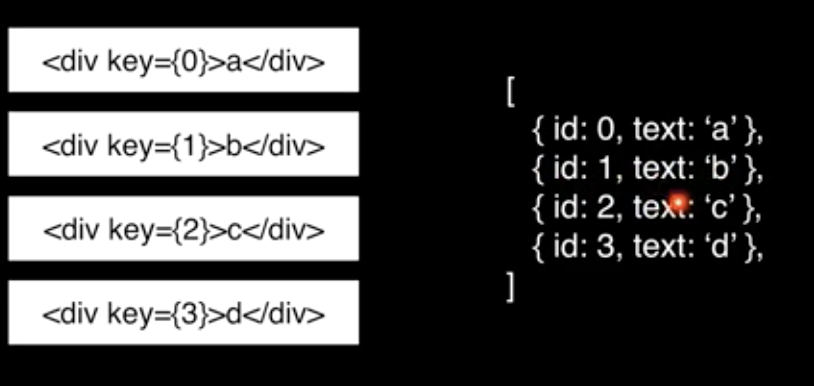

## JSX 기본 규칙

Babel이 JSX를 JS로 변환해준다.

```jsx
(
	<div>
    	<span>Hello React</span>
    </div>
)
```

```js
// JS로 변환된 JSX
"use strict";

React.createElement("div", null, React.createElement("span", null, "Hello React"));
```

1. tag는 꼭 닫혀야한다.
<Hello></Hello>
<Hello/>: self closing tag

`<br>` 안됨

2. 2개 이상의 태그는 하나의 태그로 감싸져야한다.

3. javascript 값을 사용하고 싶을 땐 {}로 감싼다

```jsx
function Hello() {
  const name = 'devson';
  return <div>안녕하세요 {name}</div>
}
```
 
4. css
import로 불러오기만 하면 된다.

```jsx
import React from 'react';
import logo from './logo.svg';
import './App.css'; // 

function App() {
  return (
    ...
  )
}
```

inline style 선언은 `style` property에 한다

```jsx
function Hello() {
  const name = 'devson';
  const style = {
    backgroundColor: 'yellow'
  }

  return <div style={style}>안녕하세요 {name}</div>
}
```

5. class 대신 className

6. 주석

```jsx
{/* comments */}

<Hello
  // comments
/>
```

## props

```jsx
function App() {
  return (
    <>
      <Hello name="react"/>
      <Hello/>
    </>
  );
}
```

```jsx
function Hello(props) {
  console.log(props);
  return <div>안녕하세요 {props.name}</div>
}

// default props
Hello.defaultProps = {
  name: "default name"
};

export default Hello;
```

### 조건부 렌더링

```jsx
function Hello(props) {
  const { isSpecial } = props;

  console.log(props);
  const style = {
    backgroundColor: 'yellow'
  }

  // prop으로 받은 값을 조건문에 넣는다
  if (isSpecial) {
    return <div>**</div>
  }

  return <div style={style}>안녕하세요 {props.name}</div>
}
```

### useState로 상태 관리하기

```jsx
import React, {useState} from 'react';

function Counter() {
  const [count, setCounter] = useState(0);

  const onIncrease = () => {
    setCounter(count + 1);
  }

  const onDecrease = () => {
    setCounter(count - 1);
  }

  return (
    <div>
      <h1>{count}</h1>
      <button onClick={onIncrease}>+1</button>
      <button onClick={onDecrease}>-1</button>
    </div>
  )
}

export default Counter;
```

#### input 상태 관리하기

```jsx
import React, {useState} from "react";

function InputSample() {
  const [text, setText] = useState('');

  const onChange = (event) => {
    console.log(event.target.value);
    setText(event.target.value);
  }

  const onReset = () => {
    setText('');
  }

  return (
    <div>
      <input onChange={onChange} value={text}/>
      <button onClick={onReset}>초기화</button>
      <div>
        <b>값: {text}</b>
      </div>
    </div>
  )
}

export default InputSample;
```

#### 여러개의 input 상태 관리하기

```jsx
import React, {useState} from "react";

function InputSample2() {
  const [inputs, setInputs] = useState({
    name: '',
    nickname: ''
  })

  const { name, nickname } = inputs;

  const onChange = (event) => {
    const { name, value } = event.target;
    const nextInputs = {
      ...inputs,
      [name]: value // 덮어 씌우기
    };
    setInputs(nextInputs);
  }

  const onReset = () => {
    setInputs({ name: '', nickname: '' });
  }

  return (
    <div>
      <input name="name" placeholder="이름" onChange={onChange} value={name}/>
      <input name="nickname" placeholder="닉네임" onChange={onChange} value={nickname}/>
      <button onClick={onReset}>초기화</button>
      <div>
        <b>이름: {name}</b>
        <b>닉네임: {nickname}</b>
      </div>
    </div>
  )
}

export default InputSample2;
```

### useRef 로 특정 DOM 선택하기

```jsx
import React, {useRef} from "react";

function ClockAndFocus() {
  // 1. 먼저 생성한 다음
  const nameInput = useRef();

  const onClick = () => {
    // 3. 해당 dom 조작을 한다.
    nameInput.current.focus();
  };

  return (
    <div>
      <input name="name" ref={nameInput}/> // 2. 생성한 ref를 지정한다.
      <button onClick={onClick}>Focus!</button>
    </div>
  )
}

export default ClockAndFocus;
```

### 배열로 컴포넌트 다루기

#### 배열 렌더링하기

```jsx
import React, {useRef, useState} from 'react';
import Hello from "./Hello";
import Wrapper from "./Wrapper";
import Counter from "./state/Counter";
import InputSample2 from "./state/InputSample2";
import ClockAndFocus from "./ref/ClickAndFocus";
import UserList from "./ref/UserList";
import CreateUser from "./ref/CreateUser";

function App() {
  const [users, setUsers] = useState([
    {
      id: 1,
      username: 'chris',
      email: 'chris@gmail.com'
    },
    {
      id: 2,
      username: 'chris2',
      email: 'chris2@gmail.com'
    },
    {
      id: 3,
      username: 'chris3',
      email: 'chris3@gmail.com'
    }
  ]);

  return (
    <>
      <UserList users={users}/> 
    </>
  );
}

export default App;
```

```jsx
import React from "react";

function User({ user }) {
  const { id, username, email } =  user;
  return (
    <div>
      {id} / {username} / {email}
    </div>
  )
}

function UserList({ users }) {
  return (
    <div>
      { users.map(user => <User key={user.id} user={user}/>) }
    </div>
  )
}

export default UserList;
```

만약 key가 index일 경우 렌더링 시 성능 최적화하기가 힘들다.

key는 unique한 id로 하는 것이 좋다.



#### 배열 추가하기

```jsx
import React, {useRef, useState} from 'react';
import Hello from "./Hello";
import Wrapper from "./Wrapper";
import Counter from "./state/Counter";
import InputSample2 from "./state/InputSample2";
import ClockAndFocus from "./ref/ClickAndFocus";
import UserList from "./ref/UserList";
import CreateUser from "./ref/CreateUser";

function App() {
  const [users, setUsers] = useState([
    {
      id: 1,
      username: 'chris',
      email: 'chris@gmail.com'
    },
    {
      id: 2,
      username: 'chris2',
      email: 'chris2@gmail.com'
    },
    {
      id: 3,
      username: 'chris3',
      email: 'chris3@gmail.com'
    }
  ]);

  const [inputs, setInputs] = useState({
    username: '',
    email: ''
  });

  const { username, email } = inputs;

  // 컴포넌트가 re-rendering 되도 이 값은 계속 갖고있다.
  const nextId = useRef(4);

  // add new user into users array
  const onCreate = () => {
    const user = { id: nextId.current, username, email }
    setUsers(users.concat(user));

    // reset input values
    setInputs({
      username: '',
      email: ''
    });

    console.log(nextId.current); // 4
    nextId.current += 1; // 값 증가
  };

  // Input value change
  const onChange = e => {
    const { name, value } = e.target;
    setInputs({
      ...inputs,
      [name]: value
    });
  };

  return (
    <>
      <CreateUser 
        username={username} 
        email={email} 
        onChange={onChange} 
        onCreate={onCreate}/>
      
      <UserList users={users}/> 
    </>
  );
}

export default App;
```

```jsx
import React from "react";

function CreateUser({ username, email, onChange, onCreate }) {
  return (
    <div>
      <input name="username" placeholder="계정명" onChange={onChange} value={username}/>
      <input name="email" placeholder="이메일" onChange={onChange} value={email}/>
      <button onClick={onCreate}>Register</button>
    </div>
  )
}

export default CreateUser;
```

#### 배열 삭제

```jsx
import React, {useRef, useState} from 'react';
import Hello from "./Hello";
import Wrapper from "./Wrapper";
import Counter from "./state/Counter";
import InputSample2 from "./state/InputSample2";
import ClockAndFocus from "./ref/ClickAndFocus";
import UserList from "./ref/UserList";
import CreateUser from "./ref/CreateUser";

function App() {
  const [users, setUsers] = useState([
    {
      id: 1,
      username: 'chris',
      email: 'chris@gmail.com'
    },
    {
      id: 2,
      username: 'chris2',
      email: 'chris2@gmail.com'
    },
    {
      id: 3,
      username: 'chris3',
      email: 'chris3@gmail.com'
    }
  ]);

  const [inputs, setInputs] = useState({
    username: '',
    email: ''
  });

  const { username, email } = inputs;

  // 컴포넌트가 re-rendering 되도 이 값은 계속 갖고있다.
  const nextId = useRef(4);

  const onCreate = () => {
    const user = { id: nextId.current, username, email }
    setUsers(users.concat(user));

    setInputs({
      username: '',
      email: ''
    });

    console.log(nextId.current); // 4
    nextId.current += 1; // 값 증가
  };

  const onChange = e => {
    const { name, value } = e.target;
    setInputs({
      ...inputs,
      [name]: value
    });
  };

  // delete element from array and set users array
  const onRemove = (id) => {
    const filteredUser = users.filter(user => user.id !== id);
    setUsers(filteredUser);
  };

  const onToggle = (id) => {
  };

  return (
    <>
      <CreateUser
        username={username}
        email={email}
        onChange={onChange}
        onCreate={onCreate}/>

      <UserList
        users={users}
        onRemove={onRemove}/>
    </>
  );
}

export default App;
```

```jsx
import React from "react";

function User({ user, onRemove }) {
  const { id, username, email } =  user;

  return (
    <div>
      {id} / {username} / {email}
      <button onClick={() => onRemove(id)}>delete</button>
    </div>
  )
}

function UserList({ users, onRemove }) {
  return (
    <div>
      {users.map(user => <User key={user.id} user={user} onRemove={onRemove}/>)}
    </div>
  )
}

export default UserList;
```

