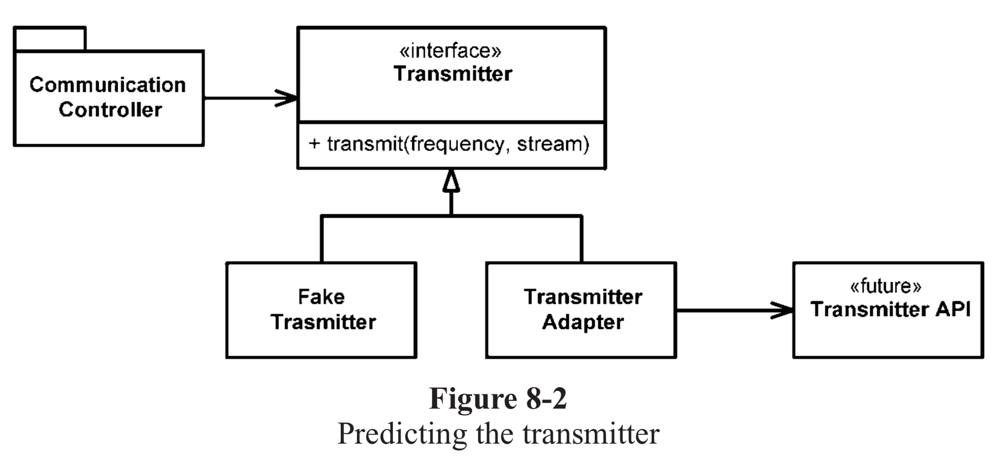

# 경계

외부 코드를 우리 코드에 깔끔하게 통합해야만 한다.

### 외부 코드 사용하기

library/framework 제공자는 **적용성을 최대한 넓히려** 애쓴다.
반면, 사용자는 **자신의 요구에 집중**하는 인터페이스를 바란다.

`Map`의 경우 기능성과 유연성은 확실히 유용하지만 그만큼 위험도 크다.
애플리케이션 내부에서 여기저기 Map을 넘길 경우에 어느곳이나 `clear` 메서드를 사용할 수 있다.

```java
Map<String, Sensor> sensors = new HashMap<>();
```

Map은 사용자에게 필요하지 않은 기능까지 제공하기 때문에 맘만 먹으면 아무 곳에서나 데이터를 조작할 수 있다.

`First Class Collection`을 사용하면 Collection을 객체 내부로 숨기기 때문에 딱 필요한 인터페이스만 외부에 노출시킬 수 있다.

```java
public class Sensors {
    private Map<String, Sensor> sensors = new HashMap<>();

    public Optional<Sensor> getById(String id) {
        return Optional.ofNullable(this.sensors.get(id));
    }
}
```

참고: https://jojoldu.tistory.com/412

Map을 쓸때마다 위와 같이 캡술화해서 쓰라는 소리가 아니라,
Map과 같은 타입을 여기저기 말라는 것이다.
Map과 같은 인터페이스를 사용할 때는 이를 사용하는 클래스나 클래스 계열 밖으로 노출되지 않도록 주의한다.

### 경계 살피고 익히기

외부 패키지를 사용하고 싶다면 어디서부터 시작하는게 좋을까?
때로는 우리 코드의 문제인지, 외부 패키지의 문제인지를 찾는데 골치를 앓는다.

외부 패키지를 테스트하는건 우리의 책임은 아니지만 우리가 사용할 기능을 테스트하는 것은 바람직하다.

우리쪽 코드를 작성하여 외부 코드를 호출하는 것이 아니라, 먼저 외부 패키지에서 사용할 기능에 대한 간단한 테스트 케이스를 작성해 외부 코드를 익히면 어떨까? 
=> `학습 테스트`

- log4j 익히기
p.148

학습 테스트를 통해 사용법을 익혔다면 이 지식을 독자적인 내부 클래스로 캡슐화한다.
그러면 이제 내부 애플리케이션은 외부 패키지의 인터페이스를 몰라도 쉽게 사용할 수 있다.

### 학습 테스트는 공짜 이상이다.

어쨋든 외부 패키지의 API를 배워야하기 때문에 학습 테스트로 인해 드는 추가 비용은 없다.
오히려 필요한 지식만 확보할 수 있는 방법이다.

패키지가 새 버전이 나온다면 학습 테스트를 돌려 차이가 있는지 호환성 확인만하면 된다.

### 아직 존재하지 않는 코드를 사용하기

때로는 다른 팀과 작업할 때 아직 인터페이스가 정해지지 않은 다른 팀의 API를 사용해야하는 경우가 있을 수 있다.
다른 팀이 설계와 개발이 끝날 때까지 기다릴 수 없기 때문에 자체적인 인터페이스를 정의해서 개발할 수 있다.

자체적인 인터페이스는 추후 다른 팀이 개발을 완료할 경우 Adapter 패턴을 사용하여 다른 팀의 API를 우리의 인터페이스에 맞게 변환해주면 된다.



이렇게 하면 우리가 인터페이스를 전적으로 통제할 수 있다는 장점이 있고 코드 가독성도 높아지고 코드 의도도 분명해진다.

또한 테스트도 편해지는데 적절한 자체 인터페이스에 Fake 객체를 사용하여 내부 애플리케이션 테스트를 할 수 있다.

### 깨끗한 경계

소프트웨어 설계가 우수하다면 변경하는데 많은 투자와 재작업이 필요하지 않다.
우리가 통제하지 못하는 코드를 사용할 때는 변경 시 너무 많은 시간과 비용이 들지 않도록 각별히 주의해야한다.

경계에 위치하는 코드는 깔끔히 분리한다.
자칫 잘못하면 외부 코드에 휘말리고 만다.
외부 패키지를 호출하는 코드를 가능한 줄여 경계를 관리하자.