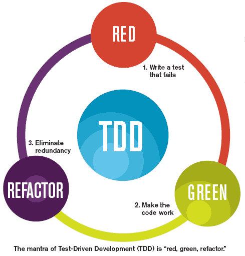

# 창발성 (Emergence)

하위계층(구성 요소)에는 없는 특성이나 행동이 상위계층(전체 구조)에서 자발적으로 돌연히 출현하는 현상

개개의 개미는 집을 지을 만한 지능이 없다. 그럼에도 불구하고 흰개미의 집합체는 역할이 서로 다른 개미들의 상호작용을 통해 거대한 탑을 만들어 내는 것이다.

---

### 창발적 설계로 깔끔한 코드를 구현하자

Kent Beck이 제시한 `단순한 설계 규칙 네 가지`가 소프트웨어 품질을 크게 높여준다고 믿는다.
중요도 순으로
1. 모든 테스트를 실행한다.
2. 중복을 없앤다.
3. 프로그래머의 의도를 표현한다.
4. 클래스와 메서드 수를 최소로 줄인다.

### 단순한 설계 규칙 1: 모든 테스트를 실행하라
설계는 `의도한 대로 돌아가는 시스템`을 내놓아야 한다.
테스트를 철저히 거쳐 모든 테스트 케이스를 항상 통과하는 시스템은 `테스트 가능한 시스템`이다.
테스트가 불가능한 시스템은 검증도 불가능하다. => 절대 출시하면 안 된다.

테스트가 가능한 시스템을 만들려고 애쓰면 설계 품질이 더불어 높아진다.
철저한 테스트가 가능한 시스템을 만들면 더 나은 설계가 얻어진다.

`테스트 케이스를 만들고 계속 돌려라` 라는 규칙을 따르면 시스템은 낮은 결합도와 높은 응집력이라는, 객체 지향 방법론이 지향하는 목표를 저절로 달성한다.

즉, 테스트 케이스를 작성하면 설계 품질이 높아진다.

### 단순한 설계 규칙 2~4: 리팩터링

테스트 케이스를 모두 작성했다면 이제 코드와 클래스를 정리해도 괜찮다.
코드를 점진적으로 리팩터링 해나가면서 테스트 케이스를 돌려 기존 기능을 깨뜨리지 않았다는 사실을 확인한다.
코드를 정리하면서 시스템이 깨질까 걱정할 필요가 없다.
`테스트 케이스가 있으니까!`



리팩터링 단계에서는 소프트웨어 설계 품질을 높이는 기법이라면 무엇이든 적용해도 괜찮다.
중복을 제거하고, 프로그래머의 의도를 표현하고, 클래스와 메서드 수를 최소로 줄이는 단계이기도 하다.

### 중복을 없애라

중복은 **추가 작업**, **추가 위험**, **불필요한 복잡도**를 뜻하기 때문에 중복은 우수한 설계에서 커다란 적이다.

구현 중복도 중복의 한 형태이다.

```java
int size() {}

boolean isEmpty() {}
```

Collection class에 위와 같은 메서드가 있을 때 `isEmpty()` 메서드는 `size()` 메서드를 이용하면 코드를 중복해 구현할 필요가 없어진다.


```java
public class HashMap<K,V> extends AbstractMap<K,V>
    implements Map<K,V>, Cloneable, Serializable {

    private int size;

    public int size() {
        return size;
    }

    public boolean isEmpty() {
        return size == 0; // 사실상 size()와 같은 코드지만 size()와는 따로 구현 됨
        // 코드도 같지만, size field 값을 사용한건 아마도 stack을 하나라도 줄이기 위한 최적화의 결과가 아닐까?
    }

    // ...
}
```


```java
public abstract class AbstractCollection<E> implements Collection<E> {
    protected AbstractCollection() {
    }

    public abstract Iterator<E> iterator();

    public abstract int size();

    public boolean isEmpty() {
        return size() == 0; // size() 메서드를 이용하여 중복 구현을 피함
    }

    // ...  
}
```

깔끔한 시스템을 만들려면 단 몇 줄의 중복이라도 제거하겠다는 의지가 필요하다.

```java
public void scaleToOneDimension(float desiredDimension, float imageDimension) {
    if (Math.abs(desiredDimension - imageDimension) < errorThreshold)
        return;
    float scalingFactor = desiredDimension / imageDimension;
    scalingFactor = (float)(Math.floor(scalingFactor * 100) * 0.01f);

    /** 중복 **/
    RenderedOpnewImage = ImageUtilities.getScaledImage(image, scalingFactor, scalingFactor);
    image.dispose();
    System.gc();
    image = newImage;
}

public synchronized void rotate(int degrees) {
    /** 중복 **/
    RenderedOp newImage = ImageUtilities.getRotatedImage(image, degrees);
    image.dispose();
    System.gc();
    image = newImage;
}
```

```java
public void scaleToOneDimension(float desiredDimension, float imageDimension) {
    if (Math.abs(desiredDimension - imageDimension) < errorThreshold)
        return;
    float scalingFactor = desiredDimension / imageDimension;
    scalingFactor = (float)(Math.floor(scalingFactor * 100) * 0.01f);

    this.replaceImage(ImageUtilities.getScaledImage(image, scalingFactor, scalingFactor));
}

public synchronized void rotate(int degrees) {
    this.replaceImage(ImageUtilities.getRotatedImage(image, degrees));
}

private void replaceImage(RemderedOp newImage) {
    image.dispose();
    System.gc();
    image = newImage;
}
```

아주 적은 양이지만 공통적인 코드를 새 메서드로 뽑고 보니 클래스가 `SRP를 위반`한다.
??
그러므로 새로 만든 **replaceImage** 메서드를 다른 클래스로 옮겨도 좋겠다.

이런 `소규모 재사용`은 시스템 복잡도를 극적으로 줄여준다.
소규모 재사용을 제대로 익혀야 대규모 재사용이 가능하다.

#### Template Method Pattern을 사용한 고차원 중복 제거 기법

`Template Method Pattern`: 부모 클래스에서 기본적인 알고리즘 흐름을 구현하고 중간에 필요한 처리를 자식 클래스에게 위임하는 Design Pattern

```java
public class VacationPolicy {
    public void accrueUSDDivisionVacation() {
        // 지금까지 근무한 시간을 바탕으로 휴가 일수를 계산하는 코드
        // ...
        // 휴가 일수가 **미국** 최소 법정 일수를 만족하는지 확인하는 코드
        // ...
        // 휴가 일수를 급여 대장에 적용하는 코드
        // ...
    }
  
    public void accrueEUDivisionVacation() {
        // 지금까지 근무한 시간을 바탕으로 휴가 일수를 계산하는 코드
        // ...
        // 휴가 일수가 **유럽연합** 최소 법정 일수를 만족하는지 확인하는 코드
        // ...
        // 휴가 일수를 급여 대장에 적용하는 코드
        // ...
    }
}
```

특정 국가의 최소 법정 일수를 계싼하는 코드만 제외하면 두 메서드는 거의 동일하다.
Template Method Pattern으로 중복을 제거하자.

```java
abstract public class VacationPolicy {
    public void accrueVacation() {
        caculateBseVacationHours();
        alterForLegalMinimums();
        applyToPayroll();
    }
  
    private void calculateBaseVacationHours() { /* ... */ };
    abstract protected void alterForLegalMinimums(); // 자식 class에게 책임을 위임
    private void applyToPayroll() { /* ... */ };
}

public class USVacationPolicy extends VacationPolicy {
    @Override 
    protected void alterForLegalMinimums() {
        // 미국 최소 법정 일수를 사용한다.
    }
}

public class EUVacationPolicy extends VacationPolicy {
    @Override 
    protected void alterForLegalMinimums() {
        // 유럽연합 최소 법정 일수를 사용한다.
    }
}
```

### 표현하라

자신이 이해하는 코드를 짜기는 쉽다.
하지만 나중에 코드를 유지보수할 사람이 코드를 짜는 사람만큼이나 문제를 깊이 이해할 가능성은 희박하다.

코드를 변경하면서 버그의 싹을 심지 않으려면 유지보수 개발자가 시스템을 제대로 이해해야 한다.
그러므로 `코드는 개발자의 의도를 분명히 표현`해야 한다.
개발자가 코드를 명백하게 짤수록 다른 사람이 그 코드를 이해하기 쉬워진다.
그래야 **결함이 줄어들고 유지보수 비용이 적게 든다**.

1. 좋은 이름을 선택한다.
2. 함수와 클래스 크기를 가능한 줄인다.
3. 표준 명칭을 사용한다.
클래스가 표준 패턴을 사용해 구현된다면 설계 의도를 이해하기 위해 해당 클래스 이름에 패턴 이름을 넣어준다.
4. 단위 테스트를 꼼꼼히 작성한다.
5. 표현력을 높이는 가장 중요한 방법은 노력이다.
함수와 클래스에 조금 더 시간을 투자하고 주의를 기울이자.

### 클래스와 메서드 수를 최소로 줄여라

기본적인 개념도 극단으로 치달으면 득보다 실이 많아진다.
클래스와 메서드 크기를 줄이자고 조그만 클래스와 메서드를 수없이 많드는 사례도 없지 않다.

때론 무의미하고 독단적인 정책 탓에 클래스 수와 메서드 수가 늘어나기도 한다.
- e.g.
  - interface, interfaceImpl
  - 자료 클래스와 동작 클래스는 무조건 분리

가능한 독단적인 견해는 멀리하고 실용적인 방식을 택한다.

목표는 함수와 클래스 크기를 작게 유지하면서 동시에 시스템 크기도 작게 유지하는 데 있다.

---

단순한 설계 규칙을 따른다면 우수한 기법과 원칙을 단번에 활용할 수 있다.