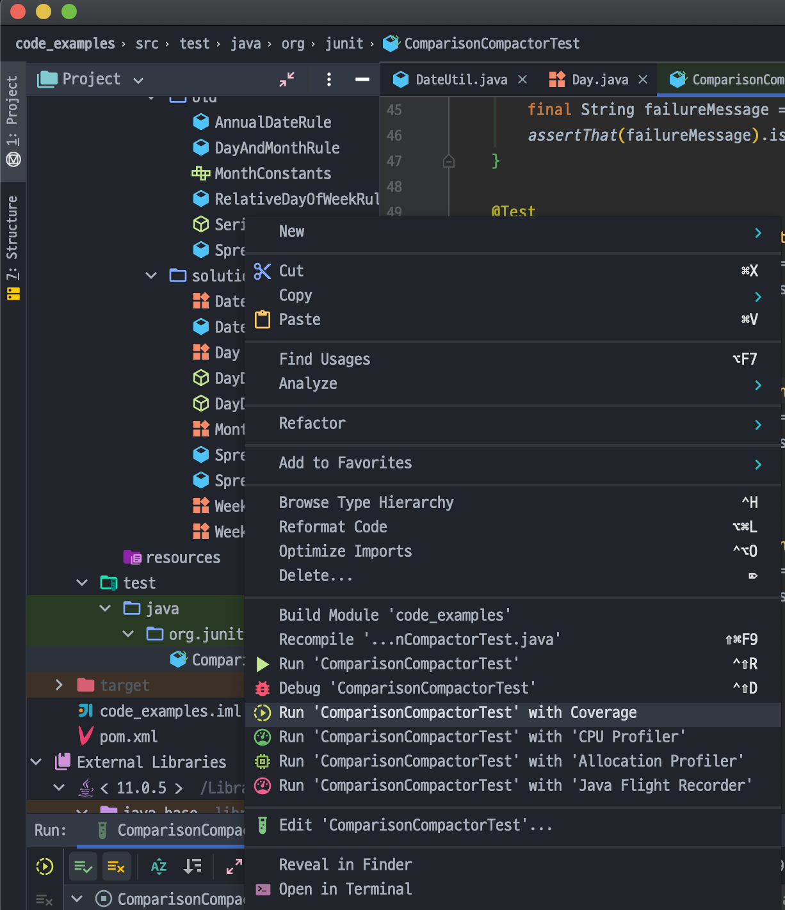
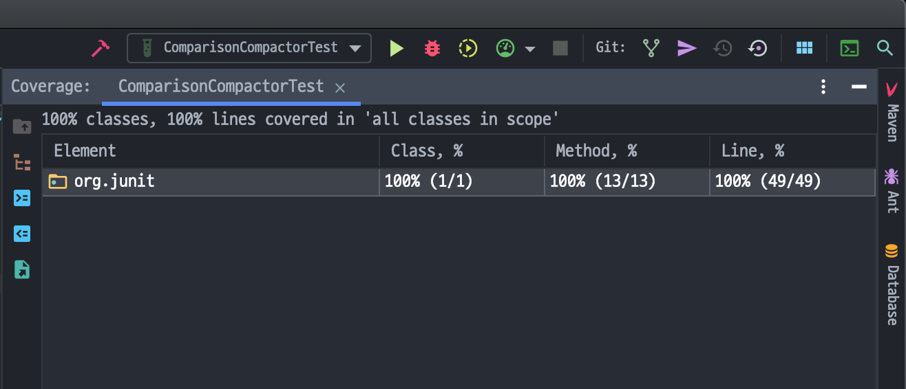

# 냄새와 휴리스틱

### 주석

- C1: 부적절한 정보
다른 시스템(VCS, Bug Tracking System, Issue Tracker...)에 저장할 정보는 주석으로 적절하지 못하다.
주석은 **코드와 설계에 기술적인 설명을 부연하는 수단**이다.

- C2: 쓸모 없는 주석
쓸모 없어질 주석은 아예 달지 않는 편이 가장 좋다.
쓸모 없어진 주석은 재빨리 삭제하는 편이 가장 좋다.
코드를 그릇된 방향으로 이끈다.

- C3: 중복된 주석
코드만으로 충분한데 구구절절 설명하는 주석이 중복된 주석이다.

```js
i++; // i 증가
```

```java
// IDE에서 생성하는 template만 그대로 둔 javadoc
/**
  * 
  * @param year
  * @return
  */
public isLeapYear(final int year) {}
```

주석은 코드만으로 다하지 못하는 설명을 추가로 알려준다.

- C4: 성의 없는 주석
작성할 가치가 있는 주석은 잘 작성할 가치도 있다.
주석을 달려면 시간을 들여 최대한 멋지게 작성한다.
**간결하고 명료하게** 작성한다.

- C5: 주석 처리된 코드
주석 처리된 코드는 그 자리에 남아 매일매일 낡아간다.
더 이상 존재하지 않는 함수를 호출하거나 이름이 바뀐 변수를 사용하는 등 주석 처리된 코드는 주변에 변화를 따라가지 않는다.

주석 처리된 코드는 즉각 지워버려라!

### 환경

- E1: 여러 단계로 빌드해야 한다
빌드는 간단히 한 단계로 끝나야 한다.
명령이나 스트립트를 잇달아 실행해 각 요소를 따로 빌드할 필요가 없어야 한다.

- E2: 여러 단계로 테스트해야 한다
모든 단위 테스트는 한 명령으로 돌려야 한다.
이는 아주 근본적이고 아주 중요하다.
따라서 그 방법이 빠르고, 쉽고, 명백해야 한다.

### 함수

- F1: 너무 많은 인수
함수에서 인수 개수는 작을수록 좋다.
넷 이상은 그 가치가 아주 의심스러우므로 최대한 피한다.

- F2: 출력 인수
일반적으로 인수를 출력이 아니라 입력으로 간주한다.
그렇기 때문에 출력 인수는 직관을 정면으로 위배한다.

```java
// s를 바닥글로 첨부할까? or
// s에 바닥글을 첨부할까?
appendFooter(s)
```

그렇기 때문에 함수에서 무언가의 상태를 변경하려하지 말고,
해당 함수가 속한 객체의 상태를 변경한다.

- F3: 플래그 인수
**boolean** 인수는 함수가 여러 기능을 수행한다는 명백한 증거이다.
이는 혼란을 초래하므로 피해야 마땅하다.

- F4: 죽은 함수
아무도 호출하지 않는 함수는 삭제한다.
이는 낭비이다.

### 일반

- G1: 한 소스 파일에 여러 언어를 사용한다
요즘은 한 소스 파일 내에서 다양한 언어를 지원한다.
e.g.) in JSP: HTML, JS, taglib, Java, English(in comment)

하나의 파일 내에서 언어가 많아지면 조잡해진다.
소스 파일에서 언어의 수와 범위를 최대한 줄이도록 애써야 한다.

- G2: 당연한 동작을 구현하지 않는다
[최소 놀람의 원칙](https://wiki.c2.com/?PrincipleOfLeastAstonishment)(코드가 읽는 이를 놀라게 해서는 안된다)에 의거해 함수나 클래스는
다른 프로그래머가 당연하게 여길 만한 동작과 기능을 제공해야 한다.

당연한 동작을 구현하지 않으면 코드를 읽거나 사용하는 사람이 더 이상 함수 이름만으로 함수 기능을 직관적으로 예상하기 어렵다.
저자를 신뢰하지 못하므로 코드를 일일히 살펴야 한다.

- G3:  경계를 올바로 처리하지 않는다
코드는 올바로 동작해야 한다.
스스로의 직관에 의존하지 말고 모든 경계 조건을 찾아내고,
모든 경계 조건을 테스트하는 테스트 케이스를 작성하라.

**T5: 경계 조건을 테스트하라** 참고

- G4: 안전 절차 무시
안전 절차를 무시하면 위험하다.
실패하는 테스트 케이스를 일단 제껴두고 나중으로 미루는 태도는 신용카드가 공짜 돈이라는 생각만큼 위험하다.

- G5: 중복
DRY: Don't Repeat Yourself / Once, and only once

코드에서 중복을 발견할 때마다 추상화할 기회로 간주하라.
중복된 코드를 하위 루틴이나 다른 클래스로 분리하라.

좀 더 미묘한 유형은 여러 모듈에서 일련의 분기문(switch, if)으로 똑같은 조건을 거듭 확인하는 중복이다.
이런 중복은 **다형성(polymorphism)**으로 대체해야 한다.

더욱 미묘한 알고리즘이 유사하나 코드가 다른 중복이다.
이는 `Template Method Pattern`, `Strategy Pattern`으로 중복을 제거한다.

```java
/**
 * Template Method Pattern
 * 어떤 작업을 처리하는 일부분을 서브 클래스로 캡슐화하여 
 * 전체 일을 수행하는 구조는 바꾸지 않으면서 특정 단계에서 수행하는 내역을 바꾸는 패턴
 */
public abstract class Coupon {
  public getDiscountedPrice(final Money originalPrice) {
    final Money discountAmount = this.getDiscountAmount();
    return this.money.minus(discountAmount);
  }

  protected abstract Money getDiscountAmount(final Money money);
}

public class FivePercentCoupon extends Coupon {
  private static final double DISCOUNT_PERCENT = 0.05;

  @Override
  protected Money getDiscountAmount(final Money money) {
    return money.multiply(DISCOUNT_PERCENT);
  }
}

public class TenThousandWonCoupon extends Coupon {
  private static final Money DISCOUNT_PRICE = Money.of(10_000);

  @Override
  protected Money getDiscountAmount(final Money money) {
    return money.minus(DISCOUNT_PRICE);
  }
}
```

- G6: 추상화 수준이 올바르지 못하다
추상화로 개념을 분리할 때는 철저해야 한다.
모든 저차원 개념은 파생 클래스에 넣고, 모든 고차원 개념은 기초 클래스에 넣는다.
기초 클래스는 구현 정보에 무지해야 마땅하다.

소스 파일, 컴포넌트, 모듈 어떤 경우든 철저하게 분리해야 한다.
고차원 개념과 저차원 개념을 섞어서는 안 된다.

```java
public interface Stack {
  Object pop();
  void push(Object o);
  double percentFull(); // Stack이라는 개념에 있어 추상화 수준이 위 함수와 동일한가?
}
```

`percentFull`과 같은 함수는 모든 Stack의 구현체에 적용될 수 없다.
**BoundedStack**과 같은 그 크기가 정해진 파생 인터페이스에 넣어야 마땅하다.

잘못된 추상화 수준은 거짓말이나 꼼수로 해결하지 못한다.

- G7: 기초 클래스가 파생 클래스에 의존한다
개념을 기초 클래스와 파생 클래스로 나누는 가장 흔한 이유는 고차원 기초 클래스 개념을 저차원 파생 클래스 개념으로부터 분리해 **독립성을 보장**하기 위해서다.
일반적으로 기초 클래스는 파생 클래스를 아예 몰라야 마땅하다.

그러면 파생 클래스의 변경이 시스템에 미치는 영향이 아주 작아지므로 현장에서 시스템을 유지보수하기가 한결 수월하게 된다.

- G8: 과도한 정보
부실하게 정의된 모듈은 인터페이스가 구질구질하다.
그래서 간단한 동작에도 온갖 인터페이스가 필요하다.
부실하게 정의된 인터페이스는 반드시 호출해야 하는 온갖 함수를 제공한다. 그래서 결합도가 높다.

우수한 소프트웨어 개발자는 클래스나 모듈 인터페이스에 노출할 함수를 제한할 줄 알아야 한다.
클래스가 제공하는 메서드 수는 작을수록 좋다.

인터페이스를 매우 작고 깐깐하게 만들어라.
정보를 제한해 결합도를 낮춰라.

- G9: 죽은 코드
죽은 코드란 실행되지 않는 코드를 가리킨다.
(생성은 했으나 아무도 실행하지 않는 함수도 포함)

```js
if (false) {
  doThis(); // dead code
}

doThat();
```

죽은 코드를 발견하면 시스템에서 제거하라.

- G10: 수직 분리
변수와 함수는 사용되는 위치에 가깝게 정의한다.

비공개 함수는 처음으로 호출한 직후에 정의한다.

비공개 함수는 처음으로 호출되는 위치를 찾은 후 조금만 아래로 내려가면 쉽게 눈에띄어야 한다.

- G11: 일관성 부족
어떤 개념을 특정 방식으로 구현했다면 유사한 개념도 같은 방식으로 구현한다.
표기법은 신중하게 선택하며, 일단 선택한 표기법은 신중하게 따라 코드의 일관성을 지킨다.

이러한 일관성만으로도 코드를 읽고 수정하기가 대단히 쉬워진다.

- G12: 잡동사니
아무도 사용하지 않는 변수, 호출하지 않는 함수, 쓸모없는 주석 모두 코드만 복잡하게 만들 뿐이므로 제거해야 마땅하다.

- G13: 인위적 결합
서로 무관한 개념을 인위적으로 결합하지 않는다.
인위적인 결합은 직접적인 상호작용이 없는 두 모듈 사이에서 일어난다.
뚜렷한 목적 없이 당장 편한(잘못된) 위치에 상수, 변수, 함수를 위치한 결과이다.

- G14: 기능 욕심
클래스 메서드는 자기 클래스에 관심을 가져야지 다른 클래스에 관심을 가져서는 안된다.
즉, 클래스의 범위를 욕심내면 안된다.

```java
public class HourlyPayCalculator {
  public Money calculateWeeklyPay(HourlyEmployee e) {
    int tenthRate = e.getTenthRate().getPennies();
    int tenthsWorked = e.getTenthsWorked();
    int straightTime = Math.min(400, tenthsWorked);
    int overTime = Math.max(0, tenthsWorked - straightTime);
    int straightPay = straightTime * tenthRate;
    int overtimePay = (int)Math.round(overTime*tenthRate*1.5);
    return new Money(straightPay + overtimePay);
  }
}
```

`HourlyPayCalculator`는 `HourlyEmployee` 클래스에 **속하기**를 바란다.
하지만 이런 경우가 어쩔 수 없는 경우도 생긴다.

```java
public class HourlyEmployeeReport {
  private HourlyEmployee employee;

  public HourlyEmployeeReport(final HourlyEmployee e) {
    this.employee = e;
  }

  String reportHours() {
    return String.format(
      "Name: %s\tHour:%d.%1d\n",
      this.employee.getName(),
      this.employee.getTenthsWorked() / 10,
      this.employee.getTenthsWorked() % 10
    )
  }
}
```

`HourlyEmployeeReport`는 확실히 `HourlyEmployee`를 욕심내지만,
`HourlyEmployee`가 리포트 형식을 알 필요는 없다.

이를 `HourlyEmployee`로 옮기면 리포트의 기능도 추가되며, 다른 리포트 형식이 필요할 경우 코드의 변경이 필요하다.

- G15: 선택자 인수

`선택자(selector)`는 여러 함수를 하나로 조합한다.
큰 함수를 여럿으로 쪼개지 않으려는 게으름의 소산이다.

```java
public int calculateWeeklyPay(boolean overtime) {
  int tenthRate = getTenthRate();
  int tenthsWorked = getTenthsWorked();
  int straightTime = Math.min(400, tenthsWorked);
  int overTime = Math.max(0, tenthsWorked - straightTime);
  int straightPay = straightTime * tenthRate;
  double overtimeRate = overtime ? 1.5 : 1.0 * tenthRate; // overtime 사용
  int overtimePay = (int)Math.round(overTime * overtimeRate);
  return straightPay + overtimePay;
}
```

이는 아래와 같이 코드를 변경할 수 있다.

```java
public int straightPay() {
  return getTenthsWorked() * getTenthRate();
}

public int overTimePay() {
  int overTimeTenths = Math.max(0, getTenthsWorked() - 400);
  int overTimePay = overTimeBonus(overTimeTenths); // 초과 근무를 하지 않았다면 0이 된다
  return straightPay() + overTimePay;
}

private int overTimeBonus(int overTimeTenths) {
  double bonus = 0.5 * getTenthRate() * overTimeTenths;
  return (int) Math.round(bonus);
}
```

이렇게 선택자로 사용되는 인수 사용은 바람직하지 않다.
이는 새로운 함수를 만드는 편이 좋다.

- G16: 모호한 의도
코드를 짤 때는 의도를 최대한 분명히 밝힌다.

```js
function m_otCalc() {
  return iThsWkd * iThsRte +
    Math.round(0.5 * iThsRte * 
      Math.max(0, iThsWkd - 400)
    );
}
```

위 함수는 짧고 빽빽할 뿐 아니라 거의 해석할 수 없다.
의도를 독자에게 분명히 표현하도록 한다.

- G17: 잘못 지운 책임
코드는 독자가 자연스럽게 기대할 위치에 배치한다.

때로는 개발자가 *영리하게* 기능을 배치한다.
e.g.) 직원이 근무한 총 시간을 보고서로 출력하는 함수

```java
public class Report {
  public int getTotalHour();
}
```

```java
public class EmployeeWorkingTimeManager {
  public void saveTimeCard();
}
```

이름만 보았을 때 두 함수 중 어느 쪽이 근무 시간의 총계를 계산해야 옳을까?
답은 명백하다. => Report

때로는 이런 이를 변경하고자 한다면 이런 사실을 반영해 함수명을 제대로 지어야한다.
**computeRunningTotalOfHours** 함수를 만든다.

- G18: 부적절한 static 함수
`Math.max`는 좋은 static 메서드다. 특정 인스턴스 관련된 기능이 아니다.
메서드를 소유하는 객체에서 가져오는 정보가 없기 때문이다.

```java
HourlyPayCalculator.calculatePay(employee, overtimeRate);
```
위는 static이 적당하다고 여길 수 있지만 함수를 재정의할 가능성이 존재한다.

수당을 계산하는 알고리즘이 여러 개이거나, 수당을 계산하는 클래스가 시급, 초과 수당 등으로 분리될 수 도 있다.
그러므로 이를 static 함수로 정의하면 안 된다.
Employee 클래스에 속하는 인스턴스 함수여야 한다.

static 함수로 정의해야겠다면 재정의할 가능성은 없는지 꼼꼼히 따져본다.

- G19: 서술적 변수
프로그램 가독성을 높이는 가장 효과적인 방법 중 하나가 계산을 여러 단계로 나누고 중간 값으로 서술적인 변수 이름을 사용하는 방법이다,

```java
Matcher match = headerPattern.matcher(line);

if (match.find()) {
  String key = match.group(1);
  String value = match.group(2);
  headers.put(key.toLowerCase(), value);
}
```

변수명을 통해 `match`의 첫 번째 그룹이 **key**이고 두 번째 그룹이 **value**라는 사실이 명확히 드러난다.

계산을 몇 단계로 나누고 중간값에 좋은 변수 이름만 붙여도 해독하기 어렵던 모듈이 순식간에 읽기 쉬운 모듈로 탈바꿈한다.

- G20: 이름과 기능이 일치하는 함수

```java
final Date date = new Date();
final Date newDate = date.add(5);
```

위 `add` 함수는 Date 인스턴스에 5일을 더하는 것인가,
인스턴스는 그대로 두고 새로운 Date 인스턴스를 리턴하는 함수인가?

인스턴스에 5일을 더하는 것이라면 **addDaysTo**, **increaseByDays**라는 이름이 좋고,
새로운 Date 인스턴스를 리턴하는 것이라면 **daysLater**, **daysSince**라는 이름이 좋다.

이름만으로 분명하지 않아 내부를 뒤져봐야한다면 더 좋은 이름으로 바꾸거나 기능을 이름짓기 쉽게 정리해야한다.


** 최소 놀람의 법칙과도 유관할 듯하다.

- G21: 알고리즘을 이해하라
구현이 끝났다고 선언하기 전에 함수가 돌아가는 방식을 확실히 이해하는자 확인하라.
테스트 케이스를 모두 통과한다는 사실만으로 부족하다.
작성자가 알고리즘이 올바르다는 사실을 알아야 한다.

이를 확인하려면 기능이 빤히 보일 정도로 함수를 깔끔하고 명확하게 재구성하는 방법이 최고다

- G22: 논리적 의존성은 물리적으로 드러내라
한 모듈이 다른 모듈에 의존한다면 물리적인 의존성도 있어야 한다.
의존하는 모듈이 상대 모듈에 대해 뭔가를 가정하면 안 된다.
모든 정보를 명시적으로 요청하는 편이 좋다.

```java
public class HourlyReporter {
  private HourlyReportFormatter formatter;
  private List<LineItem> page;
  private final int PAGE_SIZE = 55;

  public HourlyReporter(HourlyReportFormatter formatter) {
    this.formatter = formatter;
    page = new ArrayList<LineItem>();
  }

  public void generateReporter(List<HourlyEmployee> employees) {
    for (HourlyEmployee e : employees) {
      addLineItemToPage(e);

      // HourlyReporter가 페이지 크기를 알아야 하는가??
      // 이는 `HourlyReportFormatter`가 책임질 정보다. <= 잘못 지운 책임
      if (page.size() == PAGE_SIZE) { 
        printAndClearItemList();
      }
    }
    if (page.size() == 0)
      printAndClearItemList();
  }

  private void printAndClearItemList() {
    formatter.format(page);
    page.clear();
  }

  private void addLineItemToPage(HourlyEmployee e) {
    LineItem item = new LineItem();
    item.name = e.getName();
    item.hours = e.getTenthsWorked() / 10;
    item.tenths = e.getTenthsWorked() % 10;
    page.add(item);
  }

  private class LineItem {
    public String name;
    public int hours;
    public int tenths;
  }
}
```

`HourlyReporter`는 `HourlyReportFormatter`가 페이지 크기가 55임을 내부적으로 알 거라고 (논리적으로)가정한다.
만약 `HourlyReportFormatter`가 페이지 크기를 55로 처리하지 않는다면 오류가 생길 것이다.

- G23: If/Else 혹은 Switch/Case 문보다 다형성을 사용하라

1. 당장 손쉬운 선택이기 때문에 switch 문을 사용한다.
그렇기 때문에 다형성을 먼저 고려하라
2. 유형보다 함수가 더 쉽 변하는 경우는 극히 드물다. Switch 문을 의심하라

같은 선택을 수행하는 다른 코드에서는 다형성 객체를 생성해 Switch 문을 대신한다.

- G24: 표준 표기법을 따르라
TL;DR - 팀이 정한 Coding Convention을 따르라

- G25: 매직 넘버는 명명된 상수로 교체하라
숫자는 명명된 상수 뒤로 숨겨라.

하지만 어떤 상수는 이해하기 쉬우므로, 코드 자체가 자명하다면, 상수 뒤로 숨길 필요가 없다.

```java
double milesWalked = feetWalked / 5280.0; // FEET_PER_MILE?
int dailyPay = hourlyRate * 8; // WORK_HOURS_PER_DAY?
double circumference = radius * Math.PI * 2; // TWO?
```

위와 같이 명백한 숫자는 그냥 숫자를 쓰는 편이 좋다.

`매직 넘버`는 의미가 분명하지 않은 토큰을 모두 가리킨다.

```java
// `7777` and `John Doe` are Magic Numbers
assertThat(7777).isEqualTo(Employee.find("John Doe").getEmployeeNumber());

// refactor
assertThat(HOURLY_EMPLOYEE_ID).isEqualTo(Employee.find(HOURLY_EMPLOYEE_NAME).getEmployeeNumber());
```

- G26: 정확하라
검색 결과 중 첫 번째 결과만 유일한 결과로 간주하는 행동은 순진하다.
대충 결과가 맞다고 이에 대해 깊게 고민하지 않는 것은 피한다.

코드에서 뭔가를 결정할 때는 결정을 내리는 이유와 예외를 처리할 방법을 분명히 알아야한다.
대충 결정하지 않는다.

- G27: 관례보다 구조를 사용하라
설계 결정을 강제할 때는 규칙보다 관례를 사용한다.

??

- G28: 조건을 캡슐화하라
조건의 의도를 분명히 밝히는 함수로 표현하라

```java
// bad
if (timer.hasExpired() && !timer.isRecurrent())

// good
if (shouldBeDeleted(timer))
```

- G29: 부정 조건을 피하라
부정조건은 긍정 조건보다 이해하기 어렵다.

```java
// bad
if (!buffer.shouldNotCompact())

// good
if (buffer.shouldCompact())
```

- G30: 함수는 한 가지만 해야 한다
함수를 짜다보면 함수 내에 일련의 작업을 수행하고픈 유혹에 빠진다.

```java
public void pay() {
  for (final Employee e : employees) {
    if (e.isPayDay()) {
      final Money pay = e.calculatePay();
      e.deleverPay(pay);
    }
  }
}
```

이런 함수는 한 가지만 수행하는 함수가 아니다.
1. 직원 목록을 루프로 돌며
2. 각 직원의 월급일을 확인하고
3. 해당 직원에게 월급을 지급한다.

이는 아래와 같이 나누는 편이 좋다.

```java
public void pay() {
  for (Employee e : employees) {
    payIfNecessary(e);
  }
}

private void payIfNecessary(Employee e) {
  if (e.isPayDay())
    calculateAndDeliveryPay(e);
}

private void calculateAndDeliverPay(Employee e) {
  Money pay = e.calculatePay();
  e.deliveryPay();
}
```

각 함수는 한 가지 임무만 수행한다.

- G31: 숨겨진 시간적인 결합
때로는 시간적인 결합이 필요하다.
하지만 시간적인 결하블 숨겨서는 안 된다.

```java
public class MoogDiver {
  Gradient gradient;
  List<Spline> splines;

  public void dive(String reason) {
    saturateGradient();
    reticulateSplines();
    diveForMoog(reason);
  }
}
```

위 코드는 실행되는 순서가 중요하지만 시간적인 결합을 강제하지 않는다.

```java
public class MoogDiver {
  Gradient gradient;
  List<Spline> splines;

  public void dive(String reason) {
    Gradient gradient = saturateGradient();
    List<Spline> splines = reticulateSplines(gradient);
    diveForMoog(splines, reason);
  }
  ...
}
```

위와 같은 코드는 일종의 연결 소자를 생성하여 시간적인 결합을 노출한다.
각 함수의 결과가 다음 함수의 입력으로 필요하기 때문에 순서를 바꿔 호출할 수 없다.

- G33: 경계 조건을 캡슐화하라
경계 조건은 빼먹거나 놓치기 십상이다.
코드 여기저기에 +1, -1을 흩어놓지 말고, 경계 조건은 한 곳에서 별도로 처리한다.

```java
if (level + 1 < tags.length) { // level + 1 사용됨
  parts = new Parse(body, tags, level + 1, offset + endTag); // level + 1 사용됨
  body = null;
}
```

위 `level + 1`은 변수로 캡슐화하는 편이 좋다.

```java
int nextLevel = level + 1; // capsulation

if (nextLevel < tags.length) {
  parts = new Parse(body, tags, nextLevel, offset + endTag);
  body = null;
}
```

- G34: 함수는 추상화 수준을 한 단계만 내려가야 한다
함수 내 모든 문장은 추상화 수준이 동일해야 한다.

아래 코드는 추상화 수준이 최소 2개가 섞여있다.

```java
public String render() {
  // 1. HTML 문법
  StringBuffer html = new StringBuffer("<hr");

  // 2. 수평선의 크기
  if (0 < size) {
    html.append(" size=\"").append(size + 1).append("\"")
  }

  html.append(">");
  return html.toString();
}
```

아래 코드는 1차 수정을 한 코드이다.
그럼에도 여전히 추상화 수준이 섞여있다.

```java
// 1차 수정
public String render() {
  // 1. hr 태그 생성
  HtmlTag hr = new HtmlTag("hr");

  // 2. size 변수의 해석과 형식 지정
  if (0 < size) {
    hr.addAttribute("size", "" + (size + 1));
  }

  return hr.html();
}
```

아래 코드는 추상화 수준을 완벽히 분리해 놓은 코드이다.

```java
public String render() {
  HtmlTag hr = new HtmlTag("hr");

  if (0 < extraDashs) {
    hr.addAttribute("size", hrSize(extraDashes));
  }

  return hr.html();
}

private String hrSize(int height) {
  int hrSize = height + 1;
  return String.format("%d", hrSize);
}
```

- G35: 설정 정보는 최상위 단계에 둬라
추상화 최상위 단계에 둬야 할 기본값 상수나 설정 관련 상수를 저차원 함수에 숨겨서는 안 된다.

```java
public static void main(String[] args) throws Exception
{
  Arguments arguments = parseCommandLine(args);
  ...
}

public class Arguments
{
  public static final String DEFAULT_PATH = ".";
  public static final String DEFAULT_ROOT = "FitNesseRoot";
  public static final int DEFAULT_PORT = 80;
  public static final int DEFAULT_VERSION_DAYS = 14;
  ...
}
```
인수의 기본값은 `Arguments` 클래스 맨 처음에 나온다.
위와 같이 설정 관련 상수는 최상위 단계에 둔다.

그래야 `if (arguments.port == 0) // default port is 80`와 같은 저수준 코드를 찾기위해 뒤질 필요가 없다.

- G36: 추이적 탐색을 피하라

일반적으로 한 모듈은 주변 모듈을 모를수록 좋다.
e.g.) a.getB().getC().doSomething()

이를 **디미터의 법칙**이나 **Writing Shy code**라고 부른다.
이는 아는 모듈이 연이어 자신이 나는 모듈을 따라가며 시스템 전체를 휘저을 필요가 없이 자신이 직접 사용하는 모듈만 알아야 한다는 뜻이다.

내가 사용하는 모듈은 내게 필요한 서비스를 모두 제공해야 한다.

### 자바

- J1: 긴 import 목록을 피하고 와일드카드를 사용하라
패키지에서 클래스를 둘 이상 사용한다면 와일드카드를 사용해 패키지 전체를 가져와라.

```java
// bad
import package.foo;
import package.bar;
import package.foobar;

// good
import package.*;
```

때론 와일드카드 import문은 이름 충돌이나 모호성을 초래한다.
이름이 같으나 패키지가 다른 클래스는 명시적인 import나 package 경로를 명시한다.
다소 번거로우나 자주 발생하지 않기에 여전히 와일드카드 import문이 더 낫다.

- J2: 상수는 상속히지 않는다.
```java
public interface PayrollConstants {
  public static final int TENTHS_PER_WEEK = 400;
  public static final double OVERTIME_RATE = 1.5;
}
```

```java
public abstract class Employee implements PayrollConstants {
  public abstract Money calculatePay();
}
```

```java
public class HourlyEmployee extends Employee {
  private int tenthsWorked;
  private double hourlyRate;

  public Money calculatePay() {
    final int straightTime = Math.min(this.tenthsWorked, TENTHS_PER_WEEK);
    final int overTime = this.tenthsWorked - straightTime;

    return new Money(
      this.hourlyRate * (this.tenthsWorked + OVERTIME_RATE * overTime)
    );
  }
}
```

상수를 상속을 받아서 사용한다.
상속은 이렇게 사용하면 안된다!
`PayrollConstants`와 `Employee`가 **IS-A** 관계가 성립하지도 않는다.

상속하지 말고 import해서 사용하도록 한다.

- J3: 상수 vs Enum
int와 같은 상수는 코드에서 의미를 잃어버리기도 한다.
반면 **enum**은 이름이 부여된 enumeration에 속하기 때문에 의미를 잃지 않는다.

의미도 잘 부여하면서도 메서드와 필드도 사용할 수 있기 때문에 상수보다 훨씬 더 유연하고 서울적인 강력한 도구이다.

### 이름

- N1: 서술적인 이름을 사용하라
이름을 성급하게 정하지 않는다.
서술적인 이름을 신중하게 고른다.

소프트웨어의 가독성의 **90%**는 이름이 결정한다.
그러므로 시간을 들여 현명한 이름을 선택하고 유효한 상태로 유지한다.

```java
// bad
public int x() {
  int q = 0;
  int z = 0;

  for (int kk = 0; kk < 10; kk++) {

    if (l[z] == 10) {
      q += (10 + l[z + 1] + l[z + 2]);
      z += 1;
    } else if (l[z] + l[z + 1] == 10) {
      q += (10 + l[z + 2]);
      z += 2;
    } else {
      q += (l[z] + l[z + 1]);
      z += 2;
    }
  }

  return q;
}
```

```java
// good
public int x() {
  int score = 0;
  int frame = 0;

  for (int frameNumber = 0; frameNumber < 10; frameNumber++) {
    
    if (isStrike(frame)) { // 상세 구현은 알 수 없지만 의미를 충분히 짐작할 수 있다.
      score += (10 + nextTwoBallsForStrike(frame));
      frame += 1;
    } else if (isSpare(frame)) {
      score += (10 + nextBallForSpare(frame));
      frame += 2;
    } else {
      score += twoBallsInFrame(frame);
      frame += 2;
    }
  }

  return q;
}
```

신중라게 선택한 이름은 추가 설명을 포함한 코드보다 강력하다.

- N2: 적잘한 추상화 수준에서 이름을 선택하라
구현을 드러내는 이름을 피하라.
추상화 수준을 반영하는 이름을 선택하라.

```java
public interface Modem {
  boolean dial(final String phoneNumber); // 적절한가??
  boolean disconnect();
  boolean send(final char c);
  char recv();
  String getConnectedPhoneNumber(); // 적절한가??
}
```

전화선에 연결되지 않는 일부 모뎀의 경우를 생각해보라.
그렇다면 **전화번호**라는 개념은 확실히 추상화 수준이 틀렸다.

```java
public interface Modem {
  boolean connect(final String connectionLocator);
  boolean disconnect();
  boolean send(final char c);
  char recv();
  String getConnectedLocator();
}
```

위 `Modem`은 전화번호는 물론이고 다른 연결 방식에도 사용 가능하다.

- N3: 가능하다면 표준 명명법을 사용하라
기본의 명명법을 사용하는 이름은 이해하기 더 쉽다.
예를 들어 **Decorator Pattern**을 활용한다면 클래스 이름에 Decorator라는 단어를 사용해야 한다.

디자인 패턴은 한 가지 표준에 불과하다.
예를 들어 Java에서 객체를 문자열로 변환할 때 `toString()`이라는 이름을 많이 쓴다.
이런 이름은 기존의 관례를 따르는 편이 좋다.

특정 프로젝트 내에서는 팀마다 적용할 표준을 고안한다.
프로젝트 내에서 사용하는 `Ubiquitous Language`를 사용하여 독자들이 코드를 이해하기 쉽게 하라.

- N4: 명확한 이름
함수나 변수의 목절을 명확히 밝히는 이름을 선택한다.

```java
private String doRename() {
  if (refactorReferences) {
    renameReferences();
  }

  renamePage();
  pathToRename.removeNameFromEnd();
  pathToRename.addNameToEnd(newName);
  return PathParser.render(pathToRename);
}
```

`doRename`이라는 이름만 봐서는 메서드의 역할이 분명하지 않다.
내부에 `renamePage`라는 메서드가 있어 그 역할이 더더욱 모호해진다.

`renamePageAndOptionallyAllReferences`라는 이름이 더 좋다.

- N6: 인코딩을 피하라
이름에 유형 정보나 범위 정보를 넣어서는 안 된다.
`m_`이나 `f`와 같은 접두어는 불필요하다.

- N7: 이름으로 부수 효과를 설명하라
이름에 부수효과를 숨기지 않는다.

```java
public ObjectOutputStream getOos() throws IOException {
  if (m_oos == null) {
    m_oos = new ObjectOutputStream(m_socket.getOutputStream());
  }

  return m_oos;
}
```

단순히 `ObjectOutputStream`를 가져오는 것이 아니라 없으면 새로 생성한 뒤 가져온다.
그러므로 `createOrReturnOos`라는 이름이 더 좋다.

### 테스트

- T1: 불충분한 테스트
테스트 케이스는 잠재적으로 깨질 만한 부분을 모두 테스트해야 한다.
테스트 케이스가 확인하지 않는 조건이나 검증하지 않는 계산이 있다면 그 테스트는 불완전하다.

- T2: 커버리지 도구를 사용하라
커버리지 도구를 사용하면 테스트가 불충분한 모듈, 클래스, 함수를 찾기가 쉬워진다.

---

#### Test Coverage 측정





[Coverage Report example](./test_coverage_example/index.html)

---

- T3: 사소한 테스트를 건너뛰지 마라
사소한 테스트는 짜기 쉽지만 이것이 제공하는 문서적 가치는 구현에 드는 비용을 넘어선다.

- T4: 무시한 테스트는 모호함을 뜻한다
때론 요구사항이 불분명하여 프로그램이 돌아가는 방식을 확신하기 어렵다.
불문명한 요구사항은 테스트 케이스를 주석으로 처리하거나 테스트 케이스에 `@Ignore`를 붙여 표현한다.

- T5: 경계 조건을 테스트하라
경계 조건은 각별히 신경 써서 테스트한다.

```js
// bad
descript('isLegallyAdult function', () => {
  descript('when age is 8', () => {
    const age = 8;

    it('returns false', () => {
      expect(isLegallyAdult(age)).toBe(false);
    });
  });

  descript('when age is 30', () => {
    const age = 30;

    it('returns true', () => {
      expect(isLegallyAdult(age)).toBe(true);
    });
  });
});
```

```js
// good
descript('isLegallyAdult function', () => {
  descript('when age is 18', () => {
    const age = 18;

    it('returns false', () => {
      expect(isLegallyAdult(age)).toBe(false);
    });
  });

  descript('when age is 19', () => {
    const age = 19;

    it('returns true', () => {
      expect(isLegallyAdult(age)).toBe(true);
    });
  });
});
```

- T6: 버그 주변은 철저히 테스트하라
버그는 서로 모이는 경향이 있다.
한 함수에서 버그를 발견했다면 그 함수를 철저히 테스트하는 편이 좋다.

- T7: 실패 패턴을 살펴라
때로는 테스트 케이스가 실패하는 패턴으로 문제를 진단할 수 있다.
합리적인 순서로 정렬된 꼼꼼한 테스트 케이스는 실패 패턴을 드러낸다.

e.g.) 입력이 5자를 넘기는 테스트가 모두 실패할 경우, 음수를 파라미터로 받는 함수의 테스트가 모두 실패할 경우

- T8: 테스트 커버리지 패턴을 살펴라
통과하는 테스트가 실행하거나 실행하지 않는 코드를 살펴보면 실패하는 테스트 케이스의 실패 원인이 드러난다.

- T9: 테스트는 빨라야 한다
느린 테스트 케이스는 실행하지 않게 된다.
그러므로 테스트 케이스가 빨리 돌아가게 노력한다.
