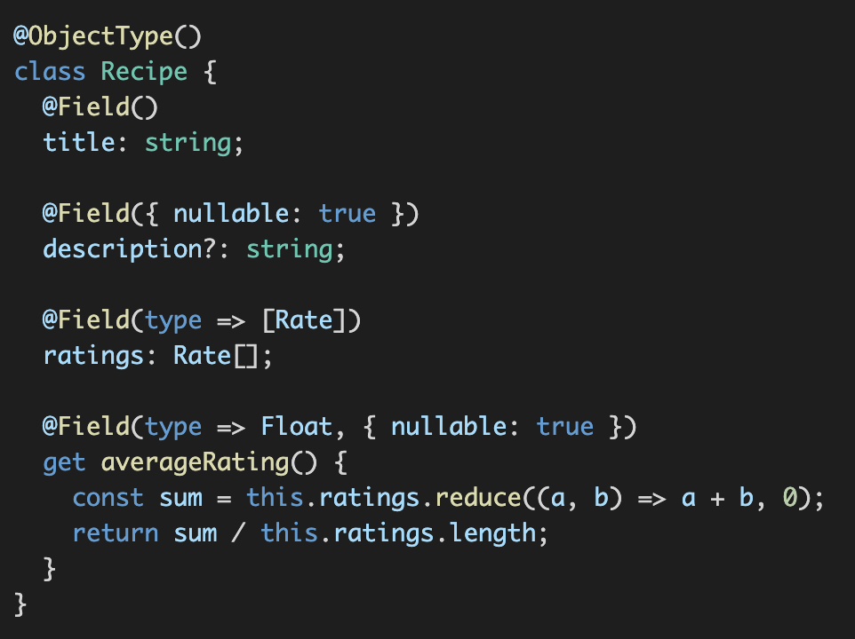

## Migration from Schema-First to Code-First

### Schema First

- Pros of Schema First:
    - Schema를 먼저 만들고 front, back을 개발함 
        - front, back이 서로 독자적으로 개발가능
        - SDL 외 별다른 document가 필요하지 않음
- Cons of Schema First:
    - String -> Int로 변경하면 디버깅하기 어려움 (컴파일/린팅 에러 X)
        - Runtime에서만 알 수 있음

### Code First

- Tools
    - **TypeGraphQL**
        - 
    - GraphQL Nexus

- Pros of Code First
    - type safty
- Cons of Code First
    - 

    - To overcome
        - Graphql Inspector
        - Graphql cli
        - `Apollo Platform` - Schema registry: 스키마 관리

### Issues
- graphql 관련 Library 호환성
- some dev's are not used to Code first way.
    - merge (schema + code)
        - Graphql Stitching
            - cache hint issue...
            - deprecated...
        - Apllo Federation: 아직은...

---

## GraphQL using Typescript

Apollo server: web framework middlewear

Why Apollo server: 완성도 높은 GraphQL 구현체 개발

