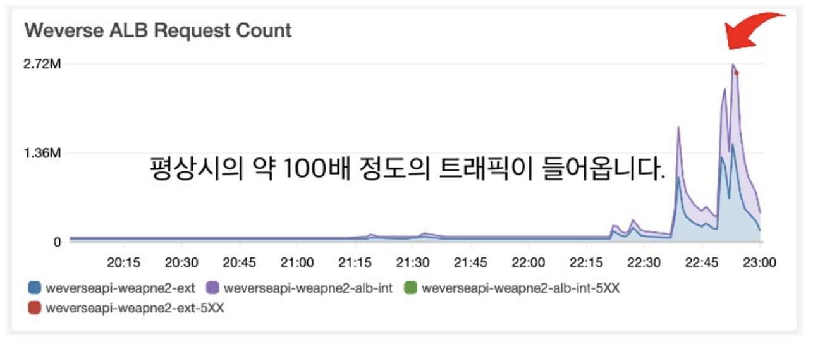
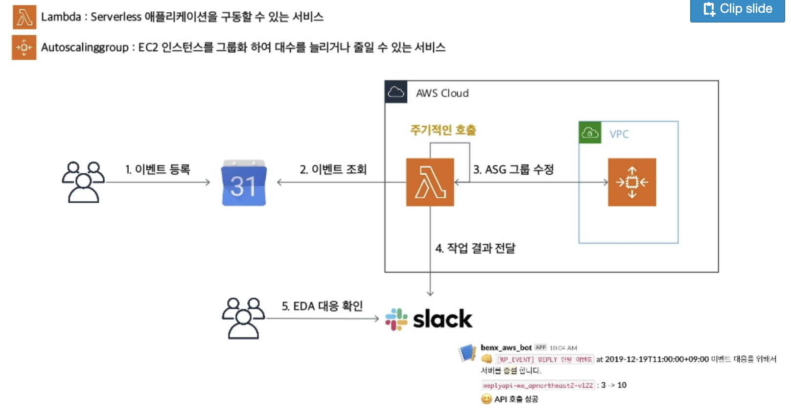
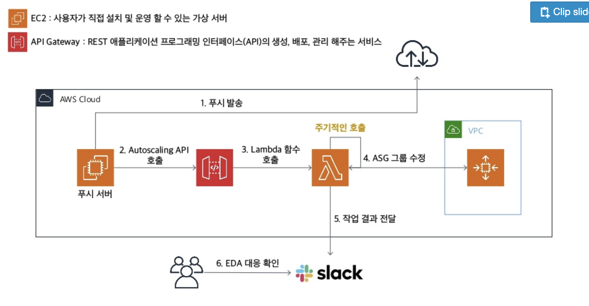
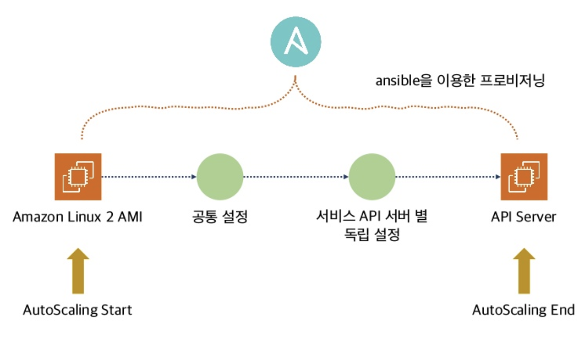
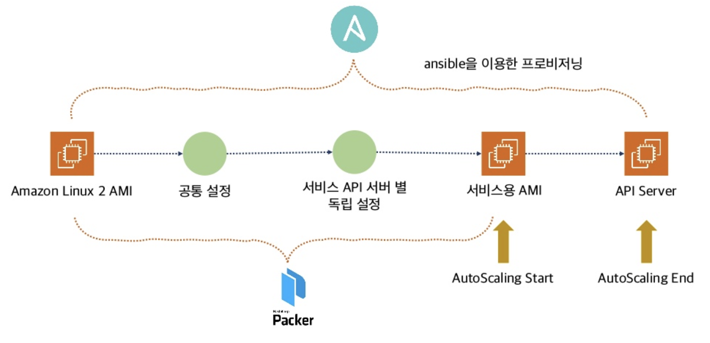
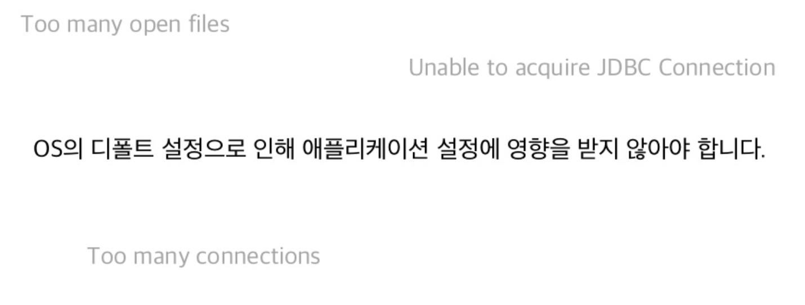

# 전 세계 팬들이 모일 수 있는 플랫폼 만들기

---

- 발표 영상: https://www.youtube.com/watch?v=X2I4NuTOWS8
- 발표 자료: https://www.slideshare.net/awskr/ss-223007438

---

트래픽이 순간적으로 몇 분 내에 엄청나게 올라감 (about more than 100 times than ordinary)

### 그래서?

Autoscaling??
- 한 템포 늦음
- 한 순간을 위해 이전에 많은 서버를 올릴 수도 없음

### 사전에 증설할 수 있는 순간을 감지할 순 없나?
=> Event Driven Autoscaling: `이벤트`에 의해 동작하는 오토 스케일링

### Event?
- Predefined event: 미리 정의한 이벤트 (MD 판매 이벤트 등)
- Undefined Event: 미리 안 정해논 이벤트 (갑자기 아티스트가 글 썼을 때) <- 사전 대응 불가능

#### Predefined Event
언제 발생할 지 미리 알고 있기 때문에 사전 대응이 가능

1. event 구글 캘린더에 등록
2. 람다가 주기적으로 돌아서 이벤트를 조회한다.
3. 이벤트를 발견하면 (1시간 전) ASG 그룹을 수정한다. (min desire 등의 값을 변경)
4. 결과를 slack으로 전달

#### Undefined Event
언제 발생할 지 알 수 없기 때문에 사전 대응이 불가능

팬들이 접속하기 전에 푸시가 날라가는데,
푸시가 날라갈게 생겻다는건 이벤트가 발생했다는 것이다.
=> 푸시 서버를 AS의 시작점으로 활용

1. Push 서버: Push 발송
2. Push 서버: Autoscaliing API 호출 (1을 실행하면서 비동기로 호출)
3. API 호출을 통해 람다가 asg를 설정한다.
람다는 주기적으로 돌면서  undefined event가 종료되었는지 확인한다
  - 유지 시간
  - 당시의 트래픽
4. 결과를 slack으로 전달

### 해결할 과제들

#### AutoScailingdp 시간을 최소화: 배포 과정 최적화

- AS-IS

Ansible을 이용한 프로비저닝
- 모든 ec2가 해야될 os 튜닝 과 같은 공통 설정
- 서비스 API 별 설정
- JAR 실행
이 과정에 5분 소요

- TO-BE

=> Packer를 통해 위 JAR 실행 외에 다른 설정을 먼저 세팅해놓음: 3분
=> 1분각 가능???: EKS on Fargate, EC2 Hibernate 를 고려하고 있다

#### 증설되는 동안 트래픽을 최대한 버텨야함: 애플리케이션 최적화
튜닝 잘 된 t3.medium이 c5.xlarge 성능을 낼 수 있다.

성능 최적화의 핵심은 모든 리소스를 최대한 활용하는 것 <- 서버 리소스 모두 짜내서 쓰게해야함

- 소켓 백로그등의 설정을 OS 디폴트 Limit 보다 높여서 쓴다
- soft, hard -> nofile, nproc 65536 : Too many often files...
- nginx
  - worker_process: 코어 수 만큼 늘려줌
  - worker_conection: 충분히 늘려줘야함
  - min-spare-threads를 충분히 늘려줘야 부족할 경우 스레드 만드는 데도 지연이 걸림
- tomcat:
  - maxThreads: 이것도 충분히 늘려줘야함
- DB: 충분한 숫자의 Connection Pool 설정
- Hikari: pool-size를 RDS max 커넥션 수를 보고 정해야함

memory보단 CPU 코어에 맞춰 튜닝하는 것이 보다 효과적

추천 자료 https://www.nginx.com/blog/tuning-nginx/
