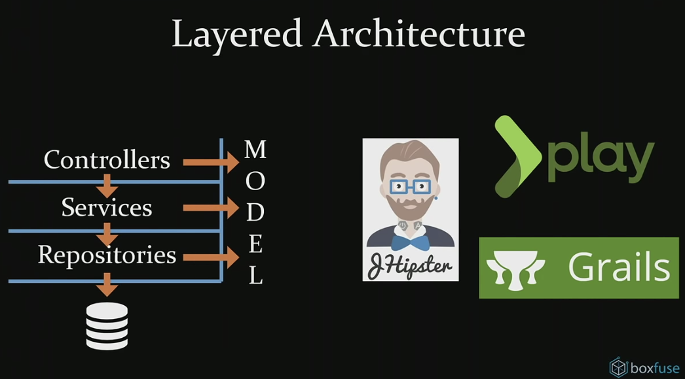
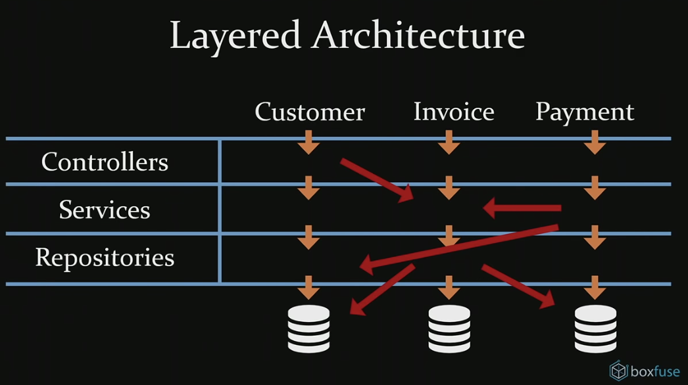
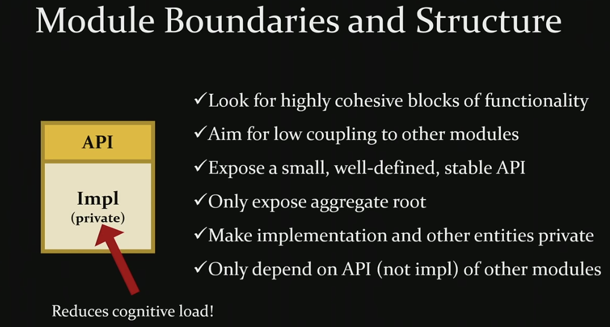

# Majestic Modular Monoliths  

https://www.youtube.com/watch?v=BOvxJaklcr0&t=144s

---

코드의 사이즈가 커지면서 생기는 병목은 읽는 사람이다.
그렇기 때문에 읽고 이해하기 쉬운 코드를 짜야한다.

아키텍쳐란 결국 Methods, Classes, Packages, Modules, Applications의 상호작용과 관계일 뿐이다.

여러 대기업의 케이스와 발표를 통해서 Microservie는 좋고 Hip한 것으로 인식되고 있다.

분산 객체 설계의 첫번째 규칙: 객체를 분산시키지 마라

| Monolith | Microservices |
| - | - |
| 하나의 큰 애플리케이션 | 여러개의 각각의 서비스 |
| 복잡하게 설킬 수 있는 위험성 | 명확하고 작은 단위에 집중 |
| 단순 method 호출 | API call 시 network를 항상 신뢰할 수 없다 |
| 모든 부분들이 항상 켜져있고 사용가능하다 | Service discovery + internal load balancing + circuit breakers |
| 인터페이스를 리팩토링하기 쉽다 | 리팩토링하기 어렵다 | 
| 애플리케이션 자체가 하나의 단위로 커진다 | 서비스가 개별적으로 성장한다 |
| 하나의 DB | 서비스 별로 적합한 DB |
| 트랜잭션 처리가 편리하며 strong consistency | eventual consistency |
| 하나의 플랫폼을 사용해야한다 | 서비스 별로 플랫폼을 선택할 수 있다 |
| 외부 dependency 사용하다 version 변경 시 전체에 영향이 갈 수 있다 | 서로 호환되지 않는 library를 사용할 수 있다 |
| 팀이 병렬적으로 일하기 힘들다 | 쉽게 팀이 병렬적으로 일할 수 있다 |

둘 사이의 뭔가가 없을까?

`Majestic` Modular Monolith

Domain Model에 모두 접근 가능한
Contorller => Service => Repository 방식의 Layered 아키텍쳐

하지만 여기 Controller에서 저기 Service 사용하고, 여기 Service에서 저기 Service 사용하고 하다보면
애플리케이션 구조가 꼬일 수 밖에 없다!

서로 순환하지 않는 명확한 의존관계를 구성해야한다.

의존을 받는 개념은 안정적이어야한다.

- 모듈간 낮은 coupling을 가져야한다.
- 모듈은 최소한의, 잘 정의된, 안정적인 API를 노출해야한다.
- API의 구현체와 다른 엔티티들을 내부로 감추어야한다.
- 모듈은 오직 구현체가 아닌 오픈된 API만을 의존해야한다.

외부 의존 library의 version이 다를 경우엔

위 3개의 경우에도 문제를 풀 수 없다면 library를 통으로 복사할 수 밖에...

## Databases

### Monolith

### Modular Monolith

오직 각자의 module만의 테이블을 사용해야한다.
(e.g. user module은 friend module의 friends table에 접근해선 안된다)

모듈간 테이블 공유를 해선 안된다.
Join도 같은 모듈에서 사용하는 테이블끼리 해야한다

## Scaling

모든 모듈을 서로 같은 사이즈로 스케일링하고 싶지 않을 수 있다.

## Language independence

Java는 다른 JVM 언어 호환 가능하기 때문에
각각의 모듈을 적절한 언어로 만들 수 있다.

